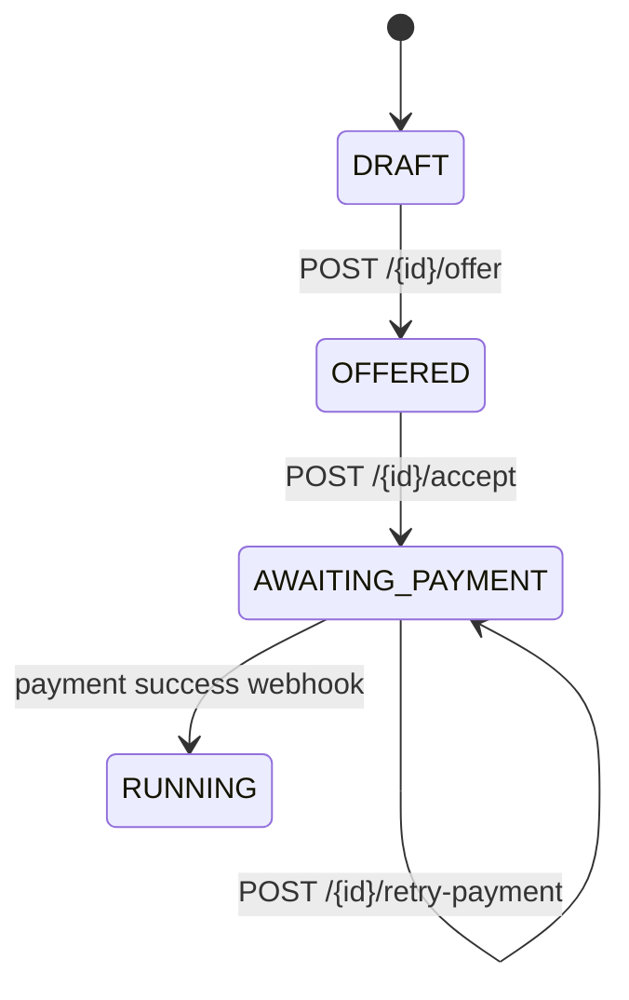

# Integrating a B2C Storefront with abstrapact

This guide explains how to integrate a customer-facing storefront (any technology:
server-rendered pages, a SPA, a mobile app talking to a BFF, etc.) with the
abstrapact public sales API to sell products and take payment via Stripe
Checkout.

It is derived from the working end-to-end flows in
`e2e-tests/tests/03-customer-contract-creation.spec.ts`,
`04-contract-booking-flow.spec.ts`, and `05-payment-flow.spec.ts`, which can be
used as executable reference examples.

## Concepts

- **Product definition** — what you sell. Created by the seller (admin side)
  with `billingModel: FIXED_PRICE`, `paymentModel: PREPAID`,
  `crossTenantApiAllowed: true`, and the Stripe credentials
  (`stripeSecretKey`, `stripeWebhookSecret`). Only products flagged
  `crossTenantApiAllowed` are visible to customers of other organisations.
- **Contract** — the "shopping cart". A contract goes through a state machine
  and carries the line items, totals, and the payment state.
- **Payment transaction** — one payment attempt per checkout session. At most
  one `PENDING` attempt exists per contract (enforced in the database).

### Contract states



`ACCEPTED` and `APPROVED` are internal transition states; the customer only ever
observes `DRAFT`, `OFFERED`, `AWAITING_PAYMENT`, and `RUNNING`.

## Authentication and request requirements

The public API uses the same session mechanism as the abstrapact UI:

- The customer must be signed in through the platform's OIDC login (the
  storefront app must live behind the same cookie domain / BFF so the session
  cookie is sent). Registration is handled by the shared auth server.
- **CSRF**: the server sets an `XSRF-TOKEN` cookie. Every mutating request must
  echo it in the `X-XSRF-TOKEN` header.
- **Idempotency-Key**: every mutating request must carry an
  `Idempotency-Key` header (see below).

```
POST /api/public/sales/contracts
Cookie: <session cookies>
X-XSRF-TOKEN: <value of the XSRF-TOKEN cookie>
Idempotency-Key: <unique key for this logical operation>
Content-Type: application/json
```

## Idempotency-Key semantics

The API guarantees that a customer can **never pay twice but always pays at
least once**. Your client is responsible for generating and reusing keys:

- Generate a **random, non-guessable key** (e.g. a UUIDv4) **once per logical
  operation** — e.g. once per "create this cart" attempt, once per
  "accept & pay" attempt.
- **Reuse the same key on every retry** of that logical operation (network
  timeouts, 5xx, browser refresh, app restart — persist it client-side, e.g. in
  session storage).
- Generate a **new key when the user starts a genuinely new action** (e.g. a
  second, intentional payment retry via `retry-payment` should usually reuse
  the same key for that retry operation).
- Max length **255 characters**; missing/blank/oversized keys → `400`.

Replay behaviour:

| Situation | Response |
|---|---|
| Same key, same request data | The original response is replayed (status + body), no side effects |
| Same key, different request data | `422` fingerprint mismatch — your client sent inconsistent data; treat as a bug or a new logical operation needing a new key |
| Concurrent requests, same key | One executes; the others receive the winner's response |
| Key expired (> 24 h) | Treated as a new key |

## The happy-path flow

### 1. Create the contract — `POST /api/public/sales/contracts` → `201`

```json
{
  "orgId": "<seller organisation id>",
  "contractReference": "ORDER-2026-000123",
  "publicNotes": "optional customer-facing note",
  "lineItems": [{
    "productCode": "MY-PRODUCT",
    "displayOrder": 1,
    "partInstances": [{
      "partCode": "MY-PART",
      "attributeValues": [],
      "childPartInstances": []
    }]
  }]
}
```

Response contains the contract with `id`, `state: "DRAFT"`,
`sellerOrganisationId`, totals, and resolved `lineItems[].productInstance`.

Errors: `400` missing `orgId` / empty `lineItems`; `422` unknown
`productCode`/`partCode` or product not purchasable; `422` POSTPAID products
(not yet supported for self-service checkout).

### 2. Offer — `POST /api/public/sales/contracts/{id}/offer` → `200`

Transitions `DRAFT → OFFERED`. In a typical storefront this is submitted when
the customer clicks "check out". Requires the contract to be `DRAFT`, else
`422`.

### 3. Accept — `POST /api/public/sales/contracts/{id}/accept` → `200`

Transitions `OFFERED → AWAITING_PAYMENT` **and creates the Stripe Checkout
Session**. The response body is the contract plus:

```json
{ "checkoutUrl": "https://checkout.stripe.com/c/pay/cs_test_..." }
```

Immediately redirect the customer to `checkoutUrl` (HTTP redirect or
`location.href`). Stripe hosts the entire payment page — your storefront never
touches card data.

Errors: `422` contract not `OFFERED`; `422` product has no Stripe key;
`503`/`400` if Stripe is unreachable/misconfigured — retry with the **same**
`Idempotency-Key`; the operation is safe to retry.

### 4. Payment completes — webhook, not polling

Stripe calls abstrapact's webhook directly; the contract transitions
`AWAITING_PAYMENT → RUNNING` once payment is confirmed. Your storefront does
not need to do anything for the payment itself — Stripe redirects the customer
back to the configured success/cancel URLs:

- Success: `{base}/public/payment/success?session_id={CHECKOUT_SESSION_ID}`
- Cancel: `{base}/public/payment/cancel?session_id={CHECKOUT_SESSION_ID}`

On your success page, fetch the contract to confirm:

### 5. Verify — `GET /api/public/sales/contracts/{id}` → `200`

`state` tells you the truth:

- `AWAITING_PAYMENT` — payment not yet confirmed (webhook may still be in
  flight; the customer can retry if the session died)
- `RUNNING` — paid, order is live
- `CANCELLED`, `FAILED`-adjacent states — handle per your UX

## Recovery: expired or failed sessions

Stripe Checkout Sessions expire after at most 24 hours. If the customer
abandons checkout or the session dies:

- Stripe sends `checkout.session.expired` → the transaction becomes `EXPIRED`.
- An hourly backstop job marks `PENDING` transactions older than
  `abstrapact.payment.session-ttl-hours` (default 48 h — deliberately longer
  than Stripe's 24 h maximum so we never expire a session that Stripe would
  still honour) as `EXPIRED`.

Call **`POST /api/public/sales/contracts/{id}/retry-payment`** (with an
`Idempotency-Key`) to get the customer paying again:

- If a live `PENDING` session exists → returns its existing `checkoutUrl`
  (same session).
- If the previous attempt is `EXPIRED` or `FAILED` → creates a new transaction
  and a **new** `checkoutUrl`.

Safe behaviour built in: if a success webhook arrives for a transaction we had
already marked `EXPIRED` (customer somehow still paid), it is recorded `STALE`
for manual review rather than dropped.

## Failure modes to handle in the client

| Status | Meaning | Client action |
|---|---|---|
| `400` | Missing/invalid `Idempotency-Key`, missing fields | Fix request; do not retry blindly |
| `422` | Wrong contract state, unknown product, key reused with different data | Surface to user; if fingerprint mismatch, generate a new key for a new logical operation |
| `503` | Stripe unreachable | Retry with the **same** key |
| `500` | Unexpected | Retry with the same key — if it succeeded server-side, you get the replayed response |

## Reference implementation

`e2e-tests/tests/` contains complete, runnable versions of every step above:

- `03-customer-contract-creation.spec.ts` — registration, contract creation,
  validation errors.
- `04-contract-booking-flow.spec.ts` — the full create → offer → accept flow,
  state-machine rejections.
- `05-payment-flow.spec.ts` — real Stripe checkout (PF1), invalid webhook
  signatures (PF2), and session expiry + `retry-payment` (PF3).

The `getXsrfHeader` helper in `e2e-tests/pages/test-helpers.ts` shows the
minimal headers: `X-XSRF-TOKEN` from the cookie plus a per-operation
`Idempotency-Key` UUID.
