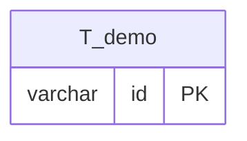

# Database Model Documentation

## Overview

The abstrapact database currently contains a minimal schema for the demo entity, which serves as a placeholder while the application's domain model (contracts, sales processes, products) is being developed.

The schema is compatible with both MySQL and H2 databases and follows a naming convention where all tables are prefixed with `T_`, foreign keys with `FK_`, and indices with `I_`.

## Entity Relationship Diagram

## Table Descriptions

### T_demo

The `T_demo` table stores a minimal demo entity used to validate the application's CRUD and authentication capabilities.

**Key Features:**
- Single-column table with a UUID primary key
- Used by the DemoResource REST endpoint and DemoService

**Constraints:**
- `id`: Primary key, VARCHAR(36)

**Default Data:**
- One seed record with id `e9877513-73cf-44fe-b581-4bad96e168cb`

## Naming Conventions

The database follows strict naming conventions for consistency and clarity:

- **Tables**: Prefixed with `T_` (e.g., `T_accounts`, `T_oauth_clients`)
- **Foreign Keys**: Format `FK_<tableName>_<columnName>` (e.g., `FK_credentials_account_id`)
- **Indices**: Format `I_<tableName>_<columnName(s)>` (e.g., `I_accounts_email`)
- **Primary Keys**: Always named `id` using VARCHAR(36) for UUID storage
- **Timestamps**: Use `created_at` and `expires_at` naming pattern

## Data Flow

Data flows from the Angular frontend through the Quarkus REST API (DemoResource) to the DemoService, which persists and retrieves records from the `T_demo` table via Hibernate ORM.

## Database Compatibility

The schema is designed to work with both MySQL and H2 databases:

- Uses standard SQL data types
- Avoids database-specific features
- Named constraints for explicit control
- Separate CREATE INDEX statements for compatibility
- BOOLEAN type supported by both databases
- VARCHAR lengths within common limits

## Indexes and Performance

Strategic indexes are placed for common query patterns:

- **Unique Indexes**: Enforce business rules (email, username, client_id, code)
- **Composite Indexes**: Support multi-column queries (client_id + account_id)
- **Expiration Indexes**: Enable efficient cleanup of expired records
- **Foreign Key Indexes**: Implicit indexes on FK columns for join performance

## Security Considerations

- **Password Storage**: Only hashed passwords stored, never plaintext
- **Expiration**: All temporary entities have expiration timestamps
- **Cascade Deletes**: Automatic cleanup of related records
- **One-Time Codes**: Authorization codes can only be used once

## Maintenance

### Cleanup Queries

As the schema evolves, add cleanup queries here for time-sensitive data such as expired sessions or temporary records.

### Monitoring Queries

As the schema evolves, add monitoring queries here for operational visibility.

