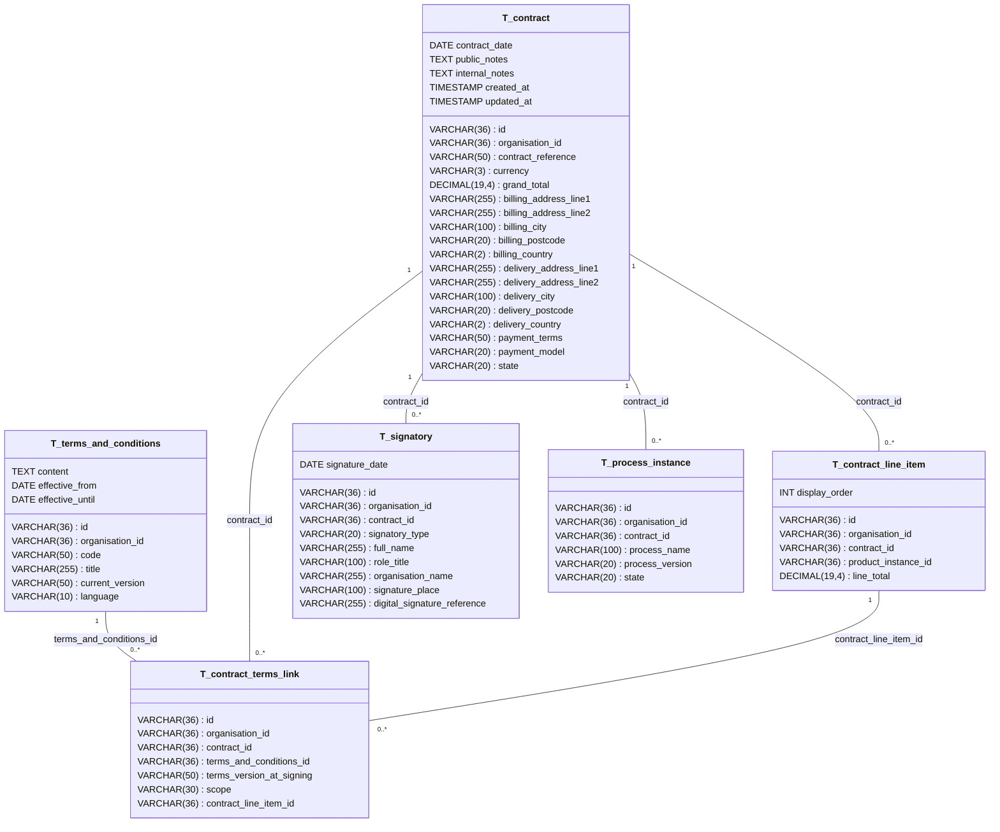

# Database Design: Contracts, Terms and Conditions

This document describes the database schema for the contract domain, following the design principles outlined in [DESIGN_OF_CONTRACTS.md](./DESIGN_OF_CONTRACTS.md).

## Overview

The schema is organised into two groups:

- **Terms and Conditions Catalogue** -- Reusable T&C documents that can be linked to contracts
- **Contract Instances** -- Concrete agreements created for specific customers, with line items, signatories, and an audit trail

## Entity Relationship Diagram

---

## Table Descriptions

### T_terms_and_conditions

Catalogue of reusable terms and conditions documents. Each entry represents a distinct T&C document with its own versioning and effective period.

| Column | Type | Description |
|--------|------|-------------|
| id | VARCHAR(36) | Primary key, UUID for the T&C record |
| organisation_id | VARCHAR(36) | Organisation that owns this T&C |
| code | VARCHAR(50) | Unique, human-readable identifier (e.g., "GENERAL-SALES") |
| title | VARCHAR(255) | Display title of the document |
| content | TEXT | Full text of the terms and conditions |
| current_version | VARCHAR(50) | Semantic version or revision identifier |
| effective_from | DATE | Date when this version becomes effective (nullable) |
| effective_until | DATE | Date when this version ceases to be effective (nullable) |
| language | VARCHAR(10) | Language code (e.g. "fr", "de", "en") for this T&C version (nullable) |

**Constraints:**
- Primary Key: `id`
- Unique: `code`

---

### T_contract

Contract instances. Each row represents a concrete agreement for a specific customer, capturing the negotiated terms, billing and delivery addresses, payment arrangements, and current lifecycle state.

| Column | Type | Description |
|--------|------|-------------|
| id | VARCHAR(36) | Primary key, UUID for the contract |
| organisation_id | VARCHAR(36) | Organisation that owns this contract |
| contract_reference | VARCHAR(50) | Unique, human-readable reference number |
| contract_date | DATE | Date the contract was agreed |
| currency | VARCHAR(3) | ISO currency code (e.g., CHF, EUR) |
| grand_total | DECIMAL(19,4) | Total contract value (default 0.00) |
| billing_address_line1 | VARCHAR(255) | Billing street address |
| billing_address_line2 | VARCHAR(255) | Billing address continuation |
| billing_city | VARCHAR(100) | Billing city |
| billing_postcode | VARCHAR(20) | Billing postal code |
| billing_country | VARCHAR(2) | Billing country ISO code |
| delivery_address_line1 | VARCHAR(255) | Delivery street address |
| delivery_address_line2 | VARCHAR(255) | Delivery address continuation |
| delivery_city | VARCHAR(100) | Delivery city |
| delivery_postcode | VARCHAR(20) | Delivery postal code |
| delivery_country | VARCHAR(2) | Delivery country ISO code |
| payment_terms | VARCHAR(50) | Human-readable payment terms |
| payment_model | VARCHAR(20) | PAY_FIRST or BILL_OVER_TIME |
| state | VARCHAR(20) | Current lifecycle state |
| public_notes | TEXT | Notes visible to the customer |
| internal_notes | TEXT | Internal-only notes |
| created_at | TIMESTAMP | Record creation timestamp |
| updated_at | TIMESTAMP | Last modification timestamp |

**Constraints:**
- Primary Key: `id`
- Unique: `contract_reference`
- Check: `payment_model` must be either 'PAY_FIRST' or 'BILL_OVER_TIME'
- Check: `state` must be one of 'DRAFT', 'OFFERED', 'ACCEPTED', 'AWAITING_APPROVAL', 'APPROVED', 'RUNNING', 'CANCELLED', 'EXPIRED', 'TERMINATED'

---

### T_contract_line_item

Individual line items within a contract. Each item references a concrete product instance and contributes to the contract grand total.

| Column | Type | Description |
|--------|------|-------------|
| id | VARCHAR(36) | Primary key, UUID for the line item |
| organisation_id | VARCHAR(36) | Organisation that owns this line item |
| contract_id | VARCHAR(36) | FK to the parent contract |
| product_instance_id | VARCHAR(36) | FK to the configured product instance |
| line_total | DECIMAL(19,4) | Price for this line item (default 0.00) |
| display_order | INT | Order for displaying the item (default 0) |

**Constraints:**
- Primary Key: `id`
- Foreign Key: `contract_id` references `T_contract(id)`
- Foreign Key: `product_instance_id` references `T_product_instance(id)`

---

### T_contract_terms_link

Links a contract to one or more terms and conditions documents. Special T&C can be attached at the line-item level; general T&C apply to the whole contract.

| Column | Type | Description |
|--------|------|-------------|
| id | VARCHAR(36) | Primary key, UUID for the link |
| organisation_id | VARCHAR(36) | Organisation that owns this link |
| contract_id | VARCHAR(36) | FK to the contract |
| terms_and_conditions_id | VARCHAR(36) | FK to the T&C document |
| terms_version_at_signing | VARCHAR(50) | Version snapshot at time of signing |
| scope | VARCHAR(30) | GENERAL or SPECIAL_FOR_LINE_ITEM |
| contract_line_item_id | VARCHAR(36) | FK to line item (nullable; populated when scope = SPECIAL_FOR_LINE_ITEM) |

**Constraints:**
- Primary Key: `id`
- Foreign Key: `contract_id` references `T_contract(id)`
- Foreign Key: `terms_and_conditions_id` references `T_terms_and_conditions(id)`
- Foreign Key: `contract_line_item_id` references `T_contract_line_item(id)`
- Check: `scope` must be either 'GENERAL' or 'SPECIAL_FOR_LINE_ITEM'

---

### T_signatory

Signatories to a contract. Captures both the SME representative and the customer representative, along with signature metadata.

| Column | Type | Description |
|--------|------|-------------|
| id | VARCHAR(36) | Primary key, UUID for the signatory |
| organisation_id | VARCHAR(36) | Organisation that owns this record |
| contract_id | VARCHAR(36) | FK to the contract |
| signatory_type | VARCHAR(20) | SME or CUSTOMER |
| full_name | VARCHAR(255) | Full name of the signatory |
| role_title | VARCHAR(100) | Job title or role |
| organisation_name | VARCHAR(255) | Name of the organisation they represent |
| signature_date | DATE | Date the signature was applied |
| signature_place | VARCHAR(100) | Location of signing |
| digital_signature_reference | VARCHAR(255) | Reference to digital signature storage |

**Constraints:**
- Primary Key: `id`
- Foreign Key: `contract_id` references `T_contract(id)`
- Check: `signatory_type` must be either 'SME' or 'CUSTOMER'

---

### T_process_instance

Generic process orchestration record that links a contract to its lifecycle workflow. The actual state transitions are stored in `T_process_instance_step` (see [DATABASE_PROCESSES.md](./DATABASE_PROCESSES.md)).

| Column | Type | Description |
|--------|------|-------------|
| id | VARCHAR(36) | Primary key, UUID for the process instance |
| organisation_id | VARCHAR(36) | Organisation that owns this record |
| contract_id | VARCHAR(36) | FK to the contract (nullable for non-contract processes) |
| process_name | VARCHAR(100) | Name of the process definition (e.g., "sales-process") |
| process_version | VARCHAR(20) | Version of the process definition |
| state | VARCHAR(20) | TO_BE_STARTED, IN_PROGRESS, BLOCKED, FAILED, or COMPLETED |

**Constraints:**
- Primary Key: `id`
- Foreign Key: `contract_id` references `T_contract(id)`
- Check: `state` must be one of 'TO_BE_STARTED', 'IN_PROGRESS', 'BLOCKED', 'FAILED', 'COMPLETED'

---

## Naming Conventions

All tables and columns follow the conventions defined in [database naming rules](../.windsurf/rules/database.md):

- **Tables**: Prefixed with `T_` (e.g., `T_contract`)
- **Foreign Keys**: Format `FK_<tableName>_<columnName>` (e.g., `FK_contract_line_item_contract_id`)
- **Indices**: Format `I_<tableName>_<columnName(s)>` (e.g., `I_contract_reference`)
- **Primary Keys**: Always named `id` using VARCHAR(36) for UUID storage
