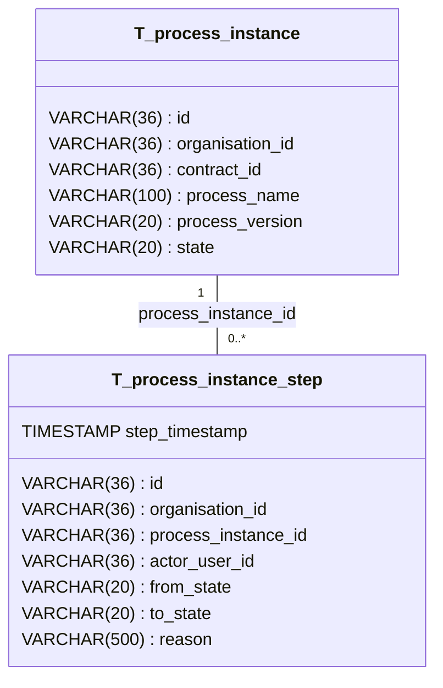

# Database Design: Processes

This document describes the generic process orchestration tables used to track workflows across the system.

## Overview

`ProcessInstance` and `ProcessInstanceStep` provide a single, reusable mechanism for recording any multi-step workflow. A process instance represents one execution of a defined process (e.g. the sales workflow for a specific contract). Each step within that instance records a single state transition with actor, timestamp, and reason.

## Entity Relationship Diagram

---

## Table Descriptions

### T_process_instance

Represents one running or completed execution of a defined business process.

| Column | Type | Description |
|--------|------|-------------|
| id | VARCHAR(36) | Primary key, UUID for the process instance |
| organisation_id | VARCHAR(36) | Organisation that owns this instance |
| contract_id | VARCHAR(36) | FK to the contract being processed (nullable for non-contract processes) |
| process_name | VARCHAR(100) | Name of the process definition (e.g., "sales-process", "onboarding") |
| process_version | VARCHAR(20) | Version of the process definition |
| state | VARCHAR(20) | Overall instance state |

**Constraints:**
- Primary Key: `id`
- Foreign Key: `contract_id` references `T_contract(id)`
- Check: `state` must be one of 'TO_BE_STARTED', 'IN_PROGRESS', 'BLOCKED', 'FAILED', 'COMPLETED'

---

### T_process_instance_step

Records a single transition within a process instance. The `from_state` and `to_state` values are free-text strings so that the same table can serve processes with different state vocabularies.

| Column | Type | Description |
|--------|------|-------------|
| id | VARCHAR(36) | Primary key, UUID for the step |
| organisation_id | VARCHAR(36) | Organisation that owns this step |
| process_instance_id | VARCHAR(36) | FK to the parent process instance |
| actor_user_id | VARCHAR(36) | ID of the user who triggered the transition (nullable) |
| step_timestamp | TIMESTAMP | When the transition occurred |
| from_state | VARCHAR(20) | State before the transition |
| to_state | VARCHAR(20) | State after the transition |
| reason | VARCHAR(500) | Optional human-readable reason |

**Constraints:**
- Primary Key: `id`
- Foreign Key: `process_instance_id` references `T_process_instance(id)`

---

## Naming Conventions

All tables and columns follow the conventions defined in [database naming rules](../.windsurf/rules/database.md):

- **Tables**: Prefixed with `T_` (e.g., `T_process_instance`)
- **Foreign Keys**: Format `FK_<tableName>_<columnName>` (e.g., `FK_process_instance_contract_id`)
- **Indices**: Format `I_<tableName>_<columnName(s)>` (e.g., `I_process_instance_contract`)
- **Primary Keys**: Always named `id` using VARCHAR(36) for UUID storage
