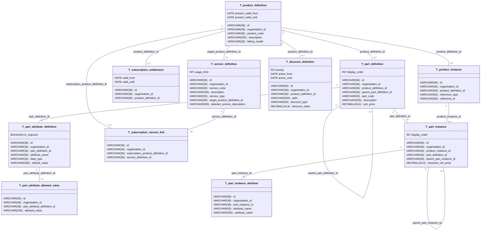

# Database Design: Products

This document describes the database schema for the product definition and product instance layers, following the design principles outlined in [DESIGN_OF_PRODUCTS.md](./DESIGN_OF_PRODUCTS.md).

## Overview

The schema is organized into two layers:

- **Product Definition Layer** -- Blueprints/templates that define what products exist and how they can be configured
- **Product Instance Layer** -- Concrete configurations created for specific customers or sales

## Entity Relationship Diagram

---

## Table Descriptions

### T_product_definition

Blueprint for sellable products. Contains the core product information including billing model (FIXED_PRICE or SUBSCRIPTION).

| Column | Type | Description |
|--------|------|-------------|
| id | VARCHAR(36) | Primary key, UUID for the product definition |
| organisation_id | VARCHAR(36) | Organisation that owns this product definition |
| product_code | VARCHAR(50) | Unique, human-readable identifier (e.g., PROD-001) |
| description | VARCHAR(255) | Display name and description for UI and documents |
| billing_model | VARCHAR(20) | Product category: FIXED_PRICE or SUBSCRIPTION |
| product_valid_from | DATE | Date when the product becomes valid (nullable) |
| product_valid_until | DATE | Date when the product expires (nullable) |

**Constraints:**
- Primary Key: `id`
- Unique: `product_code`
- Check: `billing_model` must be either 'FIXED_PRICE' or 'SUBSCRIPTION'

---

### T_service_definition

Services that can be linked to subscription products, defining what entitlements the subscription provides.

| Column | Type | Description |
|--------|------|-------------|
| id | VARCHAR(36) | Primary key, UUID for the service definition |
| organisation_id | VARCHAR(36) | Organisation that owns this service definition |
| service_code | VARCHAR(50) | Unique, human-readable identifier for the service |
| description | VARCHAR(255) | Display name and description |
| service_type | VARCHAR(20) | Type: PRODUCT_ACCESS or ABSTRACT_SERVICE |
| target_product_definition_id | VARCHAR(36) | FK to product definition (for PRODUCT_ACCESS type) |
| usage_limit | INT | Maximum usage allowed (null = unlimited) |
| abstract_service_description | VARCHAR(500) | Description for abstract services |

**Constraints:**
- Primary Key: `id`
- Unique: `service_code`
- Check: `service_type` must be either 'PRODUCT_ACCESS' or 'ABSTRACT_SERVICE'
- Foreign Key: `target_product_definition_id` references `T_product_definition(id)`

---

### T_subscription_entitlement

Validity periods for subscription products, defining when the subscription is active.

| Column | Type | Description |
|--------|------|-------------|
| id | VARCHAR(36) | Primary key, UUID for the entitlement |
| organisation_id | VARCHAR(36) | Organisation that owns this entitlement |
| product_definition_id | VARCHAR(36) | FK to the subscription product definition |
| valid_from | DATE | Start date of the subscription validity (inclusive) |
| valid_until | DATE | End date of the subscription validity (inclusive) |

**Constraints:**
- Primary Key: `id`
- Foreign Key: `product_definition_id` references `T_product_definition(id)`

---

### T_part_definition

Tree structure of product components. Each product definition has a tree of parts that define its structure and pricing.

| Column | Type | Description |
|--------|------|-------------|
| id | VARCHAR(36) | Primary key, UUID for the part definition |
| organisation_id | VARCHAR(36) | Organisation that owns this part definition |
| product_definition_id | VARCHAR(36) | FK to the parent product definition |
| parent_part_definition_id | VARCHAR(36) | FK to parent part (self-referencing, nullable for root) |
| part_code | VARCHAR(50) | Human-readable identifier for the part |
| description | VARCHAR(255) | Display name and description |
| unit_price | DECIMAL(19,4) | Unit price for this part (default 0.00) |
| display_order | INT | Order for displaying parts in UI (default 0) |

**Constraints:**
- Primary Key: `id`
- Foreign Key: `product_definition_id` references `T_product_definition(id)`
- Foreign Key: `parent_part_definition_id` references `T_part_definition(id)` (self-referencing)

---

### T_part_attribute_definition

Defines what attributes a part can have, including data type and constraints.

| Column | Type | Description |
|--------|------|-------------|
| id | VARCHAR(36) | Primary key, UUID for the attribute definition |
| organisation_id | VARCHAR(36) | Organisation that owns this attribute definition |
| part_definition_id | VARCHAR(36) | FK to the parent part definition |
| attribute_name | VARCHAR(50) | Name of the attribute (e.g., colour, weight_kg) |
| data_type | VARCHAR(20) | Data type: STRING, INTEGER, DECIMAL, BOOLEAN, or DATE |
| is_required | BOOLEAN | Whether this attribute is mandatory (default FALSE) |
| default_value | VARCHAR(255) | Default value if none provided (nullable) |

**Constraints:**
- Primary Key: `id`
- Foreign Key: `part_definition_id` references `T_part_definition(id)`
- Check: `data_type` must be one of 'STRING', 'INTEGER', 'DECIMAL', 'BOOLEAN', 'DATE'
- Unique: `(part_definition_id, attribute_name)`

---

### T_part_attribute_allowed_value

Valid values for constrained attributes that have a fixed set of allowed values.

| Column | Type | Description |
|--------|------|-------------|
| id | VARCHAR(36) | Primary key, UUID for the allowed value |
| organisation_id | VARCHAR(36) | Organisation that owns this allowed value |
| part_attribute_definition_id | VARCHAR(36) | FK to the attribute definition |
| allowed_value | VARCHAR(255) | One valid value for the attribute |

**Constraints:**
- Primary Key: `id`
- Foreign Key: `part_attribute_definition_id` references `T_part_attribute_definition(id)`

---

### T_discount_definition

Discounts applied to specific paths in the product tree, with configurable discount types and validity periods.

| Column | Type | Description |
|--------|------|-------------|
| id | VARCHAR(36) | Primary key, UUID for the discount definition |
| organisation_id | VARCHAR(36) | Organisation that owns this discount |
| product_definition_id | VARCHAR(36) | FK to the product definition |
| path | VARCHAR(255) | Path in the part tree (e.g., /root/part-a/part-b) |
| discount_type | VARCHAR(20) | Type: PERCENTAGE, FIXED_AMOUNT, or OVERRIDE |
| discount_value | DECIMAL(19,4) | The discount value (default 0.00) |
| priority | INT | Priority for applying multiple discounts (default 0) |
| active_from | DATE | Date when discount becomes active (nullable) |
| active_until | DATE | Date when discount expires (nullable) |

**Constraints:**
- Primary Key: `id`
- Foreign Key: `product_definition_id` references `T_product_definition(id)`
- Check: `discount_type` must be one of 'PERCENTAGE', 'FIXED_AMOUNT', 'OVERRIDE'

---

### T_subscription_service_link

Links subscriptions to their services, defining which services are included in a subscription product.

| Column | Type | Description |
|--------|------|-------------|
| id | VARCHAR(36) | Primary key, UUID for the link |
| organisation_id | VARCHAR(36) | Organisation that owns this link |
| subscription_product_definition_id | VARCHAR(36) | FK to the subscription product definition |
| service_definition_id | VARCHAR(36) | FK to the service definition |

**Constraints:**
- Primary Key: `id`
- Foreign Key: `subscription_product_definition_id` references `T_product_definition(id)`
- Foreign Key: `service_definition_id` references `T_service_definition(id)`
- Unique: `(subscription_product_definition_id, service_definition_id)`

---

### T_product_instance

Concrete configurations created for specific customers or sales. Captures what has been chosen from the definition.

| Column | Type | Description |
|--------|------|-------------|
| id | VARCHAR(36) | Primary key, UUID for the product instance |
| organisation_id | VARCHAR(36) | Organisation that owns this instance |
| product_definition_id | VARCHAR(36) | FK to the source product definition |
| reference_type | VARCHAR(50) | Type of reference (e.g., CONTRACT_LINE, ORDER_LINE) |
| reference_id | VARCHAR(36) | ID of the referencing entity |

**Constraints:**
- Primary Key: `id`
- Foreign Key: `product_definition_id` references `T_product_definition(id)`

---

### T_part_instance

Tree structure of included parts within a product instance. Each node represents one physical part with its resolved price.

| Column | Type | Description |
|--------|------|-------------|
| id | VARCHAR(36) | Primary key, UUID for the part instance |
| organisation_id | VARCHAR(36) | Organisation that owns this instance |
| product_instance_id | VARCHAR(36) | FK to the parent product instance |
| part_definition_id | VARCHAR(36) | FK to the source part definition |
| parent_part_instance_id | VARCHAR(36) | FK to parent part instance (self-referencing, nullable) |
| resolved_unit_price | DECIMAL(19,4) | Snapshot price at time of creation (default 0.00) |
| display_order | INT | Order for displaying parts (default 0) |

**Constraints:**
- Primary Key: `id`
- Foreign Key: `product_instance_id` references `T_product_instance(id)`
- Foreign Key: `part_definition_id` references `T_part_definition(id)`
- Foreign Key: `parent_part_instance_id` references `T_part_instance(id)` (self-referencing)

---

### T_part_instance_attribute

Actual attribute values for part instances, storing the configured values for each attribute.

| Column | Type | Description |
|--------|------|-------------|
| id | VARCHAR(36) | Primary key, UUID for the attribute instance |
| organisation_id | VARCHAR(36) | Organisation that owns this attribute |
| part_instance_id | VARCHAR(36) | FK to the parent part instance |
| attribute_name | VARCHAR(50) | Name of the attribute |
| attribute_value | VARCHAR(255) | The configured value |

**Constraints:**
- Primary Key: `id`
- Foreign Key: `part_instance_id` references `T_part_instance(id)`
- Unique: `(part_instance_id, attribute_name)`

---

## Naming Conventions

All tables and columns follow the conventions defined in [database naming rules](../.windsurf/rules/database.md):

- **Tables**: Prefixed with `T_` (e.g., `T_product_definition`)
- **Foreign Keys**: Format `FK_<tableName>_<columnName>` (e.g., `FK_part_definition_product_definition_id`)
- **Indices**: Format `I_<tableName>_<columnName(s)>` (e.g., `I_product_definition_product_code`)
- **Primary Keys**: Always named `id` using VARCHAR(36) for UUID storage
