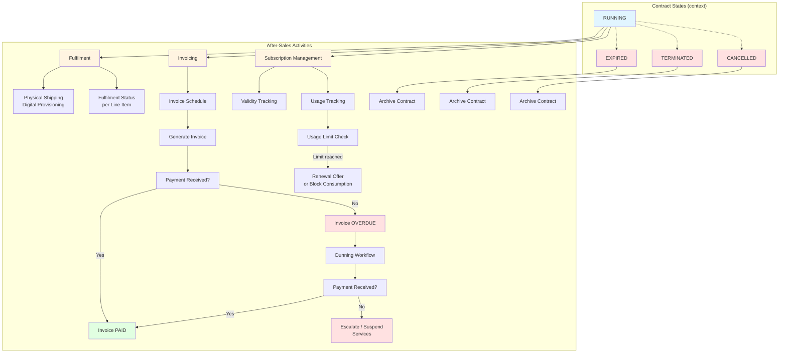
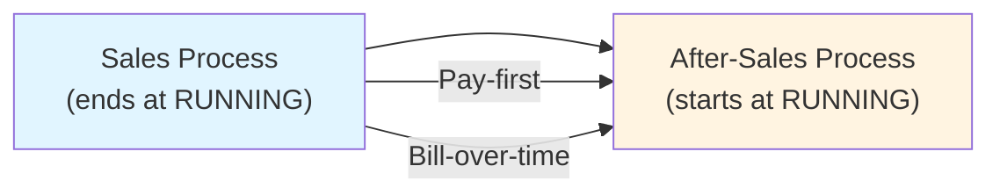

# Design of After-Sales Process

## Overview

The after-sales process begins when a contract reaches the `RUNNING` state. Its purpose is to manage the ongoing relationship with the customer: delivering the products or services promised, invoicing according to the agreed schedule, and handling any issues that arise during the life of the contract.

The after-sales process is **orthogonal** to the contract state machine. While the contract states (`RUNNING`, `EXPIRED`, `TERMINATED`) describe the legal status of the agreement, the after-sales process tracks the operational activities required to honour that agreement.

---

## Responsibilities

The after-sales process is responsible for:

- **Fulfilment** -- shipping physical products, provisioning digital services, or scheduling work.
- **Invoicing** -- generating and sending invoices according to the contract's payment schedule.
- **Payment tracking** -- recording received payments, identifying overdue invoices, and managing dunning.
- **Subscription lifecycle** -- tracking subscription validity periods, renewing or expiring subscriptions, and monitoring service consumption against usage limits.
- **Issue resolution** -- handling support requests, disputes, or delivery problems that arise after the sale is closed.
- **Contract end-of-life** -- managing natural expiration or early termination.

---

## After-Sales Activities

### 1. Fulfilment

Once the contract is `RUNNING`, the system initiates fulfilment for each line item.

- **Fixed-price physical products** -- generate a pick list or shipment order. Track the shipment status (`PENDING`, `SHIPPED`, `DELIVERED`).
- **Fixed-price digital products** -- provision access credentials or download links.
- **Subscription services** -- activate the customer's entitlement in the subscription system so that they can begin consuming services.

Fulfilment status is tracked per line item, not at the contract level, because different products may have different lead times.

### 2. Invoicing and Payment Schedule

The invoicing behaviour depends on the payment model chosen during the [sales process](DESIGN_OF_SALES_PROCESS.md).

#### Pay-First Contracts

- The initial invoice was already paid during the sales process.
- No further invoices are expected unless the contract includes add-on purchases or amendments.
- The after-sales process monitors for any supplementary charges.

#### Bill-Over-Time Contracts

- An invoice schedule was generated when the contract entered `RUNNING`.
- Invoices are issued automatically on the scheduled dates (e.g. monthly, quarterly).
- Each invoice references the contract and the period it covers.
- Payments are recorded against invoices. An invoice may be `ISSUED`, `PARTIALLY_PAID`, `PAID`, or `OVERDUE`.

### 3. Payment Tracking and Dunning

- When an invoice becomes `OVERDUE`, the after-sales process initiates a dunning workflow.
- Dunning steps may include:
  - Automated reminder emails.
  - Escalation to an accounts-receivable officer after a grace period.
  - Suspension of services (for subscription contracts) if payment remains unresolved.
- The dunning workflow does **not** automatically terminate the contract. Termination is a legal step that requires human authorisation.

### 4. Subscription Lifecycle Management

For contracts that include subscription products:

- **Validity tracking** -- monitor the `valid_from` and `valid_until` dates on each subscription service.
- **Usage tracking** -- record consumption against product-access services and compare against the `usage_limit` defined in the [service definition](DESIGN_OF_PRODUCTS.md).
- **Renewal** -- before a subscription expires, the system may generate a renewal offer (a new contract in `DRAFT` state) for the customer to accept.
- **Pro-rata handling** -- if a subscription is activated mid-period, the first invoice may be pro-rated.

### 5. Issue Resolution

- Support requests or disputes are logged as **cases** linked to the contract.
- Each case has a type (e.g. `DELIVERY_PROBLEM`, `BILLING_QUERY`, `QUALITY_ISSUE`), a priority, and a resolution status.
- Cases do not change the contract state directly, but a pattern of unresolved cases may trigger a human review that leads to termination.

### 6. Contract End-of-Life

- **Natural expiration** -- when all subscription services have passed their `valid_until` dates and all products have been fulfilled, the contract transitions from `RUNNING` to `EXPIRED`.
- **Early termination** -- either party may invoke termination according to the terms and conditions. The contract moves to `TERMINATED`.
- **Cancellation** -- a running contract may be voided (moved to `CANCELLED`) if a legal defect is discovered. This is rare and requires SME authorisation.

---

## After-Sales Process Diagram

The diagram below shows the operational activities that run in parallel once the contract is `RUNNING`. The contract state transitions from the [contract design](DESIGN_OF_CONTRACTS.md) are shown as dashed lines for context.



---

## Data Model Sketch (After-Sales Layer)

```
FulfilmentEvent
- id (PK)
- contract_line_item_id (FK -> ContractLineItem)
- event_type (SHIPMENT | DIGITAL_PROVISION | SERVICE_ACTIVATION)
- status (PENDING | IN_PROGRESS | COMPLETED | FAILED)
- tracking_reference (nullable)
- created_at
- completed_at (nullable)

Invoice
- id (PK)
- contract_id (FK -> Contract)
- invoice_number (unique, not null)
- issue_date
- due_date
- period_from (nullable)
- period_to (nullable)
- total_amount
- amount_paid
- status (DRAFT | ISSUED | PARTIALLY_PAID | PAID | OVERDUE | VOID)
- created_at

InvoiceLineItem
- id (PK)
- invoice_id (FK)
- contract_line_item_id (FK -> ContractLineItem, nullable)
- description
- amount

Payment
- id (PK)
- invoice_id (FK -> Invoice)
- amount
- received_at
- payment_method
- transaction_reference

DunningRecord
- id (PK)
- invoice_id (FK -> Invoice)
- dunning_level (1 | 2 | 3)
- sent_at
- reminder_type (EMAIL | LETTER | PHONE)
- response (nullable)
- escalated_to_user_id (nullable)

SubscriptionUsageRecord
- id (PK)
- contract_line_item_id (FK -> ContractLineItem)
- service_definition_id (FK -> ServiceDefinition)
- consumed_at
- quantity_consumed
- remaining_limit_after (nullable)

SupportCase
- id (PK)
- contract_id (FK -> Contract)
- case_type (DELIVERY_PROBLEM | BILLING_QUERY | QUALITY_ISSUE | OTHER)
- priority (LOW | MEDIUM | HIGH | CRITICAL)
- status (OPEN | IN_PROGRESS | WAITING_CUSTOMER | RESOLVED | CLOSED)
- assigned_to_user_id (nullable)
- created_at
- resolved_at (nullable)
```

---

## Relationship to Sales Process



The two processes are sequential but have different owners:

- **Sales** is owned by the sales team. Its goal is to get a signed, paid (or approved) contract into `RUNNING`.
- **After-sales** is owned by operations, finance, and support. Its goal is to fulfil the contract, collect revenue, and manage the customer relationship until the contract ends.

---

## Open Questions

1. Should the dunning workflow be **configurable per customer** (some customers get more reminders than others) or globally standardised?
2. Should the system support **partial fulfilment** (ship some line items while others are back-ordered) or does everything ship together?
3. Is there a need for a **service-desk integration** so that support cases can be raised automatically from subscription usage alerts or failed fulfilment events?
4. Should renewal offers be generated **automatically** by the after-sales process, or is that a manual step triggered by the sales team?
