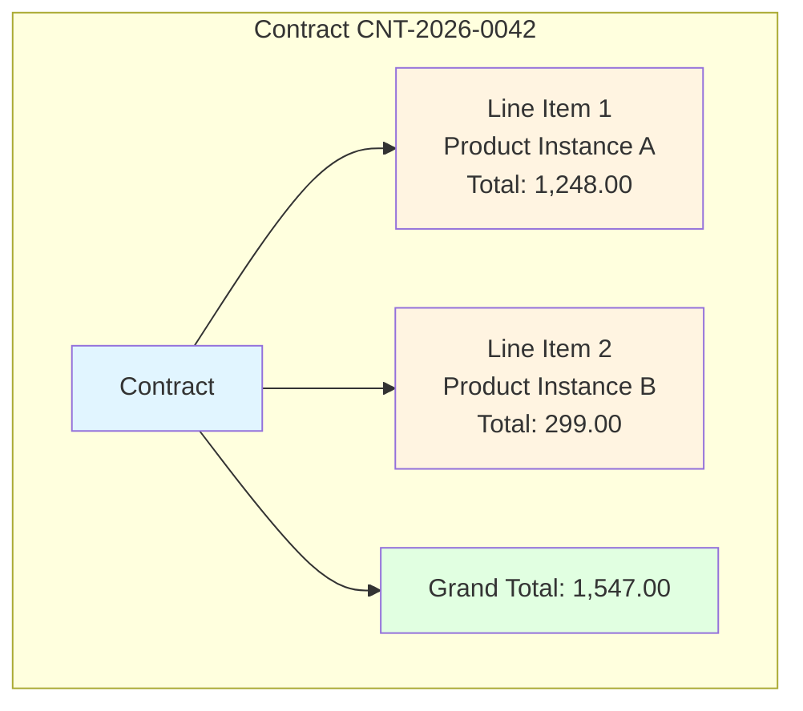
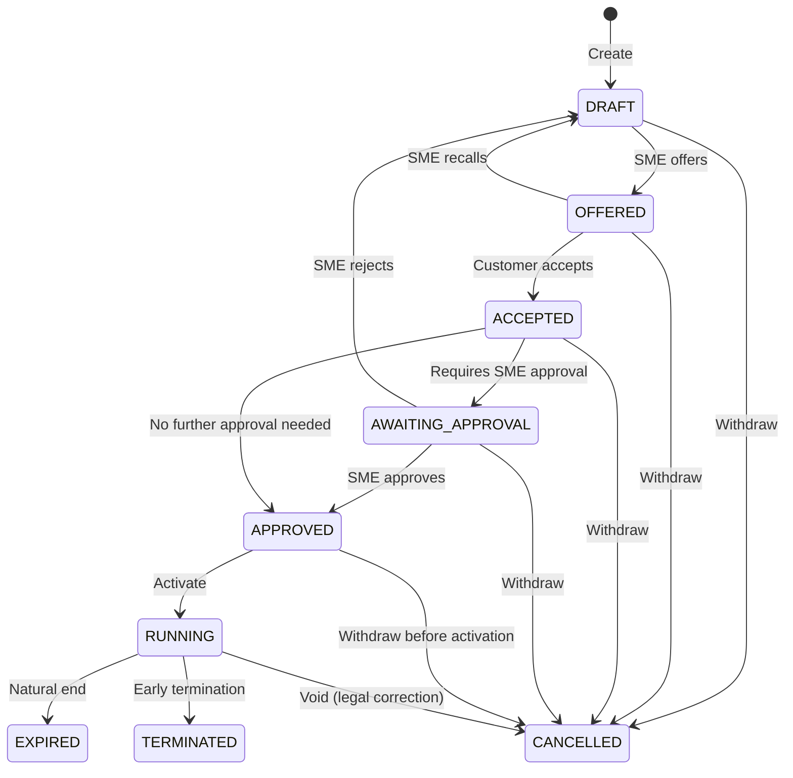
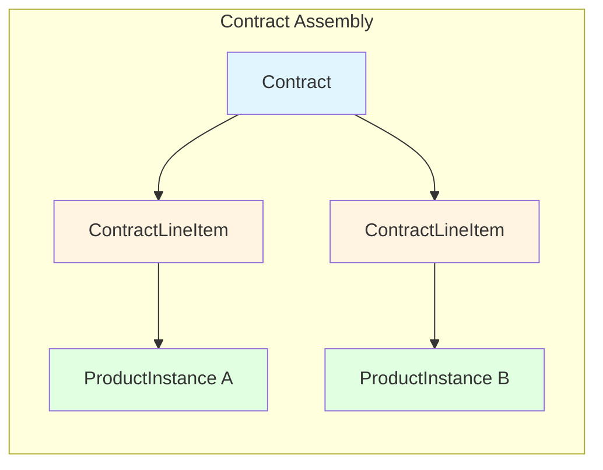

# Design of Contracts

## Overview

A contract is the legal agreement between the SME and a customer. It brings together everything required for a sale: the products the customer is buying, the total price, the terms both parties agree to, and the signatures that make it binding.

A contract references one or more [product instances](DESIGN_OF_PRODUCTS.md#product-instance) (the concrete configurations the customer will receive), but it does not duplicate the part-level tree data. The contract stores the line-item summary and the total amount; the instance tree is stored in the product instance layer.

---

## Contract Elements

### 1. Contract Reference Number

A unique, human-readable identifier for the contract (e.g. `CNT-2026-0042`). Used in correspondence, reporting, and integration with external accounting or CRM systems.

### 2. Contract Date

The date on which the contract is considered to have been created or issued. This is not necessarily the same as any signature date.

### 3. Product Instances

A contract contains **one or more product instances**.

- Each line item points to a single `ProductInstance` record.
- The line item stores the resolved total price of that instance at the time the contract is formed.
- The contract itself also stores a **grand total** so that the agreed amount is visible at the contract level without traversing all instances.
- The product instances are created from `ProductDefinition` records at the moment the contract is assembled.



### 4. Terms and Conditions

The contract references one or more terms-and-conditions documents drawn from a **catalogue**.

- The catalogue is a repository of reusable T&C documents maintained by the SME.
- Each T&C entry has a version identifier. The contract records which version was in force at the time of signing.
- This ensures that a contract signed under "Standard Terms v3.2" remains bound to that version even if the SME later publishes v3.3.
- A contract must reference at least one T&C document.

### 5. Signatories

A contract has exactly **two signatories**:

- **SME signatory** -- the representative of the SME who is authorised to enter into the agreement.
- **Customer signatory** -- the individual who accepts the agreement on behalf of the customer.

For each signatory the contract records:

- **Name** -- full legal name of the person.
- **Role / Title** -- the capacity in which they are signing (e.g. "Managing Director", "Authorised Officer").
- **Organisation** -- the legal entity they represent.
- **Signature date** -- the date on which the signature was applied.
- **Signature place** -- the location (city, country) where the signature was applied.
- **Digital signature reference** -- a reference to the cryptographic signature or approval token captured by the system.

The two signature dates may differ (e.g. the SME signs on Monday and the customer signs on Wednesday).

### 6. Billing and Delivery Details

- **Billing address** -- where invoices are sent.
- **Delivery address** -- where physical products are shipped (may be the same as the billing address).
- **Payment terms** -- e.g. "Net 30 days", "Payment on delivery", "Monthly by direct debit".
- **Currency** -- the currency in which all prices and totals are denominated.

### 7. Payment Model

The contract declares which payment model governs how and when the customer pays.

```java
enum PaymentModel {
    /** The contract does not enter RUNNING until the initial invoice is paid in full. */
    PAY_FIRST,

    /** The contract enters RUNNING as soon as it is approved;
        invoices are issued periodically over the life of the contract. */
    BILL_OVER_TIME
}
```

- The payment model is selected when the contract is drafted and cannot be changed once the contract has been offered.
- It determines the behaviour of the [sales process](DESIGN_OF_SALES_PROCESS.md) after the contract reaches `APPROVED`.

### 8. Contract State

The contract moves through a defined lifecycle. The states are listed below in the order they are normally encountered.

```java
enum ContractState {
    /** The SME has created a draft which the customer may see. */
    DRAFT,

    /** The SME has offered the draft to the customer so that they can review it. */
    OFFERED,

    /** The customer has accepted the offer. */
    ACCEPTED,

    /** The customer has accepted the offer but it still needs approval from the SME. */
    AWAITING_APPROVAL,

    /** The SME has approved the accepted offer and it will shortly be running.
        E.g. final documents are still being prepared. */
    APPROVED,

    /** The SME has a running contract with the customer. Their subscription may
        not yet have started; products may not have been shipped yet. */
    RUNNING,

    /** The contract has been cancelled as though it never existed. This happens
        if for legal reasons it should never have come to fruition, or e.g. it
        has been replaced with a corrected contract. */
    CANCELLED,

    /** The contract has run its length. A subscription is complete, or products
        have been dispatched and delivered. */
    EXPIRED,

    /** The contract was terminated prematurely by either side, according to the
        terms and conditions in the contract. */
    TERMINATED
}
```

**State transitions**



### 9. Notes and Internal Comments

- **Public notes** -- visible to both the SME and the customer on the contract record.
- **Internal notes** -- visible only to the SME; used for reminders, risk flags, or approval commentary.

### 10. Audit Trail

Every transition between states is recorded with:

- Timestamp
- Actor (user identifier)
- From state
- To state
- Optional reason / comment

---

## Data Model Sketch

```
Contract
- id (PK)
- contract_reference (unique, not null)
- contract_date
- currency
- grand_total
- billing_address_line1
- billing_address_line2
- billing_city
- billing_postcode
- billing_country
- delivery_address_line1
- delivery_address_line2
- delivery_city
- delivery_postcode
- delivery_country
- payment_terms
- payment_model (PaymentModel)
- state (ContractState)
- public_notes
- internal_notes
- created_at
- updated_at

ContractLineItem
- id (PK)
- contract_id (FK)
- product_instance_id (FK -> ProductInstance)
- line_total
- display_order

ContractTermsLink
- id (PK)
- contract_id (FK)
- terms_and_conditions_id (FK -> TermsAndConditions)
- terms_version_at_signing

TermsAndConditions
- id (PK)
- code (unique, not null)
- title
- content (text or URL)
- current_version
- effective_from
- effective_until (nullable)

Signatory
- id (PK)
- contract_id (FK)
- signatory_type (SME | CUSTOMER)
- full_name
- role_title
- organisation_name
- signature_date
- signature_place
- digital_signature_reference

ContractStateTransition
- id (PK)
- contract_id (FK)
- from_state
- to_state
- actor_user_id
- transitioned_at
- reason
```

---

## Relationship to Product Instances



A contract does not own the detailed part tree. The `ProductInstance` record (and its `PartInstance` tree) is the authoritative source for the configuration. The contract stores the summary price on each line item and the grand total at the contract level. This means:

- Historical contract values are preserved even if product definitions are later modified.
- The contract can be rendered for review without loading the entire part tree, if required.
- The part tree remains available for fulfilment, shipping, and support queries.

---

## Open Questions

1. Should a contract support **amendments** (new versions of the same contract with changed line items) or is every change a new contract with the old one cancelled?
2. Should the system enforce that a contract can only enter `RUNNING` once both signatures are present, or is that a configurable business rule?
3. Should there be a separate **fulfilment state** (e.g. `PENDING_SHIPMENT`, `SHIPPED`, `DELIVERED`) tracked per line item, distinct from the legal contract state?
4. Should `CANCELLED` contracts be **physically deleted** after a retention period, or must they remain in the database indefinitely for audit purposes?
