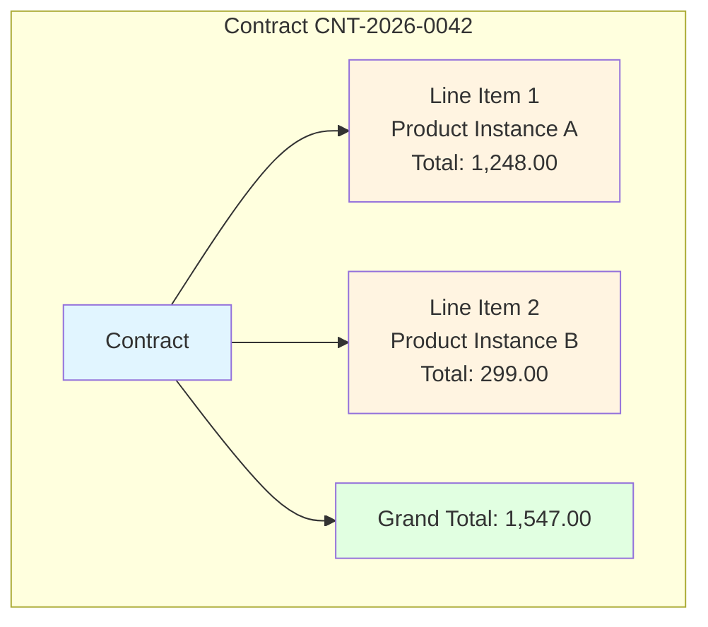
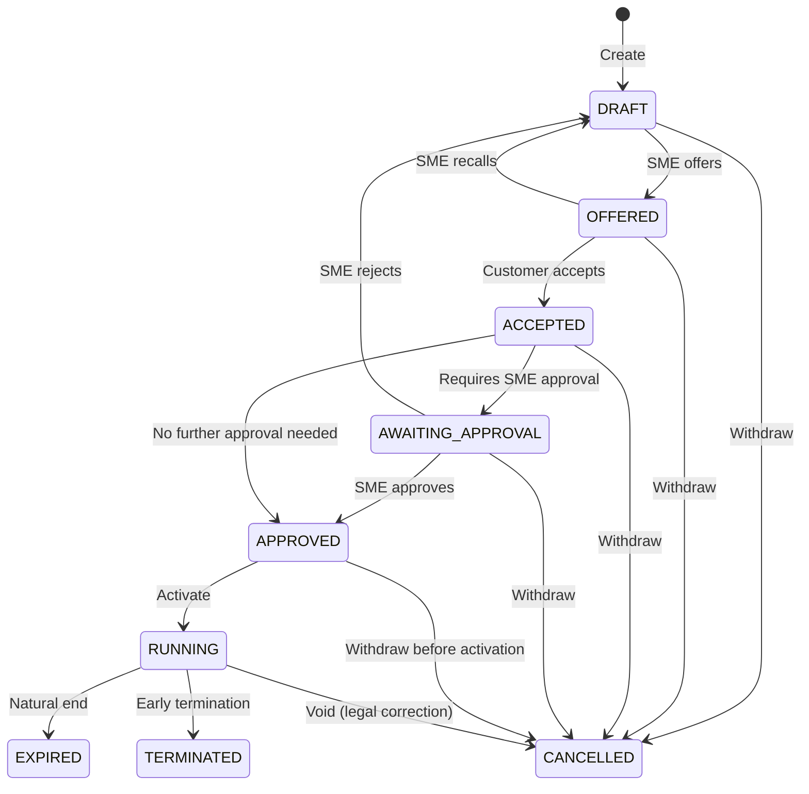
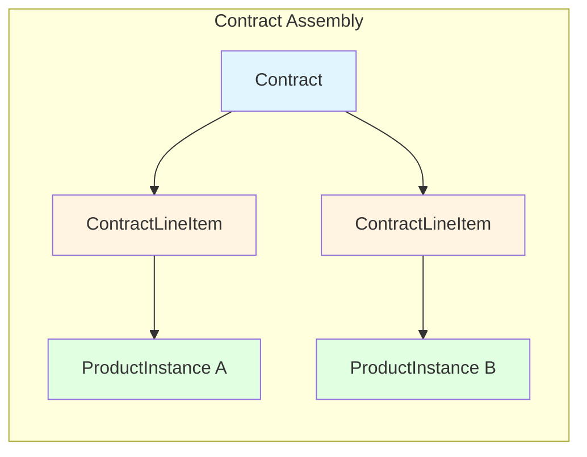

# Design of Contracts

## Overview

A contract is the legal agreement between the SME and a customer. It brings together everything required for a sale: the products the customer is buying, the total price, the terms both parties agree to, and the signatures that make it binding.

A contract references one or more [product instances](DESIGN_OF_PRODUCTS.md#product-instance) (the concrete configurations the customer will receive), but it does not duplicate the part-level tree data. The contract stores the line-item summary and the total amount; the instance tree is stored in the product instance layer.

---

## Contract Elements

### 1. Contract Reference Number

A unique, human-readable identifier for the contract (e.g. `CNT-2026-0042`). Used in correspondence, reporting, and integration with external accounting or CRM systems.

### 2. Contract Date

The date on which the contract is considered to have been created or issued. This is not necessarily the same as any signature date.

### 3. Product Instances

A contract contains **one or more product instances**.

- Each line item points to a single `ProductInstance` record.
- The line item stores the resolved total price of that instance at the time the contract is formed.
- The contract itself also stores a **grand total** so that the agreed amount is visible at the contract level without traversing all instances.
- The product instances are created from `ProductDefinition` records at the moment the contract is assembled.



### 4. Terms and Conditions

The contract references one or more terms-and-conditions documents drawn from a **catalogue**.

#### General Terms and Conditions

General T&C apply to the contract as a whole.

- The catalogue is a repository of reusable T&C documents maintained by the SME.
- Each T&C entry has a version identifier. The contract records which version was in force at the time of signing.
- This ensures that a contract signed under "Standard Terms v3.2" remains bound to that version even if the SME later publishes v3.3.
- A contract must reference at least one general T&C document.

#### Special Terms and Conditions

Special T&C are attached to individual `PartDefinition` records. They apply only when the corresponding part is selected by the customer during product configuration.

- A `PartDefinition` may optionally reference a `TermsAndConditions` document via `special_terms_and_conditions_id`.
- When the part is included in a product instance that becomes a contract line item, the special terms are added to the contract.
- The contract records which version of the special terms was in force at signing.

#### Precedence

The contract document must state that **special terms and conditions take precedence over general terms and conditions** where the two conflict. Special terms supplement the general terms for the specific product or service they apply to.

#### Legal Framework (Swiss Law)

Unlike German law (which has dedicated AGB provisions in §§ 305–310 BGB), Swiss law does not have a dedicated chapter on general terms and conditions in the Code of Obligations. The relevant legal basis is found in:

**Code of Obligations (OR)**
- **Art. 1 OR** — Good faith (`Treu und Glauben`): parties must exercise rights and fulfil obligations in good faith.
- **Art. 6 OR** — Tacit acceptance (`stillschweigende Annahme`): relevant for how terms are incorporated into the contract.
- **Art. 18 OR** — Form requirements (`Formvorschrift`): written-form clauses in GTC are only valid if the parties were aware of the form requirement.

**Swiss Civil Code (ZGB)**
- **Art. 8 ZGB** — Good faith in civil law.

**Unfair Competition Act (UWG)**
- **Art. 8 UWG** — Unfair business practices (`missbräuchliche Geschäftsbedingungen`): provides limited content control for particularly unfair clauses in consumer and B2B contexts.

**Case law (Bundesgericht)**
- The **unusualness rule** (`Ungewöhnlichkeitsregel`): a clause that is unusual and surprising is not binding on the accepting party unless it was clearly highlighted.
- **Individual agreements take precedence** over general terms where the two conflict.

Key requirements for the system:

- **Transparency** -- The customer must be able to review both general and any applicable special terms before accepting the contract. The UI should surface special terms when the customer configures an optional part.
- **No surprise clauses** -- Unusual clauses in special terms (e.g., liability limitations for a "premium support" add-on) must be clearly flagged so the customer is not bound by clauses they would not reasonably expect.
- **Versioning** -- Just like general terms, special terms must be versioned. A contract signed under "Warranty Terms v2.1" remains bound to that version even if the SME later publishes a new version.

### 5. Signatories

A contract has exactly **two signatories**:

- **SME signatory** -- the representative of the SME who is authorised to enter into the agreement.
- **Customer signatory** -- the individual who accepts the agreement on behalf of the customer.

For each signatory the contract records:

- **Name** -- full legal name of the person.
- **Role / Title** -- the capacity in which they are signing (e.g. "Managing Director", "Authorised Officer").
- **Organisation** -- the legal entity they represent.
- **Signature date** -- the date on which the signature was applied.
- **Signature place** -- the location (city, country) where the signature was applied.
- **Digital signature reference** -- a reference to the cryptographic signature or approval token captured by the system.

The two signature dates may differ (e.g. the SME signs on Monday and the customer signs on Wednesday).

### 6. Billing and Delivery Details

- **Billing address** -- where invoices are sent.
- **Delivery address** -- where physical products are shipped (may be the same as the billing address).
- **Payment terms** -- e.g. "Net 30 days", "Payment on delivery", "Monthly by direct debit".
- **Currency** -- the currency in which all prices and totals are denominated.

### 7. Payment Model

The contract declares which payment model governs how and when the customer pays.

```java
enum PaymentModel {
    /** The contract does not enter RUNNING until the initial invoice is paid in full. */
    PREPAID,

    /** The contract enters RUNNING as soon as it is approved;
        if the billing model is `SUBSCRIPTION` then invoices are issued periodically over the life of the contract. */
    POSTPAID
}
```

- Each `ProductDefinition` carries its own `PaymentModel`.
- The contract's payment model is **derived from its line items** when the draft is created:
  - if **any** line item product is `PREPAID`, the contract is `PREPAID`;
  - if **all** line item products are `POSTPAID`, the contract is `POSTPAID`;
  - a draft with no line items defaults to `PREPAID`.
- The contract can contain products with different `BillingModel` values (e.g. a fixed-price installation and a subscription service). The payment model is independent of the billing model.
- The payment model cannot be changed once the contract has been offered.
- It determines the behaviour of the [sales process](DESIGN_OF_SALES_PROCESS.md) after the contract reaches `APPROVED`.

### 8. Contract State

The contract moves through a defined lifecycle. The states are listed below in the order they are normally encountered.

```java
enum ContractState {
    /** The SME or customer has created a draft. Products can still be configured
        and line items can still be changed while in this state. */
    DRAFT,

    /** The draft has been finalised and the configuration is frozen. The contract is effectively in the shopping cart, offered to the customer, waiting for them to consider it and accept it. */
    OFFERED,

    /** The customer has accepted the offer. */
    ACCEPTED,

    /** The customer has accepted the offer but it still needs approval from the SME. */
    AWAITING_APPROVAL,

    /** The SME has approved the accepted offer and it will shortly be running.
        E.g. final documents are still being prepared. */
    APPROVED,

    /** The SME has a running contract with the customer. Their subscription may
        not yet have started; products may not have been shipped yet. */
    RUNNING,

    /** The contract has been cancelled as though it never existed. This happens
        if for legal reasons it should never have come to fruition, or e.g. it
        has been replaced with a corrected contract. */
    CANCELLED,

    /** The contract has run its length. A subscription is complete, or products
        have been dispatched and delivered. */
    EXPIRED,

    /** The contract was terminated prematurely by either side, according to the
        terms and conditions in the contract. */
    TERMINATED
}
```

**State transitions**



### 9. Notes and Internal Comments

- **Public notes** -- visible to both the SME and the customer on the contract record.
- **Internal notes** -- visible only to the SME; used for reminders, risk flags, or approval commentary.

### 10. Audit Trail

Contract lifecycle transitions are tracked through a generic `ProcessInstance` linked to the contract. Each step within the process records:

- Timestamp
- Actor (user identifier)
- From state
- To state
- Optional reason / comment

The `ProcessInstance` and `ProcessInstanceStep` tables are described in [DATABASE_PROCESSES.md](./DATABASE_PROCESSES.md).

---

## Data Model Sketch

```
Contract
- id (PK)
- contract_reference (unique, not null)
- contract_date
- currency
- grand_total
- billing_address_line1
- billing_address_line2
- billing_city
- billing_postcode
- billing_country
- delivery_address_line1
- delivery_address_line2
- delivery_city
- delivery_postcode
- delivery_country
- payment_terms
- payment_model (PaymentModel)
- state (ContractState)
- public_notes
- internal_notes
- created_at
- updated_at

ContractLineItem
- id (PK)
- contract_id (FK)
- product_instance_id (FK -> ProductInstance)
- line_total
- display_order

ContractTermsLink
- id (PK)
- contract_id (FK)
- terms_and_conditions_id (FK -> TermsAndConditions)
- terms_version_at_signing
- scope (GENERAL | SPECIAL_FOR_LINE_ITEM)
- contract_line_item_id (FK -> ContractLineItem, nullable, populated when scope = SPECIAL_FOR_LINE_ITEM)

TermsAndConditions
- id (PK)
- code (unique, not null)
- title
- content (text or URL)
- current_version
- effective_from
- effective_until (nullable)

Signatory
- id (PK)
- contract_id (FK)
- signatory_type (SME | CUSTOMER)
- full_name
- role_title
- organisation_name
- signature_date
- signature_place
- digital_signature_reference

ProcessInstance (generic -- see DATABASE_PROCESSES.md)
- id (PK)
- contract_id (FK, nullable for non-contract processes)
- process_name
- process_version
- state (TO_BE_STARTED | IN_PROGRESS | BLOCKED | FAILED | COMPLETED)

ProcessInstanceStep (generic -- see DATABASE_PROCESSES.md)
- id (PK)
- process_instance_id (FK)
- actor_user_id
- step_timestamp
- from_state
- to_state
- reason
```

---

## Relationship to Product Instances



A contract does not own the detailed part tree. The `ProductInstance` record (and its `PartInstance` tree) is the authoritative source for the configuration. The contract stores the summary price on each line item and the grand total at the contract level. This means:

- Historical contract values are preserved even if product definitions are later modified.
- The contract can be rendered for review without loading the entire part tree, if required.
- The part tree remains available for fulfilment, shipping, and support queries.

---

## Open Questions

1. Should a contract support **amendments** (new versions of the same contract with changed line items) or is every change a new contract with the old one cancelled?
2. Should the system enforce that a contract can only enter `RUNNING` once both signatures are present, or is that a configurable business rule?
3. Should there be a separate **fulfilment state** (e.g. `PENDING_SHIPMENT`, `SHIPPED`, `DELIVERED`) tracked per line item, distinct from the legal contract state?
4. Should `CANCELLED` contracts be **physically deleted** after a retention period, or must they remain in the database indefinitely for audit purposes?
