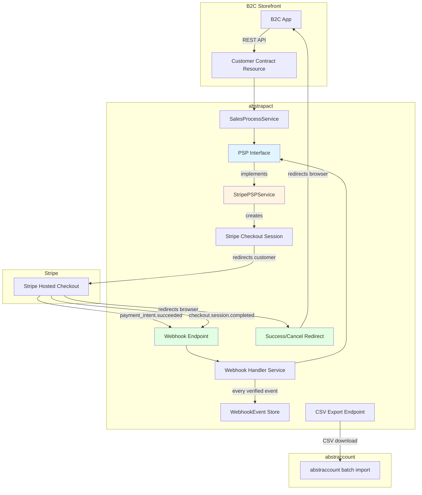
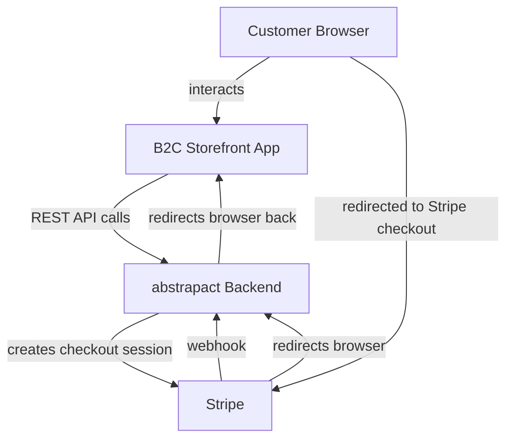
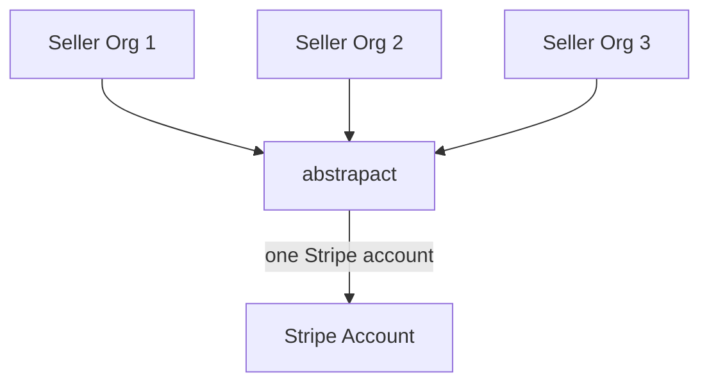
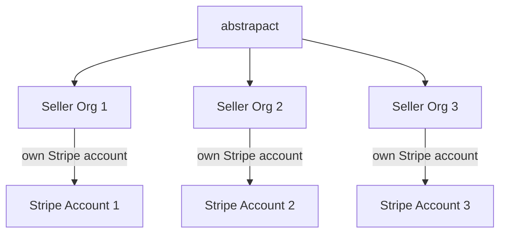
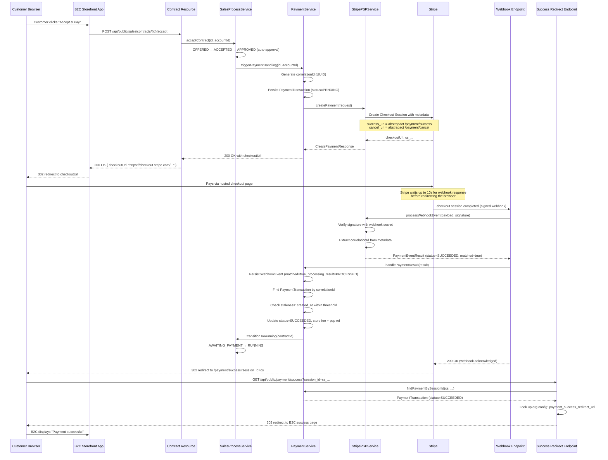
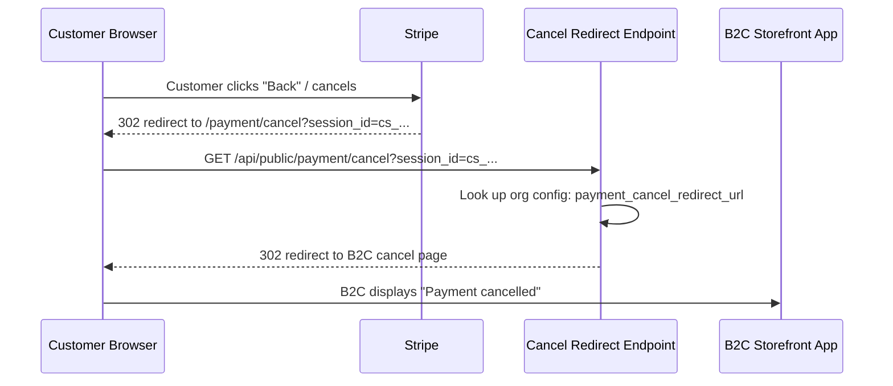
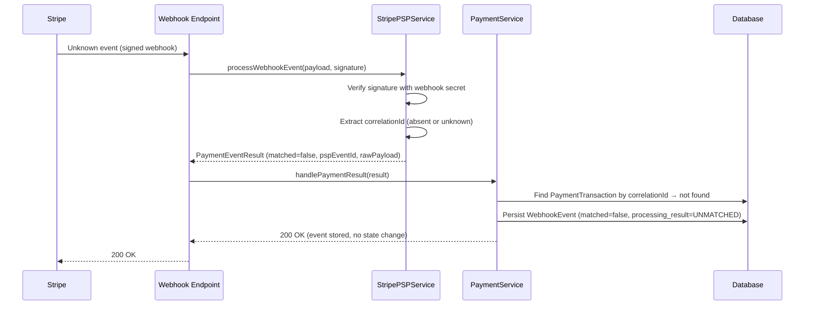
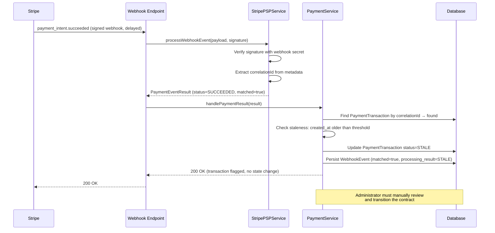

# Design of Payment Handling

## Overview

This document describes how abstrapact integrates with a Payment Service Provider (PSP) to
collect payments from customers. The integration is built around a **PSP-agnostic interface**
so that additional providers (PayPal, Square, Adyen, etc.) can be added later without
changing the sales process or the contract lifecycle.

The initial implementation supports **Stripe** only, using Stripe Checkout Sessions to
generate hosted payment pages that customers are redirected to. A webhook endpoint
receives signed payment events from Stripe and transitions the contract through the
payment states defined in [DESIGN_OF_SALES_PROCESS.md](./DESIGN_OF_SALES_PROCESS.md).

A CSV export endpoint allows the seller to download payment data in a format compatible
with the accounting software (abstraccount) for manual import.

---

## Concepts

### Payment Service Provider (PSP)

A PSP is an external service that processes card and online payments on behalf of the
seller. The PSP holds funds in a balance account until paying them out to the seller's
bank account. The PSP charges a processing fee per transaction.

### Payment Transaction

A **payment transaction** is abstrapact's internal record of a single payment attempt
through a PSP. It tracks:

- The contract being paid.
- The PSP that processed the payment.
- A **correlation ID** — an opaque UUID generated by abstrapact, never shown to any user,
  stored on the PSP object as metadata. When the webhook arrives, the correlation ID
  proves the event belongs to us and not to a forged request.
- The PSP's own transaction reference (e.g. Stripe's `pi_...` or `ch_...`).
- The gross amount, fee amount, and net amount.
- The currency.
- The payment status (pending, succeeded, failed, refunded).

### Correlation ID

> **Security requirement.** When creating a payment on the PSP, abstrapact generates a
> fresh UUID and stores it as metadata on the PSP object (e.g. in the Checkout Session's
> `payment_intent_data.metadata` and on the session itself). This UUID is **not** the
> contract id and is never exposed to the customer or the seller. When a webhook event
> arrives, abstrapact looks up the payment transaction by the correlation ID. If no
> matching transaction is found, the event is **stored as an unmatched webhook event**
> (see [Unmatched Webhook Events](#unmatched-webhook-events)) so that it can be
> investigated later. The contract state is not changed.
>
> This prevents an attacker from creating a draft contract, paying through their own
> Stripe infrastructure, and sending a forged webhook to mark their contract as paid.
> Additionally, a [staleness check](#staleness-check) prevents a delayed or replayed
> webhook from auto-completing an old pending transaction. The webhook payload is
> additionally verified using the Stripe webhook signing secret
> (see [Webhook Security](#webhook-security)).

### Idempotency

Webhook events may be delivered more than once. Every verified event is recorded in
`T_webhook_event` with a unique constraint on `(psp_identifier, psp_event_id)`, so a
redelivered event is detected as a duplicate. The payment transaction record ensures
that processing the same event twice does not double-transition the contract: once a
payment transaction is in a terminal state (`SUCCEEDED`, `FAILED`, `STALE`), subsequent
events for the same correlation ID are recorded with `processing_result=DUPLICATE` and
do not trigger another state transition.

---

## Architecture



### B2C Application Integration

abstrapact is a **backend-only service**. It is never called directly by the customer's
browser. Instead, a separate B2C application (the "storefront") interacts with the
customer's browser and calls abstrapact's REST API to drive the sales process. The
payment flow therefore involves three parties:



The end-to-end flow is:

1. **B2C app calls abstrapact** — `POST /api/public/sales/contracts/{id}/accept`.
   abstrapact transitions the contract to `APPROVED`, then to `AWAITING_PAYMENT`, creates
   a Stripe Checkout Session, and returns the `checkoutUrl` in the response body.
2. **B2C app redirects the browser** to the `checkoutUrl` (Stripe's hosted checkout page).
3. **Customer pays** on the Stripe-hosted page.
4. **Stripe sends the webhook** to abstrapact's webhook endpoint
   (`POST /api/public/payment/webhook`). **Stripe waits up to 10 seconds** for a `2xx`
   response before redirecting the customer's browser. This means that by the time the
   browser is redirected, the webhook has typically already been processed and the
   contract is in `RUNNING` state. If the webhook endpoint is down or slow, Stripe
   redirects the browser after 10 seconds regardless — the contract may still be in
   `AWAITING_PAYMENT` in that case.
5. **Stripe redirects the browser** to abstrapact's success endpoint
   (`GET /api/public/payment/success?session_id={CHECKOUT_SESSION_ID}`).
6. **abstrapact verifies the payment** by looking up the `PaymentTransaction` by the
   Stripe session id. If the transaction is `SUCCEEDED`, abstrapact redirects the browser
   to the B2C app's success page (configured per-organisation, see
   [Redirect URL Configuration](#redirect-url-configuration)). If the transaction is
   still `PENDING` (webhook not yet processed), abstrapact redirects to the B2C app's
   success page with a `status=processing` query parameter so the B2C app can display a
   "payment is being processed" message and poll the contract status.
7. **If the customer cancels**, Stripe redirects the browser to abstrapact's cancel
   endpoint (`GET /api/public/payment/cancel?session_id={CHECKOUT_SESSION_ID}`), which
   redirects to the B2C app's cancel page.

> **Why abstrapact handles the redirect, not Stripe directly to the B2C app:**
>
> 1. abstrapact needs to verify the payment status before the customer sees a success
>    page. If Stripe redirected directly to the B2C app, the B2C app would have to call
>    abstrapact to check the contract state, adding a round-trip. By having abstrapact
>    handle the redirect, the verification happens server-side and the browser is only
>    sent to the B2C app once the status is known.
> 2. **Third-party B2C apps.** Any third party is free to write their own B2C storefront
>    app and deploy it to any domain. The abstrapact operator should not have to
>    reconfigure their Stripe `success_url`/`cancel_url` settings every time a new
>    third party onboards. By having Stripe redirect to abstrapact (which has a fixed
>    URL), and then having abstrapact redirect to the per-organisation B2C URL configured
>    in `T_config`, each third party only configures their own redirect URL through the
>    product's configuration — no Stripe dashboard changes required.

### Redirect URL Configuration

The B2C app's success and cancel page URLs are **configured per-organisation** in the
`T_config` table, not passed by the B2C app at runtime. This prevents
[open redirect attacks](https://owasp.org/www-community/attacks/Unvalidated_Redirects_and_Forwards)
where an attacker could supply an arbitrary URL as the redirect destination.

Two new columns are added to `T_config`:

| Column | Description | Example |
|---|---|---|
| `payment_success_redirect_url` | URL the browser is redirected to after successful payment. May contain `{contractId}` placeholder. | `https://shop.example.com/checkout/success?contract={contractId}` |
| `payment_cancel_redirect_url` | URL the browser is redirected to after payment cancellation. | `https://shop.example.com/checkout/cancelled` |

These are set by an administrator when configuring the seller organisation. If a
redirect URL is not configured, abstrapact returns a simple HTML page indicating the
payment status (success/cancelled/processing) rather than redirecting.

> **Security:** The B2C app must **never** be allowed to pass a redirect URL as part of
> the accept request. Allowing client-supplied redirect URLs creates an open redirect
> vulnerability — see the
> [Capgo advisory GHSA-grc7-98pf-h8hq](https://github.com/Cap-go/capgo.app/security/advisories/GHSA-grc7-98pf-h8hq)
> for a real-world example. The redirect URLs are trusted because they are set by an
> administrator, not by the customer or the B2C app's client-side code.

### Stripe Webhook Timing

A critical aspect of the integration is the timing of the webhook relative to the
browser redirect:

- **Normal case:** Stripe sends the `checkout.session.completed` webhook and **waits up
  to 10 seconds** for a `2xx` response. abstrapact processes the webhook (marks the
  payment as `SUCCEEDED`, transitions the contract to `RUNNING`) and responds `200`.
  Stripe then immediately redirects the browser to the success URL. By the time the
  browser arrives at abstrapact's success endpoint, the contract is already `RUNNING`.

- **Webhook slow or down:** If abstrapact does not respond within 10 seconds, Stripe
  redirects the browser to the success URL anyway. The contract may still be in
  `AWAITING_PAYMENT`. abstrapact's success endpoint detects this (transaction is
  `PENDING`) and redirects to the B2C app with `status=processing`. The B2C app should
  poll the contract status (via `GET /api/public/sales/contracts/{id}`) until it
  transitions to `RUNNING`.

- **Webhook never delivered:** If the webhook is never delivered (e.g. abstrapact is
  down for an extended period), the contract remains in `AWAITING_PAYMENT`. The payment
  transaction will eventually be marked `STALE` by the staleness check when a late
  webhook arrives, or an administrator can manually reconcile via the Stripe dashboard.

> **Design implication:** abstrapact's webhook endpoint must respond **as quickly as
> possible** — within 10 seconds — to avoid the customer seeing a "processing" page.
> The webhook handler persists the `WebhookEvent` row and updates the `PaymentTransaction`
> synchronously, but defers any external calls (e.g. accounting export) to asynchronous
> processing.

### Stripe Account Ownership

There are two architectural options for which Stripe account processes the payments.
The initial implementation uses **Option A** (platform-owned), but the design supports
a future migration to **Option B** (seller-owned) where each seller organisation uses
their own Stripe account.

#### Option A: Platform-Owned Stripe Account (Initial Implementation)

A single Stripe account is configured at the abstrapact deployment level via environment
variables (`abstrapact.payment.stripe.secret-key`, etc.). All payments for all seller
organisations flow through this one account. abstrapact is the merchant of record.



**Advantages:**
- Simple to implement and operate — one set of credentials, one webhook endpoint.
- abstrapact controls the fee structure and can take a platform fee (via Stripe
  Connect or manual reconciliation).
- Sellers do not need their own Stripe accounts.

**Disadvantages:**
- All money flows through abstrapact's bank account — abstrapact is responsible for
  paying out to sellers.
- abstrapact is the merchant of record for tax and compliance purposes.
- A single Stripe account is a single point of failure.

#### Option B: Seller-Owned Stripe Accounts (Future)

Each seller organisation configures their own Stripe API key and webhook secret in
`T_config`. Payments are processed directly through the seller's own Stripe account.
The seller is the merchant of record.



**New `T_config` columns for Option B:**

| Column | Description |
|---|---|
| `stripe_secret_key` | Seller's Stripe secret API key (`sk_live_...`) |
| `stripe_webhook_secret` | Seller's Stripe webhook signing secret (`whsec_...`) |

The `StripePSPService` would be modified to load the Stripe credentials from the
seller's `T_config` row (looked up via the contract's `organisation_id`) instead of
from global environment variables. Each seller must configure a webhook endpoint in
their own Stripe dashboard pointing to abstrapact's webhook URL. The webhook handler
would need to identify which seller's Stripe account the event belongs to (via the
correlation ID lookup, which resolves to the contract and thus the organisation).

**Advantages:**
- Each seller is their own merchant of record — no payout responsibility for abstrapact.
- Sellers can use their own Stripe dashboard for refunds, disputes, and reporting.
- Third parties can fully self-serve: they bring their own Stripe account, configure
  their credentials and redirect URLs in `T_config`, and deploy their B2C app to any
  domain — all without the abstrapact operator touching any configuration.

**Disadvantages:**
- More complex: each seller must have a Stripe account and configure a webhook endpoint.
- The webhook endpoint must handle events from multiple Stripe accounts — the signing
  secret is different per seller, so the webhook handler must try to identify the seller
  before verifying the signature, or use Stripe's
  [webhook endpoints with account filtering](https://docs.stripe.com/webhooks.md#webhook-endpoints).
- abstrapact cannot take an automatic platform fee (would need Stripe Connect for that).

> **Migration path:** The `PSPInterface` abstraction means the switch from Option A to
> Option B is isolated to `StripePSPService` and the configuration loading. The rest of
> the system (correlation IDs, webhook event handling, staleness checks, redirect logic)
> is unchanged. The migration can be done per-organisation: sellers who have configured
> their own Stripe credentials use Option B, others fall back to the platform account
> (Option A).

### Package Structure

All payment code lives under a new package
`dev.abstratium.abstrapact.non_multitenancy.sales.payment`:

```
dev.abstratium.abstrapact.non_multitenancy.sales.payment
├── boundary
│   ├── PaymentWebhookResource.java          # Stripe webhook endpoint
│   ├── PaymentRedirectResource.java         # success/cancel browser redirect endpoints
│   ├── PaymentExportResource.java           # CSV export endpoint
│   └── dto
│       ├── CreatePaymentResponse.java       # returned to the B2C app
│       ├── PaymentEventResult.java          # result of processing a webhook event
│       └── PaymentExportRow.java            # one row in the CSV export
├── service
│   ├── PaymentService.java                  # orchestrates payment creation, webhook handling, staleness check
│   ├── PaymentTransactionService.java       # CRUD for payment transaction records
│   ├── WebhookEventService.java             # persists and deduplicates webhook event records
│   ├── PSPInterface.java                    # PSP-agnostic interface
│   └── stripe
│       └── StripePSPService.java            # Stripe implementation of PSPInterface
└── entity
    ├── PaymentTransaction.java              # JPA entity
    └── WebhookEvent.java                    # JPA entity — audit log of every verified webhook call
```

---

## PSP Interface

The `PSPInterface` abstracts the PSP-specific operations that abstrapact needs. Each PSP
implementation provides its own CDI bean. The active PSP is selected via configuration.

```java
public interface PSPInterface {

    /**
     * Creates a payment for the given contract and returns a URL the customer
     * can be redirected to in order to complete payment.
     *
     * @param request the payment creation request (contract, amount, currency, correlation id)
     * @return the PSP response containing the checkout URL and PSP session id
     */
    CreatePaymentResponse createPayment(CreatePaymentRequest request);

    /**
     * Processes a webhook event from the PSP. The raw payload and signature
     * are passed so the implementation can verify authenticity.
     *
     * @param payload   the raw request body
     * @param signature the signature header value
     * @return the processed event, or an unmatched result if the event does not
     *         correspond to a known payment transaction
     */
    PaymentEventResult processWebhookEvent(String payload, String signature);

    /**
     * Returns the PSP identifier (e.g. "stripe", "paypal").
     */
    String getPspIdentifier();
}
```

### `CreatePaymentRequest`

```java
public class CreatePaymentRequest {
    private String contractId;          // internal contract id
    private String correlationId;       // opaque UUID, stored as PSP metadata
    private BigDecimal amount;          // gross amount to charge
    private String currency;            // ISO 4217, e.g. "EUR", "CHF"
    private String description;         // shown on the PSP checkout page
    private String successUrl;          // redirect URL after successful payment
    private String cancelUrl;           // redirect URL if the customer cancels
    // getters / setters
}
```

### `CreatePaymentResponse`

```java
public class CreatePaymentResponse {
    private String checkoutUrl;         // URL the customer is redirected to
    private String pspSessionId;        // PSP session/checkout id (e.g. Stripe's cs_...)
    // getters / setters
}
```

### `PaymentEventResult`

```java
public class PaymentEventResult {
    private String pspEventId;          // PSP event id (e.g. Stripe's evt_...), for deduplication
    private String eventType;           // e.g. "payment_intent.succeeded"
    private String correlationId;       // matches the correlation id stored at creation; may be null if absent from metadata
    private String pspTransactionRef;   // e.g. Stripe's pi_...
    private BigDecimal grossAmount;
    private BigDecimal feeAmount;       // may be null if not yet available
    private String currency;
    private PaymentStatus status;       // SUCCEEDED, FAILED, PENDING
    private boolean matched;            // true if a PaymentTransaction was found for this correlation id
    private String rawPayload;          // the original webhook payload, stored for every event
    // getters / setters
}
```

---

## Data Model

### Modified Table: `T_config` (add redirect URLs)

Two new columns are added to the existing `T_config` table to configure where the
customer's browser is redirected after payment success or cancellation:

```sql
ALTER TABLE T_config ADD COLUMN payment_success_redirect_url VARCHAR(500);
ALTER TABLE T_config ADD COLUMN payment_cancel_redirect_url VARCHAR(500);
```

The `payment_success_redirect_url` may contain a `{contractId}` placeholder which is
replaced with the contract id at redirect time. Both columns are nullable — if not set,
abstrapact returns a simple HTML status page instead of redirecting.

Include this in migration `V01.025__createPaymentTransactionTable.sql`.

The existing `Config` and `NonMultitenancyConfig` entities are extended with
corresponding fields:

```java
@Column(name = "payment_success_redirect_url", length = 500)
private String paymentSuccessRedirectUrl;

@Column(name = "payment_cancel_redirect_url", length = 500)
private String paymentCancelRedirectUrl;
```

### New Table: `T_payment_transaction`

Records one payment attempt per contract. A contract may have multiple payment
transactions (e.g. a failed attempt followed by a successful one).

```sql
CREATE TABLE T_payment_transaction (
    id VARCHAR(36) PRIMARY KEY,
    organisation_id VARCHAR(36) NOT NULL,
    contract_id VARCHAR(36) NOT NULL,
    psp_identifier VARCHAR(30) NOT NULL,
    correlation_id VARCHAR(36) NOT NULL,
    psp_session_id VARCHAR(255),
    psp_transaction_ref VARCHAR(255),
    gross_amount DECIMAL(19, 4) NOT NULL,
    fee_amount DECIMAL(19, 4),
    net_amount DECIMAL(19, 4),
    currency VARCHAR(3) NOT NULL,
    status VARCHAR(20) NOT NULL,
    created_at TIMESTAMP NOT NULL,
    updated_at TIMESTAMP NOT NULL,
    CONSTRAINT FK_payment_transaction_contract
        FOREIGN KEY (contract_id) REFERENCES T_contract(id),
    CONSTRAINT UQ_payment_transaction_correlation
        UNIQUE (correlation_id)
);

CREATE INDEX I_payment_transaction_contract ON T_payment_transaction(contract_id);
CREATE INDEX I_payment_transaction_correlation ON T_payment_transaction(correlation_id);
CREATE INDEX I_payment_transaction_org ON T_payment_transaction(organisation_id);
```

Add the corresponding Envers audit table:

```sql
CREATE TABLE T_payment_transaction_AUD (
    id VARCHAR(36) NOT NULL,
    organisation_id VARCHAR(36),
    contract_id VARCHAR(36),
    psp_identifier VARCHAR(30),
    correlation_id VARCHAR(36),
    psp_session_id VARCHAR(255),
    psp_transaction_ref VARCHAR(255),
    gross_amount DECIMAL(19, 4),
    fee_amount DECIMAL(19, 4),
    net_amount DECIMAL(19, 4),
    currency VARCHAR(3),
    status VARCHAR(20),
    created_at TIMESTAMP,
    updated_at TIMESTAMP,
    REV BIGINT NOT NULL,
    REVTYPE TINYINT,
    PRIMARY KEY (id, REV),
    CONSTRAINT FK_payment_transaction_aud_rev
        FOREIGN KEY (REV) REFERENCES REVINFO(REV)
);

CREATE INDEX I_payment_transaction_aud_rev ON T_payment_transaction_AUD(REV);
CREATE INDEX I_payment_transaction_aud_id ON T_payment_transaction_AUD(id);
```

Name the migration `V01.025__createPaymentTransactionTable.sql`.

### Entity

```java
@Entity
@Table(name = "T_payment_transaction")
@Audited
public class PaymentTransaction {

    @Id
    @Column(name = "id", length = 36)
    private String id;

    @Column(name = "organisation_id", length = 36, nullable = false)
    private String organisationId;

    @Column(name = "contract_id", length = 36, nullable = false)
    private String contractId;

    @Column(name = "psp_identifier", length = 30, nullable = false)
    private String pspIdentifier;

    @Column(name = "correlation_id", length = 36, nullable = false, unique = true)
    private String correlationId;

    @Column(name = "psp_session_id", length = 255)
    private String pspSessionId;

    @Column(name = "psp_transaction_ref", length = 255)
    private String pspTransactionRef;

    @Column(name = "gross_amount", precision = 19, scale = 4, nullable = false)
    private BigDecimal grossAmount;

    @Column(name = "fee_amount", precision = 19, scale = 4)
    private BigDecimal feeAmount;

    @Column(name = "net_amount", precision = 19, scale = 4)
    private BigDecimal netAmount;

    @Column(name = "currency", length = 3, nullable = false)
    private String currency;

    @Enumerated(EnumType.STRING)
    @Column(name = "status", length = 20, nullable = false)
    private PaymentStatus status;

    @Column(name = "created_at", nullable = false)
    private LocalDateTime createdAt;

    @Column(name = "updated_at", nullable = false)
    private LocalDateTime updatedAt;

    public enum PaymentStatus {
        PENDING,
        SUCCEEDED,
        FAILED,
        STALE
    }

    // getters / setters
}
```

### Relationship to the Sales Process

The payment transaction is linked to the contract via `contract_id`. There is no JPA
relationship from `PaymentTransaction` to `NonMultitenancyContract` — the contract id is
stored as a plain column, mirroring the `ProcessInstance` pattern described in
[DESIGN_OF_SALES_PROCESS.md](./DESIGN_OF_SALES_PROCESS.md). This keeps the payment data
lifecycle independent from the contract data lifecycle.

### New Table: `T_webhook_event`

Records **every** webhook call that passes signature verification — matched, unmatched,
stale, and duplicate events alike. This provides a complete audit trail of all PSP
communication, allowing an administrator to analyse how the system is being called by
the PSP, investigate anomalies, and reconcile unexpected events.

```sql
CREATE TABLE T_webhook_event (
    id VARCHAR(36) PRIMARY KEY,
    organisation_id VARCHAR(36),
    psp_identifier VARCHAR(30) NOT NULL,
    psp_event_id VARCHAR(255) NOT NULL,
    event_type VARCHAR(100) NOT NULL,
    correlation_id VARCHAR(36),
    payment_transaction_id VARCHAR(36),
    matched BOOLEAN NOT NULL,
    processing_result VARCHAR(30) NOT NULL,
    raw_payload TEXT NOT NULL,
    received_at TIMESTAMP NOT NULL,
    CONSTRAINT UQ_webhook_event_psp_event
        UNIQUE (psp_identifier, psp_event_id),
    CONSTRAINT FK_webhook_event_payment_transaction
        FOREIGN KEY (payment_transaction_id) REFERENCES T_payment_transaction(id)
);

CREATE INDEX I_webhook_event_correlation ON T_webhook_event(correlation_id);
CREATE INDEX I_webhook_event_received ON T_webhook_event(received_at);
CREATE INDEX I_webhook_event_matched ON T_webhook_event(matched);
CREATE INDEX I_webhook_event_processing_result ON T_webhook_event(processing_result);
```

The `psp_identifier` + `psp_event_id` unique constraint ensures that a redelivered event
does not create a duplicate row. The `organisation_id` may be null for unmatched events
because abstrapact cannot determine the seller organisation from an unknown event.

The `processing_result` column records the outcome of processing the event:

| Value | Meaning |
|---|---|
| `PROCESSED` | A matching transaction was found, the transaction was updated, and the contract was transitioned. |
| `DUPLICATE` | The event was already processed (transaction already in a terminal state). No state change. |
| `UNMATCHED` | No matching `PaymentTransaction` was found for the correlation ID. No state change. |
| `STALE` | A matching transaction was found but it was created too long ago (see [Staleness Check](#staleness-check)). The transaction was marked `STALE` and the contract was **not** transitioned. Requires manual review. |
| `IGNORED` | The event type is not one that abstrapact actively processes (e.g. `charge.refunded` before refund support is implemented). No state change. |

Add the corresponding Envers audit table:

```sql
CREATE TABLE T_webhook_event_AUD (
    id VARCHAR(36) NOT NULL,
    organisation_id VARCHAR(36),
    psp_identifier VARCHAR(30),
    psp_event_id VARCHAR(255),
    event_type VARCHAR(100),
    correlation_id VARCHAR(36),
    payment_transaction_id VARCHAR(36),
    matched BOOLEAN,
    processing_result VARCHAR(30),
    raw_payload TEXT,
    received_at TIMESTAMP,
    REV BIGINT NOT NULL,
    REVTYPE TINYINT,
    PRIMARY KEY (id, REV),
    CONSTRAINT FK_webhook_event_aud_rev
        FOREIGN KEY (REV) REFERENCES REVINFO(REV)
);

CREATE INDEX I_webhook_event_aud_rev ON T_webhook_event_AUD(REV);
CREATE INDEX I_webhook_event_aud_id ON T_webhook_event_AUD(id);
```

Include this table in the same migration `V01.025__createPaymentTransactionTable.sql`.

### Entity: `WebhookEvent`

```java
@Entity
@Table(name = "T_webhook_event")
@Audited
public class WebhookEvent {

    @Id
    @Column(name = "id", length = 36)
    private String id;

    @Column(name = "organisation_id", length = 36)
    private String organisationId;

    @Column(name = "psp_identifier", length = 30, nullable = false)
    private String pspIdentifier;

    @Column(name = "psp_event_id", length = 255, nullable = false)
    private String pspEventId;

    @Column(name = "event_type", length = 100, nullable = false)
    private String eventType;

    @Column(name = "correlation_id", length = 36)
    private String correlationId;

    @Column(name = "payment_transaction_id", length = 36)
    private String paymentTransactionId;

    @Column(name = "matched", nullable = false)
    private boolean matched;

    @Enumerated(EnumType.STRING)
    @Column(name = "processing_result", length = 30, nullable = false)
    private ProcessingResult processingResult;

    @Lob
    @Column(name = "raw_payload", nullable = false)
    private String rawPayload;

    @Column(name = "received_at", nullable = false)
    private LocalDateTime receivedAt;

    public enum ProcessingResult {
        PROCESSED,
        DUPLICATE,
        UNMATCHED,
        STALE,
        IGNORED
    }

    // getters / setters
}
```

### Webhook Event Handling

Every verified webhook event is persisted as a `WebhookEvent` row **before** any
further processing. This ensures the audit trail is complete even if processing fails
partway through. The `PaymentService.handlePaymentResult` method is responsible for
this logic:

1. **Persist the webhook event row** with `matched=false`, `processing_result=IGNORED`
   as a placeholder. The row is updated once processing is complete.
2. **Attempt to find** a `PaymentTransaction` by the correlation ID from the event.
3. **If not found** → set `matched=false`, `processing_result=UNMATCHED`. The contract
   state is not changed. The event is stored for investigation.
4. **If found** → set `matched=true` and the `payment_transaction_id` on the event row.
   Then:
   - If the transaction is already in a terminal state (`SUCCEEDED`, `FAILED`, `STALE`)
     → `processing_result=DUPLICATE`. No state change.
   - If the event type is not one abstrapact processes → `processing_result=IGNORED`.
     No state change.
   - If the event indicates success and the transaction is `STALE` (see
     [Staleness Check](#staleness-check)) → `processing_result=STALE`. The contract is
     **not** transitioned. Requires manual review.
   - If the event indicates success and the transaction is fresh → update the
     transaction to `SUCCEEDED`, store fee + PSP ref, transition the contract to
     `RUNNING`. `processing_result=PROCESSED`.
   - If the event indicates failure → update the transaction to `FAILED`. The contract
     remains in `AWAITING_PAYMENT`. `processing_result=PROCESSED`.
5. In all cases, return `200` to Stripe so the event is not retried.

### Staleness Check

A payment transaction that has been `PENDING` for too long may indicate a stuck payment,
a replay attack, or a misconfigured webhook pipeline. To protect against this, a
configurable staleness threshold is applied when a success webhook arrives for a
`PENDING` transaction:

- **Property:** `abstrapact.payment.webhook.stale-after-hours` (default: `24`)
- **Logic:** When a success event is received for a `PENDING` transaction whose
  `created_at` is older than the threshold, the transaction is marked `STALE` instead
  of `SUCCEEDED`. The contract is **not** automatically transitioned to `RUNNING`. The
  webhook event is recorded with `processing_result=STALE`.
- **Manual review:** An administrator must review the stale transaction (e.g. verify
  in the Stripe dashboard that the payment was genuinely successful) and manually
  transition the contract to `RUNNING` once satisfied. The manual approval endpoint
  is out of scope for the initial implementation but will be added as a follow-up.
- **Rationale:** A 24-hour threshold is generous enough to accommodate delayed payment
  methods (e.g. bank transfers, Klarna) while catching genuinely stale or suspicious
  events. The threshold is configurable so it can be tuned per deployment.

> The staleness check only applies to success events. Failure events for old
> transactions are processed normally (the transaction is marked `FAILED`) since a
> late failure notification does not pose a security risk.

---

## Payment Flow

### Pay-First (Prepaid) Contracts

When the contract's payment model is `PREPAID`, the customer must pay before the contract
enters `RUNNING`. The complete end-to-end flow involves the B2C storefront app, the
customer's browser, abstrapact, and Stripe:



> **If the webhook is slow or not delivered:** Stripe redirects the browser to the
> success endpoint after 10 seconds regardless. The success endpoint finds the
> `PaymentTransaction` still in `PENDING` state and redirects to the B2C app with
> `status=processing`. The B2C app should poll `GET /api/public/sales/contracts/{id}`
> until the contract transitions to `RUNNING`.

### Cancel Flow

If the customer cancels the payment on the Stripe checkout page:



The contract remains in `AWAITING_PAYMENT`. The customer may retry by accepting the
contract again (which creates a new payment transaction and a new Stripe Checkout
Session).

### Unmatched Webhook Event Flow



### Stale Webhook Event Flow



### Bill-Over-Time (Postpaid) Contracts

Postpaid contracts (where the customer is invoiced periodically after the contract enters
`RUNNING`) are **not yet implemented**. When the contract's payment model is `POSTPAID`,
`triggerPaymentHandling` throws an `UnsupportedPaymentModelException` (a
`WebApplicationException` mapped to `422 Unprocessable Entity`) rather than transitioning
the contract. The contract remains in its current state (`APPROVED`). This makes the
limitation explicit at the boundary rather than silently allowing a contract to enter
`RUNNING` without a payment mechanism.

> **Future:** Once periodic invoicing is implemented, `POSTPAID` contracts will transition
> directly to `RUNNING` upon approval and the payment flow will be triggered per invoice.

### State Transitions

The `triggerPaymentHandling` method in `SalesProcessService` (currently a placeholder)
will be updated to:

1. Load the contract and check its payment model.
2. For `PREPAID`:
   - Transition the contract to `AWAITING_PAYMENT`.
   - Delegate to `PaymentService.createPaymentForContract(contractId, accountId)`.
   - Return the checkout URL to the B2C app (via the REST response).
3. For `POSTPAID`:
   - Throw `UnsupportedPaymentModelException` (HTTP `422`).
   - The contract is **not** transitioned and no payment is created.

When the webhook confirms a successful payment:

1. `PaymentService` finds the `PaymentTransaction` by correlation ID.
2. Checks the staleness threshold (see [Staleness Check](#staleness-check)). If the
   transaction is older than `abstrapact.payment.webhook.stale-after-hours`, the
   transaction is marked `STALE` and the contract is **not** transitioned. The webhook
   event is recorded with `processing_result=STALE`.
3. If the transaction is fresh, updates the transaction status to `SUCCEEDED`, stores
   the fee amount and PSP transaction reference.
4. Calls `SalesProcessService.transitionToRunning(contractId)`, which moves the contract
   from `AWAITING_PAYMENT` to `RUNNING`.

If the payment fails, the contract remains in `AWAITING_PAYMENT`. The customer may retry
(creating a new payment transaction). A system timeout (grace period expiry) will
eventually move the contract to `CANCELLED` — this timeout mechanism is out of scope for
the initial implementation.

---

## Stripe Implementation

### Stripe Checkout Sessions

The `StripePSPService` uses Stripe's [Checkout Sessions API](https://docs.stripe.com/api/checkout/sessions/create)
to create a hosted payment page. The customer is redirected to Stripe's checkout URL and
returns to abstrapact after completing (or cancelling) the payment.

Key parameters when creating a Checkout Session:

| Parameter | Value |
|---|---|
| `mode` | `payment` (one-time payment) |
| `line_items` | One line item with `price_data` (ad-hoc price) containing the contract's currency and grand total |
| `payment_intent_data.metadata` | `{"correlation_id": "<UUID>"}` — the opaque correlation ID |
| `metadata` | `{"correlation_id": "<UUID>"}` — also on the session itself for `checkout.session.completed` events |
| `success_url` | `https://{abstrapact-host}/api/public/payment/success?session_id={CHECKOUT_SESSION_ID}` — always points to abstrapact, not the B2C app |
| `cancel_url` | `https://{abstrapact-host}/api/public/payment/cancel?session_id={CHECKOUT_SESSION_ID}` — always points to abstrapact, not the B2C app |
| `client_reference_id` | The contract id (for dashboard visibility only; **not** used for webhook matching) |

> **Why `success_url` points to abstrapact, not the B2C app:** abstrapact needs to
> verify the payment status before redirecting the browser to the B2C app. The
> `{CHECKOUT_SESSION_ID}` placeholder is used by Stripe to inject the session id into the
> URL, which abstrapact uses to look up the `PaymentTransaction`. abstrapact then
> redirects the browser to the B2C app's success page (configured per-organisation in
> `T_config.payment_success_redirect_url`). See
> [B2C Application Integration](#b2c-application-integration).

> **Important:** Metadata set on the Checkout Session does **not** automatically propagate
> to the PaymentIntent. The `payment_intent_data.metadata` parameter must be set
> explicitly so that the correlation ID is available in `payment_intent.succeeded` webhook
> events. See the [Stripe metadata documentation](https://docs.stripe.com/metadata/use-cases).

### Stripe SDK

Add the Stripe Java SDK as a dependency:

```xml
<dependency>
    <groupId>com.stripe</groupId>
    <artifactId>stripe-java</artifactId>
    <version>{latest-stable}</version>
</dependency>
```

> Use a version published at least 7 days ago. Check
> [Maven Central](https://central.sonatype.com/artifact/com.stripe/stripe-java) for the
> latest stable release.

> **Native image warning.** This project is deployed as a GraalVM native image. The Stripe
> Java SDK makes heavy use of reflection and runtime JSON deserialization (Gson), which
> does not work out of the box in a native image. See
> [Native Image Considerations](#native-image-considerations) below for the required
> reflection configuration. **Build and test the native image early** to catch
> `ClassNotFoundException` / `NoSuchMethodException` errors before they accumulate.

The `StripeClient` is initialised with the secret API key read from configuration:

```java
@ApplicationScoped
public class StripePSPService implements PSPInterface {

    @ConfigProperty(name = "abstrapact.payment.stripe.secret-key")
    String secretKey;

    @ConfigProperty(name = "abstrapact.payment.stripe.webhook-secret")
    String webhookSecret;

    @ConfigProperty(name = "abstrapact.payment.stripe.success-url")
    String successUrl;

    @ConfigProperty(name = "abstrapact.payment.stripe.cancel-url")
    String cancelUrl;

    private StripeClient client;

    @PostConstruct
    void init() {
        Stripe.apiKey = secretKey;
        client = new StripeClient(secretKey);
    }

    // ...
}
```

### Configuration Properties

| Property | Description | Example |
|---|---|---|
| `abstrapact.payment.psp` | Active PSP identifier | `stripe` |
| `abstrapact.payment.stripe.secret-key` | Stripe secret API key (`sk_live_...` or `sk_test_...`) | `sk_test_...` |
| `abstrapact.payment.stripe.webhook-secret` | Stripe webhook endpoint signing secret (`whsec_...`) | `whsec_...` |
| `abstrapact.payment.stripe.success-url` | abstrapact's own success redirect endpoint. Must include `{CHECKOUT_SESSION_ID}` placeholder. | `https://abstrapact.example.com/api/public/payment/success?session_id={CHECKOUT_SESSION_ID}` |
| `abstrapact.payment.stripe.cancel-url` | abstrapact's own cancel redirect endpoint. Must include `{CHECKOUT_SESSION_ID}` placeholder. | `https://abstrapact.example.com/api/public/payment/cancel?session_id={CHECKOUT_SESSION_ID}` |
| `abstrapact.payment.webhook.stale-after-hours` | Hours after which a `PENDING` transaction is considered stale when a success webhook arrives. The transaction is marked `STALE` and the contract is not auto-transitioned. Default: `24` | `24` |

These properties are set via environment variables or `application.properties` and must
**never** be committed to the repository.

> **Note:** `success-url` and `cancel-url` always point to **abstrapact's own
> endpoints**, not the B2C app. abstrapact verifies the payment status and then
> redirects the browser to the B2C app using the per-organisation
> `payment_success_redirect_url` / `payment_cancel_redirect_url` configured in
> `T_config` (see [Redirect URL Configuration](#redirect-url-configuration)).

---

## Webhook Endpoint

### Resource

```java
@Path("/api/public/payment/webhook")
@Produces(MediaType.APPLICATION_JSON)
@Consumes(MediaType.APPLICATION_JSON)
public class PaymentWebhookResource {

    @Inject
    PaymentService paymentService;

    @Inject
    PSPInterface psp;

    @POST
    @Operation(summary = "Receive a PSP webhook event")
    public Response handleWebhook(String payload, @HeaderParam("Stripe-Signature") String signature) {
        try {
            PaymentEventResult result = psp.processWebhookEvent(payload, signature);
            paymentService.handlePaymentResult(result);
            return Response.ok().build();
        } catch (WebApplicationException e) {
            return e.getResponse();
        } catch (Exception e) {
            return Response.status(Response.Status.BAD_REQUEST).build();
        }
    }
}
```

> `handlePaymentResult` is responsible for recording every verified webhook event in
> `T_webhook_event` and then dispatching based on the result: matched events update the
> `PaymentTransaction` and transition the contract (subject to the staleness check);
> unmatched, stale, duplicate, and ignored events are recorded but do not change the
> contract state. In all cases a `200` is returned so Stripe does not retry.

### Webhook Security

The webhook endpoint is **not** behind the standard OIDC authentication — it is called by
Stripe, not by an authenticated user. Security is provided by:

1. **Signature verification:** The `StripePSPService.processWebhookEvent` method uses
   `StripeClient.constructEvent(payload, signature, webhookSecret)` to verify that the
   payload was signed with the webhook endpoint secret. If verification fails, a 400 is
   returned and the event is discarded — it is not recorded in `T_webhook_event`
   because it cannot be trusted.
2. **Correlation ID matching:** Even if an attacker somehow bypasses signature
   verification, the event is only processed if the correlation ID in the metadata matches
   an existing `PaymentTransaction` in the database. An attacker cannot forge this because
   they do not know which correlation IDs exist. Unmatched events are recorded in
   `T_webhook_event` with `processing_result=UNMATCHED` for investigation but do not
   affect any contract.
3. **Staleness check:** Even if the correlation ID matches, a success event for a
   `PENDING` transaction older than the configured threshold is not auto-processed. The
   transaction is marked `STALE` and the contract is not transitioned, preventing a
   delayed or replayed webhook from activating an old contract without manual review.
4. **Idempotency:** If the same event is delivered twice, the second delivery finds the
   payment transaction already in a terminal state and does nothing. All events are
   deduplicated by their PSP event id in `T_webhook_event`.

### Webhook Events

The Stripe implementation handles the following event types:

| Event Type | Action |
|---|---|
| `checkout.session.completed` | Extract correlation ID from session metadata; mark payment as succeeded if `payment_status == "paid"` |
| `payment_intent.succeeded` | Extract correlation ID from PaymentIntent metadata; mark payment as succeeded |
| `checkout.session.async_payment_succeeded` | Same as `checkout.session.completed` (delayed payment methods) |
| `checkout.session.async_payment_failed` | Mark payment as failed; contract remains in `AWAITING_PAYMENT` |
| `charge.updated` | Update fee amount from `balance_transaction` data (fees may arrive in a later event) |

> **Fee data timing:** Stripe does not always include fee data in the initial
> `payment_intent.succeeded` event. The `charge.updated` event (fired once the
> `balance_transaction` is available) is used to capture the fee. The payment transaction
> is updated in place when the fee data arrives.

### Responding Quickly

The webhook endpoint must return a `2xx` status code quickly, before any complex
processing. Stripe retries events that do not receive a `2xx` within a timeout. The
current design processes the event synchronously, which is acceptable for the initial
implementation. If processing becomes slow, a future optimisation is to enqueue the event
for asynchronous processing and return `200` immediately.

---

## REST API Endpoints

### Payment Creation (Implicit)

Payment creation is not a separate endpoint. It is triggered by the existing
`POST /api/public/sales/contracts/{id}/accept` endpoint, which is called by the B2C
storefront app (not the customer's browser directly). When the contract is prepaid,
the accept response body is extended to include the checkout URL:

```json
{
  "id": "...",
  "state": "AWAITING_PAYMENT",
  "checkoutUrl": "https://checkout.stripe.com/c/pay/cs_..."
}
```

The `CustomerContractResponse` DTO is extended with an optional `checkoutUrl` field,
populated only when a payment was created.

### Payment Success Redirect

```
GET /api/public/payment/success?session_id={CHECKOUT_SESSION_ID}
```

This endpoint is called by the customer's browser when Stripe redirects after a
successful payment. It is **not** behind OIDC authentication — it is a browser redirect
target, not an API call. The endpoint:

1. Looks up the `PaymentTransaction` by `psp_session_id` (the Stripe Checkout Session id).
2. If the transaction is `SUCCEEDED`:
   - Looks up the seller organisation's `payment_success_redirect_url` from `T_config`.
   - If configured, responds with a `302` redirect to that URL, replacing the
     `{contractId}` placeholder with the contract id.
   - If not configured, responds with a simple HTML page indicating "Payment successful".
3. If the transaction is `PENDING` (webhook not yet processed):
   - Looks up the `payment_success_redirect_url`.
   - If configured, responds with a `302` redirect to that URL with an additional
     `status=processing` query parameter.
   - If not configured, responds with a simple HTML page indicating "Payment is being
     processed".
4. If no transaction is found for the session id, responds with `404`.

> This endpoint does **not** trigger any state transitions. It only reads the current
> state of the payment transaction. The actual state transition happens in the webhook
> handler (see [Stripe Webhook Timing](#stripe-webhook-timing)).

### Payment Cancel Redirect

```
GET /api/public/payment/cancel?session_id={CHECKOUT_SESSION_ID}
```

This endpoint is called by the customer's browser when Stripe redirects after the
customer cancels the payment. It is not behind OIDC authentication. The endpoint:

1. Looks up the seller organisation's `payment_cancel_redirect_url` from `T_config`.
2. If configured, responds with a `302` redirect to that URL.
3. If not configured, responds with a simple HTML page indicating "Payment cancelled".

The contract remains in `AWAITING_PAYMENT`. No state change is triggered.

### CSV Export

```
GET /api/public/payment/export?from={date}&to={date}
```

Returns a CSV file with one row per successful payment transaction in the given date
range. The endpoint requires the `abstratium-abstrapact_user` role and is scoped to the
caller's organisation (the seller org, resolved from the JWT).

**CSV format** (matching the abstraccount batch import):

```csv
date,partner,description,gross_amount,fee_amount,stripe_txn,contract_id
2025-08-09,,Contract E2E-REF-123,100.00,3.20,pi_3Mtwxxxx,abc-123-def
2025-08-09,,Contract E2E-REF-456,250.00,7.50,pi_3Mtwyyyy,ghi-789-jkl
```

| Column | Source | Notes |
|---|---|---|
| `date` | `PaymentTransaction.updatedAt` (date of successful payment) | ISO date `YYYY-MM-DD` |
| `partner` | Empty (abstraccount assigns the partner) | May be populated in the future |
| `description` | `Contract.contractReference` | Human-readable reference |
| `gross_amount` | `PaymentTransaction.grossAmount` | Decimal with 2 decimal places |
| `fee_amount` | `PaymentTransaction.feeAmount` | Decimal; may be `0.00` if fee data not yet received |
| `stripe_txn` | `PaymentTransaction.pspTransactionRef` | The PSP's transaction code |
| `contract_id` | `PaymentTransaction.contractId` | Internal contract id |

**Response headers:**

```
Content-Type: text/csv
Content-Disposition: attachment; filename="payments-{from}-to-{to}.csv"
```

---

## Stripe Portal Configuration

The following steps must be performed in the [Stripe Dashboard](https://dashboard.stripe.com)
by the seller (the SME):

### 1. Obtain API Keys

1. Navigate to **Developers → API Keys**.
2. Copy the **Secret key** (`sk_live_...` for production, `sk_test_...` for test mode).
3. Set it as the `ABSTRAPACT_PAYMENT_STRIPE_SECRET_KEY` environment variable.

### 2. Create a Webhook Endpoint

1. Navigate to **Developers → Webhooks**.
2. Click **Add endpoint**.
3. Set the endpoint URL to `https://{abstrapact-domain}/api/public/payment/webhook`.
4. Select the following events to listen for:
   - `checkout.session.completed`
   - `checkout.session.async_payment_succeeded`
   - `checkout.session.async_payment_failed`
   - `payment_intent.succeeded`
   - `charge.updated`
5. Click **Add endpoint**.
6. On the endpoint detail page, click **Reveal** under **Signing secret**.
7. Copy the signing secret (`whsec_...`).
8. Set it as the `ABSTRAPACT_PAYMENT_STRIPE_WEBHOOK_SECRET` environment variable.

### 3. Configure Success and Cancel URLs

The `ABSTRAPACT_PAYMENT_STRIPE_SUCCESS_URL` and
`ABSTRAPACT_PAYMENT_STRIPE_CANCEL_URL` environment variables must point to abstrapact's
own redirect endpoints (not the B2C app). They must include the
`{CHECKOUT_SESSION_ID}` placeholder so that abstrapact can look up the payment
transaction:

```
ABSTRAPACT_PAYMENT_STRIPE_SUCCESS_URL=https://abstrapact.example.com/api/public/payment/success?session_id={CHECKOUT_SESSION_ID}
ABSTRAPACT_PAYMENT_STRIPE_CANCEL_URL=https://abstrapact.example.com/api/public/payment/cancel?session_id={CHECKOUT_SESSION_ID}
```

The **B2C app's** success and cancel URLs are configured separately, per-organisation,
in the `T_config` table (`payment_success_redirect_url` and
`payment_cancel_redirect_url` columns). See
[Redirect URL Configuration](#redirect-url-configuration).

### 4. Test with the Stripe CLI

During development, use the [Stripe CLI](https://docs.stripe.com/cli) to forward webhook
events to your local server:

```bash
stripe listen --forward-to localhost:8080/api/public/payment/webhook
```

The CLI prints a temporary webhook signing secret (`whsec_...`). Use this as the
`ABSTRAPACT_PAYMENT_STRIPE_WEBHOOK_SECRET` for local testing.

Trigger a test payment:

```bash
stripe trigger checkout.session.completed
```

### 5. Activate Live Mode

Once testing is complete:

1. Switch the API key from `sk_test_...` to `sk_live_...`.
2. Ensure the webhook endpoint in the Stripe Dashboard is configured for live mode.
3. Set the `ABSTRAPACT_PAYMENT_STRIPE_SECRET_KEY` and
   `ABSTRAPACT_PAYMENT_STRIPE_WEBHOOK_SECRET` to the live values.

---

## Native Image Considerations

This project **must** be deployed as a GraalVM native image (see
[overview rule](../.devin/rules/overview.md)). The Stripe Java SDK is not designed for
native images out of the box — it uses reflection, Gson JSON deserialization, and dynamic
class loading extensively. The following steps are required to make it work:

### 1. Register Stripe classes for reflection

Quarkus automatically registers classes annotated with `@RegisterForReflection` for
reflection in the native image, but the Stripe SDK classes are external and cannot be
annotated. There are two approaches:

**Option A — `quarkus.native.additional-build-args` (broad):**

Register the entire `com.stripe` package for reflection and initialise it at build time:

```properties
quarkus.native.additional-build-args=\
  --initialize-at-build-time=com.stripe,\
  -H:ReflectionConfigurationResources=reflect-config-stripe.json
```

**Option B — `reflect-config.json` (precise, recommended):**

Create a `src/main/resources/META-INF/native-image/reflect-config-stripe.json` listing
only the Stripe classes that are actually accessed via reflection. This is more work but
produces a smaller native image and surfaces missing classes at build time rather than at
runtime.

The classes that typically need reflection registration include:

- `com.stripe.model.*` — all model classes deserialised from JSON (e.g.
  `PaymentIntent`, `Charge`, `Checkout.Session`, `Event`, `BalanceTransaction`).
- `com.stripe.net.ApiResource` — uses Gson to (de)serialise API resources.
- Any nested parameter builder classes used by `SessionCreateParams`.

Start with a broad registration and narrow it down once the integration is working:

```json
[
  {
    "name": "com.stripe.model.PaymentIntent",
    "allDeclaredConstructors": true,
    "allPublicMethods": true,
    "allDeclaredFields": true
  },
  {
    "name": "com.stripe.model.Charge",
    "allDeclaredConstructors": true,
    "allPublicMethods": true,
    "allDeclaredFields": true
  },
  {
    "name": "com.stripe.model.checkout.Session",
    "allDeclaredConstructors": true,
    "allPublicMethods": true,
    "allDeclaredFields": true
  },
  {
    "name": "com.stripe.model.Event",
    "allDeclaredConstructors": true,
    "allPublicMethods": true,
    "allDeclaredFields": true
  },
  {
    "name": "com.stripe.model.BalanceTransaction",
    "allDeclaredConstructors": true,
    "allPublicMethods": true,
    "allDeclaredFields": true
  }
]
```

> The exact list of classes will be determined empirically. Build the native image, run
> the webhook test, and add any class that appears in a `ClassNotFoundException` or
> `NoSuchMethodException` to the reflection config.

### 2. Gson registration

The Stripe SDK uses Gson for JSON (de)serialisation. Gson itself may need reflection
registration for `com.google.gson.*` classes. Quarkus's built-in Gson extension (if
present) usually handles this, but if Gson errors appear in the native image, add:

```properties
quarkus.native.additional-build-args=--initialize-at-build-time=com.google.gson
```

### 3. Build and test early

Do not wait until the end of the implementation to test the native image. After
implementing the `StripePSPService` and webhook endpoint:

1. Run `./mvnw verify -Pnative` to build the native image.
2. Start the native binary and send a test webhook payload (using the Stripe CLI).
3. Fix any reflection errors by adding the missing classes to `reflect-config.json`.
4. Repeat until the webhook is processed successfully in the native image.

### 4. Resources

- [Quarkus Native Image Guide](https://quarkus.io/guides/native-reference)
- [GraalVM Reflection Configuration](https://www.graalvm.org/latest/reference-manual/native-image/dynamic-features/Reflection/)

---

## Testing

### Unit Tests

- `StripePSPServiceTest`: test `createPayment` builds correct Checkout Session parameters
  (metadata, line items, URLs). Use a mocked `StripeClient`.
- `PaymentServiceTest`: test correlation ID generation, payment transaction persistence,
  idempotent webhook handling (same correlation ID processed twice → single state
  transition, second event recorded as `DUPLICATE`), unmatched event handling (no
  transaction found → `WebhookEvent` persisted with `UNMATCHED`), and staleness check
  (old `PENDING` transaction + success event → `STALE` status, no contract transition).
- `PaymentTransactionServiceTest`: test CRUD operations.
- `WebhookEventServiceTest`: test persistence and deduplication (same PSP event id →
  unique constraint violation on second insert).

### Integration Tests (`@QuarkusTest`)

- `PaymentWebhookResourceTest`: send a signed webhook payload (using the test webhook
  secret) and verify the contract transitions to `RUNNING` and a `WebhookEvent` row is
  persisted with `processing_result=PROCESSED`. Send an unsigned payload and verify 400
  and that no `WebhookEvent` row is created. Send a payload with an unknown correlation
  ID and verify that a `WebhookEvent` row is persisted with
  `processing_result=UNMATCHED` and the contract state is unchanged. Send the same event
  twice and verify only one `WebhookEvent` row exists (deduplication by PSP event id),
  and the second delivery records `processing_result=DUPLICATE`. Send a success event
  for a `PENDING` transaction whose `created_at` is older than the staleness threshold
  and verify the transaction is marked `STALE`, the contract is not transitioned, and
  the `WebhookEvent` row has `processing_result=STALE`.
- `PaymentExportResourceTest`: create payment transactions, call the CSV export endpoint,
  verify the CSV format and content.
- `SalesProcessServiceTest` (update): verify that `triggerPaymentHandling` creates a
  payment transaction and transitions the contract to `AWAITING_PAYMENT` for prepaid
  contracts. Verify that `triggerPaymentHandling` throws
  `UnsupportedPaymentModelException` (HTTP `422`) for postpaid contracts and that the
  contract state is not changed.

### E2E Tests

E2E tests are part of this implementation, not deferred to the future. They use the
existing Playwright-based e2e test framework (see `e2e-tests/tests/`) and the Stripe CLI
to simulate webhook events.

#### `05-payment-flow.spec.ts` — Happy Path

1. Create a product definition (prepaid, fixed price).
2. Create a customer contract via the cross-tenant API.
3. Offer and accept the contract.
4. Verify the accept response contains a `checkoutUrl` pointing to
   `checkout.stripe.com`.
5. Start the Stripe CLI listener forwarding webhooks to the test abstrapact instance:
   `stripe listen --forward-to localhost:8080/api/public/payment/webhook`.
6. Trigger a test payment event:
   `stripe trigger checkout.session.completed` (using the test checkout session id
   from step 4, or construct a signed webhook payload with the correct correlation id
   in the metadata).
7. Poll `GET /api/public/sales/contracts/{id}` until the contract state transitions to
   `RUNNING`.
8. Verify a `PaymentTransaction` exists with status `SUCCEEDED`.
9. Verify a `WebhookEvent` row exists with `processing_result=PROCESSED`.

#### `05-payment-flow.spec.ts` — Cancel Path

1. Create a product definition and contract as above.
2. Accept the contract and verify the `checkoutUrl`.
3. Do not trigger a payment event (simulating the customer clicking "Back" on the
   Stripe checkout page).
4. Call `GET /api/public/payment/cancel?session_id={cs_id}` and verify it returns a
   `302` redirect (or HTML page if no redirect URL is configured).
5. Verify the contract remains in `AWAITING_PAYMENT`.

#### `05-payment-flow.spec.ts` — Success Redirect

1. Create a product definition and contract, configure
   `payment_success_redirect_url` on the seller org's `T_config`.
2. Accept the contract, trigger the payment event.
3. Call `GET /api/public/payment/success?session_id={cs_id}` and verify it returns a
   `302` redirect to the configured B2C success URL with `{contractId}` replaced.
4. Repeat with the webhook not yet processed (transaction still `PENDING`) and verify
   the redirect includes `status=processing`.

#### `05-payment-flow.spec.ts` — Postpaid Rejection

1. Create a product definition with `paymentModel=POSTPAID`.
2. Create and accept a contract.
3. Verify the accept response returns `422` with an
   `UnsupportedPaymentModelException` error.
4. Verify the contract remains in `APPROVED` (not `RUNNING`).

> **Test infrastructure requirement:** The e2e tests require the Stripe CLI to be
> installed and configured with a test mode API key. The test abstrapact instance must
> have `abstrapact.payment.stripe.secret-key` and
> `abstrapact.payment.stripe.webhook-secret` set to the Stripe CLI's test values. See
> the [Stripe CLI documentation](https://docs.stripe.com/cli) for setup instructions.

---

## Implementation Task List

### Prerequisites

- [ ] Add the Stripe Java SDK dependency to `pom.xml`.
- [ ] Add configuration properties for Stripe keys, redirect URLs, and staleness threshold.

### Database Migrations

- [ ] **V01.025** — create `T_payment_transaction`, `T_payment_transaction_AUD`,
      `T_webhook_event`, and `T_webhook_event_AUD` tables; add
      `payment_success_redirect_url` and `payment_cancel_redirect_url` columns to
      `T_config`.

### Domain Model

- [ ] Create `PaymentTransaction` entity with `PaymentStatus` enum (`PENDING`,
      `SUCCEEDED`, `FAILED`, `STALE`).
- [ ] Create `WebhookEvent` entity with `ProcessingResult` enum (`PROCESSED`,
      `DUPLICATE`, `UNMATCHED`, `STALE`, `IGNORED`).
- [ ] Extend `Config` and `NonMultitenancyConfig` entities with
      `paymentSuccessRedirectUrl` and `paymentCancelRedirectUrl` fields.

### PSP Interface

- [ ] Implement `PSPInterface`, `CreatePaymentRequest`, `CreatePaymentResponse`,
      `PaymentEventResult` (including `matched`, `pspEventId`, `rawPayload` fields).
- [ ] Implement `StripePSPService` (Checkout Session creation with
      `success_url`/`cancel_url` pointing to abstrapact, webhook event processing,
      signature verification).

### Services

- [ ] Implement `PaymentService` — orchestrates payment creation, correlation ID
      generation, webhook result handling (persist every verified event in
      `T_webhook_event`, dispatch based on matched/unmatched/stale/duplicate), and
      staleness check using `abstrapact.payment.webhook.stale-after-hours`.
- [ ] Implement `PaymentTransactionService` — CRUD for payment transactions, including
      lookup by `psp_session_id` (for the success/cancel redirect endpoints).
- [ ] Implement `WebhookEventService` — persist and deduplicate webhook events.
- [ ] Update `SalesProcessService.triggerPaymentHandling` — transition to
      `AWAITING_PAYMENT` and delegate to `PaymentService` for prepaid contracts; throw
      `UnsupportedPaymentModelException` (HTTP `422`) for postpaid contracts.

### REST Resources

- [ ] Implement `PaymentWebhookResource` at `/api/public/payment/webhook`.
- [ ] Implement `PaymentRedirectResource` at `/api/public/payment/success` and
      `/api/public/payment/cancel` — browser redirect endpoints that look up the payment
      transaction by session id and redirect to the per-organisation configured URL.
- [ ] Implement `PaymentExportResource` at `/api/public/payment/export`.
- [ ] Extend `CustomerContractResponse` with optional `checkoutUrl` field.

### Configuration

- [ ] Document required environment variables in the project README or deployment guide,
      including `abstrapact.payment.webhook.stale-after-hours` and the
      `success-url`/`cancel-url` properties (which must point to abstrapact, not the
      B2C app).
- [ ] Document the per-organisation `T_config` redirect URL columns for administrators.

### Tests

- [ ] Unit tests for `StripePSPService`, `PaymentService`, `PaymentTransactionService`,
      `WebhookEventService`.
- [ ] Integration tests for `PaymentWebhookResource` (matched, unmatched, stale,
      duplicate, unsigned), `PaymentRedirectResource` (success with configured redirect,
      success without redirect, cancel, processing status, 404 for unknown session),
      `PaymentExportResource`.
- [ ] Update `SalesProcessServiceTest` for the new `triggerPaymentHandling` behaviour.
- [ ] E2E test `05-payment-flow.spec.ts` — happy path, cancel path, success redirect,
      postpaid rejection (using Stripe CLI for webhook simulation).

### Native Image

- [ ] Verify the native image build works with the Stripe SDK.
- [ ] Add any required reflection configuration.

### Future: Seller-Owned Stripe Accounts (Option B)

- [ ] Add `stripe_secret_key` and `stripe_webhook_secret` columns to `T_config`.
- [ ] Modify `StripePSPService` to load credentials from `T_config` per-organisation,
      falling back to global environment variables if not configured.
- [ ] Update webhook handler to identify the seller organisation from the correlation ID
      before verifying the signature.
- [ ] Document the per-seller Stripe dashboard setup (webhook endpoint, API keys).

---

## References

- [Stripe Webhooks (Java)](https://docs.stripe.com/webhooks.md?lang=java)
- [Stripe Checkout Sessions API](https://docs.stripe.com/api/checkout/sessions/create)
- [Stripe Checkout Fulfillment](https://docs.stripe.com/checkout/fulfillment)
- [Stripe Metadata Use Cases](https://docs.stripe.com/metadata/use-cases)
- [Stripe CLI](https://docs.stripe.com/cli)
- [DESIGN_OF_SALES_PROCESS.md](./DESIGN_OF_SALES_PROCESS.md)
- [DESIGN_OF_CONTRACTS.md](./DESIGN_OF_CONTRACTS.md)
- [DESIGN_OF_CROSS_TENANT_CUSTOMER_CONTRACTS.md](./DESIGN_OF_CROSS_TENANT_CUSTOMER_CONTRACTS.md)
