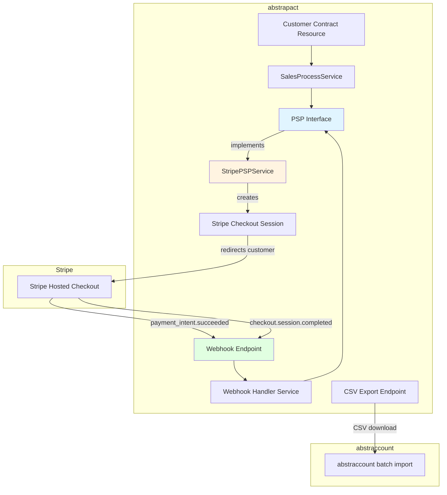
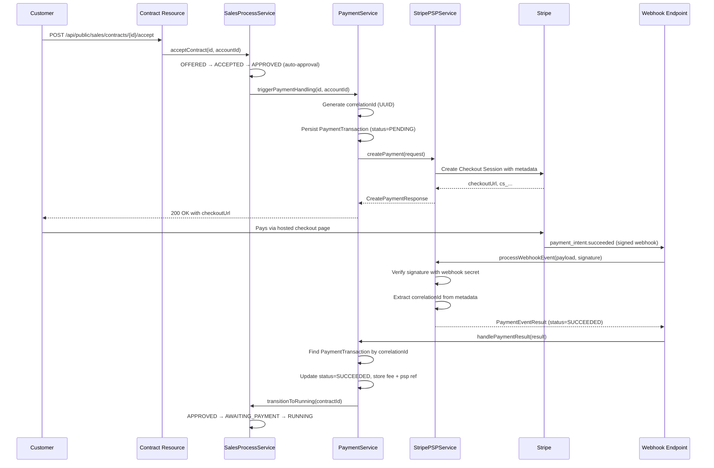

# Design of Payment Handling

## Overview

This document describes how abstrapact integrates with a Payment Service Provider (PSP) to
collect payments from customers. The integration is built around a **PSP-agnostic interface**
so that additional providers (PayPal, Square, Adyen, etc.) can be added later without
changing the sales process or the contract lifecycle.

The initial implementation supports **Stripe** only, using Stripe Checkout Sessions to
generate hosted payment pages that customers are redirected to. A webhook endpoint
receives signed payment events from Stripe and transitions the contract through the
payment states defined in [DESIGN_OF_SALES_PROCESS.md](./DESIGN_OF_SALES_PROCESS.md).

A CSV export endpoint allows the seller to download payment data in a format compatible
with the accounting software (abstraccount) for manual import.

---

## Concepts

### Payment Service Provider (PSP)

A PSP is an external service that processes card and online payments on behalf of the
seller. The PSP holds funds in a balance account until paying them out to the seller's
bank account. The PSP charges a processing fee per transaction.

### Payment Transaction

A **payment transaction** is abstrapact's internal record of a single payment attempt
through a PSP. It tracks:

- The contract being paid.
- The PSP that processed the payment.
- A **correlation ID** — an opaque UUID generated by abstrapact, never shown to any user,
  stored on the PSP object as metadata. When the webhook arrives, the correlation ID
  proves the event belongs to us and not to a forged request.
- The PSP's own transaction reference (e.g. Stripe's `pi_...` or `ch_...`).
- The gross amount, fee amount, and net amount.
- The currency.
- The payment status (pending, succeeded, failed, refunded).

### Correlation ID

> **Security requirement.** When creating a payment on the PSP, abstrapact generates a
> fresh UUID and stores it as metadata on the PSP object (e.g. in the Checkout Session's
> `payment_intent_data.metadata` and on the session itself). This UUID is **not** the
> contract id and is never exposed to the customer or the seller. When a webhook event
> arrives, abstrapact looks up the payment transaction by the correlation ID. If no
> matching transaction is found, the event is ignored.
>
> This prevents an attacker from creating a draft contract, paying through their own
> Stripe infrastructure, and sending a forged webhook to mark their contract as paid.
> The webhook payload is additionally verified using the Stripe webhook signing secret
> (see [Webhook Security](#webhook-security)).

### Idempotency

Webhook events may be delivered more than once. The payment transaction record ensures
that processing the same event twice does not double-transition the contract. The
correlation ID is the idempotency key: once a payment transaction is marked as
`succeeded`, subsequent events for the same correlation ID are ignored.

---

## Architecture



### Package Structure

All payment code lives under a new package
`dev.abstratium.abstrapact.non_multitenancy.sales.payment`:

```
dev.abstratium.abstrapact.non_multitenancy.sales.payment
├── boundary
│   ├── PaymentWebhookResource.java          # Stripe webhook endpoint
│   ├── PaymentExportResource.java           # CSV export endpoint
│   └── dto
│       ├── CreatePaymentResponse.java       # returned to the customer
│       └── PaymentExportRow.java            # one row in the CSV export
├── service
│   ├── PaymentService.java                  # orchestrates payment creation and lookup
│   ├── PaymentTransactionService.java       # CRUD for payment transaction records
│   ├── PSPInterface.java                    # PSP-agnostic interface
│   └── stripe
│       └── StripePSPService.java            # Stripe implementation of PSPInterface
└── entity
    └── PaymentTransaction.java              # JPA entity
```

---

## PSP Interface

The `PSPInterface` abstracts the PSP-specific operations that abstrapact needs. Each PSP
implementation provides its own CDI bean. The active PSP is selected via configuration.

```java
public interface PSPInterface {

    /**
     * Creates a payment for the given contract and returns a URL the customer
     * can be redirected to in order to complete payment.
     *
     * @param request the payment creation request (contract, amount, currency, correlation id)
     * @return the PSP response containing the checkout URL and PSP session id
     */
    CreatePaymentResponse createPayment(CreatePaymentRequest request);

    /**
     * Processes a webhook event from the PSP. The raw payload and signature
     * are passed so the implementation can verify authenticity.
     *
     * @param payload   the raw request body
     * @param signature the signature header value
     * @return the processed event, or null if the event should be ignored
     */
    PaymentEventResult processWebhookEvent(String payload, String signature);

    /**
     * Returns the PSP identifier (e.g. "stripe", "paypal").
     */
    String getPspIdentifier();
}
```

### `CreatePaymentRequest`

```java
public class CreatePaymentRequest {
    private String contractId;          // internal contract id
    private String correlationId;       // opaque UUID, stored as PSP metadata
    private BigDecimal amount;          // gross amount to charge
    private String currency;            // ISO 4217, e.g. "EUR", "CHF"
    private String description;         // shown on the PSP checkout page
    private String successUrl;          // redirect URL after successful payment
    private String cancelUrl;           // redirect URL if the customer cancels
    // getters / setters
}
```

### `CreatePaymentResponse`

```java
public class CreatePaymentResponse {
    private String checkoutUrl;         // URL the customer is redirected to
    private String pspSessionId;        // PSP session/checkout id (e.g. Stripe's cs_...)
    // getters / setters
}
```

### `PaymentEventResult`

```java
public class PaymentEventResult {
    private String correlationId;       // matches the correlation id stored at creation
    private String pspTransactionRef;   // e.g. Stripe's pi_...
    private BigDecimal grossAmount;
    private BigDecimal feeAmount;       // may be null if not yet available
    private String currency;
    private PaymentStatus status;       // SUCCEEDED, FAILED, PENDING
    // getters / setters
}
```

---

## Data Model

### New Table: `T_payment_transaction`

Records one payment attempt per contract. A contract may have multiple payment
transactions (e.g. a failed attempt followed by a successful one).

```sql
CREATE TABLE T_payment_transaction (
    id VARCHAR(36) PRIMARY KEY,
    organisation_id VARCHAR(36) NOT NULL,
    contract_id VARCHAR(36) NOT NULL,
    psp_identifier VARCHAR(30) NOT NULL,
    correlation_id VARCHAR(36) NOT NULL,
    psp_session_id VARCHAR(255),
    psp_transaction_ref VARCHAR(255),
    gross_amount DECIMAL(19, 4) NOT NULL,
    fee_amount DECIMAL(19, 4),
    net_amount DECIMAL(19, 4),
    currency VARCHAR(3) NOT NULL,
    status VARCHAR(20) NOT NULL,
    created_at TIMESTAMP NOT NULL,
    updated_at TIMESTAMP NOT NULL,
    CONSTRAINT FK_payment_transaction_contract
        FOREIGN KEY (contract_id) REFERENCES T_contract(id),
    CONSTRAINT UQ_payment_transaction_correlation
        UNIQUE (correlation_id)
);

CREATE INDEX I_payment_transaction_contract ON T_payment_transaction(contract_id);
CREATE INDEX I_payment_transaction_correlation ON T_payment_transaction(correlation_id);
CREATE INDEX I_payment_transaction_org ON T_payment_transaction(organisation_id);
```

Add the corresponding Envers audit table:

```sql
CREATE TABLE T_payment_transaction_AUD (
    id VARCHAR(36) NOT NULL,
    organisation_id VARCHAR(36),
    contract_id VARCHAR(36),
    psp_identifier VARCHAR(30),
    correlation_id VARCHAR(36),
    psp_session_id VARCHAR(255),
    psp_transaction_ref VARCHAR(255),
    gross_amount DECIMAL(19, 4),
    fee_amount DECIMAL(19, 4),
    net_amount DECIMAL(19, 4),
    currency VARCHAR(3),
    status VARCHAR(20),
    created_at TIMESTAMP,
    updated_at TIMESTAMP,
    REV BIGINT NOT NULL,
    REVTYPE TINYINT,
    PRIMARY KEY (id, REV),
    CONSTRAINT FK_payment_transaction_aud_rev
        FOREIGN KEY (REV) REFERENCES REVINFO(REV)
);

CREATE INDEX I_payment_transaction_aud_rev ON T_payment_transaction_AUD(REV);
CREATE INDEX I_payment_transaction_aud_id ON T_payment_transaction_AUD(id);
```

Name the migration `V01.025__createPaymentTransactionTable.sql`.

### Entity

```java
@Entity
@Table(name = "T_payment_transaction")
@Audited
public class PaymentTransaction {

    @Id
    @Column(name = "id", length = 36)
    private String id;

    @Column(name = "organisation_id", length = 36, nullable = false)
    private String organisationId;

    @Column(name = "contract_id", length = 36, nullable = false)
    private String contractId;

    @Column(name = "psp_identifier", length = 30, nullable = false)
    private String pspIdentifier;

    @Column(name = "correlation_id", length = 36, nullable = false, unique = true)
    private String correlationId;

    @Column(name = "psp_session_id", length = 255)
    private String pspSessionId;

    @Column(name = "psp_transaction_ref", length = 255)
    private String pspTransactionRef;

    @Column(name = "gross_amount", precision = 19, scale = 4, nullable = false)
    private BigDecimal grossAmount;

    @Column(name = "fee_amount", precision = 19, scale = 4)
    private BigDecimal feeAmount;

    @Column(name = "net_amount", precision = 19, scale = 4)
    private BigDecimal netAmount;

    @Column(name = "currency", length = 3, nullable = false)
    private String currency;

    @Enumerated(EnumType.STRING)
    @Column(name = "status", length = 20, nullable = false)
    private PaymentStatus status;

    @Column(name = "created_at", nullable = false)
    private LocalDateTime createdAt;

    @Column(name = "updated_at", nullable = false)
    private LocalDateTime updatedAt;

    public enum PaymentStatus {
        PENDING,
        SUCCEEDED,
        FAILED
    }

    // getters / setters
}
```

### Relationship to the Sales Process

The payment transaction is linked to the contract via `contract_id`. There is no JPA
relationship from `PaymentTransaction` to `NonMultitenancyContract` — the contract id is
stored as a plain column, mirroring the `ProcessInstance` pattern described in
[DESIGN_OF_SALES_PROCESS.md](./DESIGN_OF_SALES_PROCESS.md). This keeps the payment data
lifecycle independent from the contract data lifecycle.

---

## Payment Flow

### Pay-First (Prepaid) Contracts

When the contract's payment model is `PREPAID`, the customer must pay before the contract
enters `RUNNING`. The flow is:



### Bill-Over-Time (Postpaid) Contracts

When the contract's payment model is `POSTPAID`, the contract enters `RUNNING` immediately
upon approval. No payment is created at this stage. Invoices are issued periodically and
the payment flow above is triggered per invoice. This is out of scope for the initial
implementation.

### State Transitions

The `triggerPaymentHandling` method in `SalesProcessService` (currently a placeholder)
will be updated to:

1. Load the contract and check its payment model.
2. For `PREPAID`:
   - Transition the contract to `AWAITING_PAYMENT`.
   - Delegate to `PaymentService.createPaymentForContract(contractId, accountId)`.
   - Return the checkout URL to the customer (via the REST response).
3. For `POSTPAID`:
   - Transition the contract directly to `RUNNING`.
   - No payment is created (future: periodic invoicing).

When the webhook confirms a successful payment:

1. `PaymentService` finds the `PaymentTransaction` by correlation ID.
2. Updates the transaction status to `SUCCEEDED`, stores the fee amount and PSP
   transaction reference.
3. Calls `SalesProcessService.transitionToRunning(contractId)`, which moves the contract
   from `AWAITING_PAYMENT` to `RUNNING`.

If the payment fails, the contract remains in `AWAITING_PAYMENT`. The customer may retry
(creating a new payment transaction). A system timeout (grace period expiry) will
eventually move the contract to `CANCELLED` — this timeout mechanism is out of scope for
the initial implementation.

---

## Stripe Implementation

### Stripe Checkout Sessions

The `StripePSPService` uses Stripe's [Checkout Sessions API](https://docs.stripe.com/api/checkout/sessions/create)
to create a hosted payment page. The customer is redirected to Stripe's checkout URL and
returns to abstrapact after completing (or cancelling) the payment.

Key parameters when creating a Checkout Session:

| Parameter | Value |
|---|---|
| `mode` | `payment` (one-time payment) |
| `line_items` | One line item with `price_data` (ad-hoc price) containing the contract's currency and grand total |
| `payment_intent_data.metadata` | `{"correlation_id": "<UUID>"}` — the opaque correlation ID |
| `metadata` | `{"correlation_id": "<UUID>"}` — also on the session itself for `checkout.session.completed` events |
| `success_url` | Configurable, e.g. `https://abstrapact.example.com/payment/success` |
| `cancel_url` | Configurable, e.g. `https://abstrapact.example.com/payment/cancel` |
| `client_reference_id` | The contract id (for dashboard visibility only; **not** used for webhook matching) |

> **Important:** Metadata set on the Checkout Session does **not** automatically propagate
> to the PaymentIntent. The `payment_intent_data.metadata` parameter must be set
> explicitly so that the correlation ID is available in `payment_intent.succeeded` webhook
> events. See the [Stripe metadata documentation](https://docs.stripe.com/metadata/use-cases).

### Stripe SDK

Add the Stripe Java SDK as a dependency:

```xml
<dependency>
    <groupId>com.stripe</groupId>
    <artifactId>stripe-java</artifactId>
    <version>{latest-stable}</version>
</dependency>
```

> Use a version published at least 7 days ago. Check
> [Maven Central](https://central.sonatype.com/artifact/com.stripe/stripe-java) for the
> latest stable release.

The `StripeClient` is initialised with the secret API key read from configuration:

```java
@ApplicationScoped
public class StripePSPService implements PSPInterface {

    @ConfigProperty(name = "abstrapact.payment.stripe.secret-key")
    String secretKey;

    @ConfigProperty(name = "abstrapact.payment.stripe.webhook-secret")
    String webhookSecret;

    @ConfigProperty(name = "abstrapact.payment.stripe.success-url")
    String successUrl;

    @ConfigProperty(name = "abstrapact.payment.stripe.cancel-url")
    String cancelUrl;

    private StripeClient client;

    @PostConstruct
    void init() {
        Stripe.apiKey = secretKey;
        client = new StripeClient(secretKey);
    }

    // ...
}
```

### Configuration Properties

| Property | Description | Example |
|---|---|---|
| `abstrapact.payment.psp` | Active PSP identifier | `stripe` |
| `abstrapact.payment.stripe.secret-key` | Stripe secret API key (`sk_live_...` or `sk_test_...`) | `sk_test_...` |
| `abstrapact.payment.stripe.webhook-secret` | Stripe webhook endpoint signing secret (`whsec_...`) | `whsec_...` |
| `abstrapact.payment.stripe.success-url` | URL the customer is redirected to after successful payment | `https://abstrapact.example.com/payment/success` |
| `abstrapact.payment.stripe.cancel-url` | URL the customer is redirected to after cancelling | `https://abstrapact.example.com/payment/cancel` |

These properties are set via environment variables or `application.properties` and must
**never** be committed to the repository.

---

## Webhook Endpoint

### Resource

```java
@Path("/api/public/payment/webhook")
@Produces(MediaType.APPLICATION_JSON)
@Consumes(MediaType.APPLICATION_JSON)
public class PaymentWebhookResource {

    @Inject
    PaymentService paymentService;

    @Inject
    PSPInterface psp;

    @POST
    @Operation(summary = "Receive a PSP webhook event")
    public Response handleWebhook(String payload, @HeaderParam("Stripe-Signature") String signature) {
        try {
            PaymentEventResult result = psp.processWebhookEvent(payload, signature);
            if (result == null) {
                return Response.ok().build();
            }
            paymentService.handlePaymentResult(result);
            return Response.ok().build();
        } catch (WebApplicationException e) {
            return e.getResponse();
        } catch (Exception e) {
            return Response.status(Response.Status.BAD_REQUEST).build();
        }
    }
}
```

### Webhook Security

The webhook endpoint is **not** behind the standard OIDC authentication — it is called by
Stripe, not by an authenticated user. Security is provided by:

1. **Signature verification:** The `StripePSPService.processWebhookEvent` method uses
   `StripeClient.constructEvent(payload, signature, webhookSecret)` to verify that the
   payload was signed with the webhook endpoint secret. If verification fails, a 400 is
   returned and the event is discarded.
2. **Correlation ID matching:** Even if an attacker somehow bypasses signature
   verification, the event is only processed if the correlation ID in the metadata matches
   an existing `PaymentTransaction` in the database. An attacker cannot forge this because
   they do not know which correlation IDs exist.
3. **Idempotency:** If the same event is delivered twice, the second delivery finds the
   payment transaction already in `SUCCEEDED` state and does nothing.

### Webhook Events

The Stripe implementation handles the following event types:

| Event Type | Action |
|---|---|
| `checkout.session.completed` | Extract correlation ID from session metadata; mark payment as succeeded if `payment_status == "paid"` |
| `payment_intent.succeeded` | Extract correlation ID from PaymentIntent metadata; mark payment as succeeded |
| `checkout.session.async_payment_succeeded` | Same as `checkout.session.completed` (delayed payment methods) |
| `checkout.session.async_payment_failed` | Mark payment as failed; contract remains in `AWAITING_PAYMENT` |
| `charge.updated` | Update fee amount from `balance_transaction` data (fees may arrive in a later event) |

> **Fee data timing:** Stripe does not always include fee data in the initial
> `payment_intent.succeeded` event. The `charge.updated` event (fired once the
> `balance_transaction` is available) is used to capture the fee. The payment transaction
> is updated in place when the fee data arrives.

### Responding Quickly

The webhook endpoint must return a `2xx` status code quickly, before any complex
processing. Stripe retries events that do not receive a `2xx` within a timeout. The
current design processes the event synchronously, which is acceptable for the initial
implementation. If processing becomes slow, a future optimisation is to enqueue the event
for asynchronous processing and return `200` immediately.

---

## REST API Endpoints

### Payment Creation (Implicit)

Payment creation is not a separate endpoint. It is triggered by the existing
`POST /api/public/sales/contracts/{id}/accept` endpoint. When the contract is prepaid,
the accept response body is extended to include the checkout URL:

```json
{
  "id": "...",
  "state": "AWAITING_PAYMENT",
  "checkoutUrl": "https://checkout.stripe.com/c/pay/cs_..."
}
```

The `CustomerContractResponse` DTO is extended with an optional `checkoutUrl` field,
populated only when a payment was created.

### CSV Export

```
GET /api/public/payment/export?from={date}&to={date}
```

Returns a CSV file with one row per successful payment transaction in the given date
range. The endpoint requires the `abstratium-abstrapact_user` role and is scoped to the
caller's organisation (the seller org, resolved from the JWT).

**CSV format** (matching the abstraccount batch import):

```csv
date,partner,description,gross_amount,fee_amount,stripe_txn,contract_id
2025-08-09,,Contract E2E-REF-123,100.00,3.20,pi_3Mtwxxxx,abc-123-def
2025-08-09,,Contract E2E-REF-456,250.00,7.50,pi_3Mtwyyyy,ghi-789-jkl
```

| Column | Source | Notes |
|---|---|---|
| `date` | `PaymentTransaction.updatedAt` (date of successful payment) | ISO date `YYYY-MM-DD` |
| `partner` | Empty (abstraccount assigns the partner) | May be populated in the future |
| `description` | `Contract.contractReference` | Human-readable reference |
| `gross_amount` | `PaymentTransaction.grossAmount` | Decimal with 2 decimal places |
| `fee_amount` | `PaymentTransaction.feeAmount` | Decimal; may be `0.00` if fee data not yet received |
| `stripe_txn` | `PaymentTransaction.pspTransactionRef` | The PSP's transaction code |
| `contract_id` | `PaymentTransaction.contractId` | Internal contract id |

**Response headers:**

```
Content-Type: text/csv
Content-Disposition: attachment; filename="payments-{from}-to-{to}.csv"
```

---

## Stripe Portal Configuration

The following steps must be performed in the [Stripe Dashboard](https://dashboard.stripe.com)
by the seller (the SME):

### 1. Obtain API Keys

1. Navigate to **Developers → API Keys**.
2. Copy the **Secret key** (`sk_live_...` for production, `sk_test_...` for test mode).
3. Set it as the `ABSTRAPACT_PAYMENT_STRIPE_SECRET_KEY` environment variable.

### 2. Create a Webhook Endpoint

1. Navigate to **Developers → Webhooks**.
2. Click **Add endpoint**.
3. Set the endpoint URL to `https://{abstrapact-domain}/api/public/payment/webhook`.
4. Select the following events to listen for:
   - `checkout.session.completed`
   - `checkout.session.async_payment_succeeded`
   - `checkout.session.async_payment_failed`
   - `payment_intent.succeeded`
   - `charge.updated`
5. Click **Add endpoint**.
6. On the endpoint detail page, click **Reveal** under **Signing secret**.
7. Copy the signing secret (`whsec_...`).
8. Set it as the `ABSTRAPACT_PAYMENT_STRIPE_WEBHOOK_SECRET` environment variable.

### 3. Configure Success and Cancel URLs

These are the pages the customer sees after completing or cancelling payment. Set them
via the `ABSTRAPACT_PAYMENT_STRIPE_SUCCESS_URL` and
`ABSTRAPACT_PAYMENT_STRIPE_CANCEL_URL` environment variables. They should point to pages
on the abstrapact frontend.

### 4. Test with the Stripe CLI

During development, use the [Stripe CLI](https://docs.stripe.com/cli) to forward webhook
events to your local server:

```bash
stripe listen --forward-to localhost:8080/api/public/payment/webhook
```

The CLI prints a temporary webhook signing secret (`whsec_...`). Use this as the
`ABSTRAPACT_PAYMENT_STRIPE_WEBHOOK_SECRET` for local testing.

Trigger a test payment:

```bash
stripe trigger checkout.session.completed
```

### 5. Activate Live Mode

Once testing is complete:

1. Switch the API key from `sk_test_...` to `sk_live_...`.
2. Ensure the webhook endpoint in the Stripe Dashboard is configured for live mode.
3. Set the `ABSTRAPACT_PAYMENT_STRIPE_SECRET_KEY` and
   `ABSTRAPACT_PAYMENT_STRIPE_WEBHOOK_SECRET` to the live values.

---

## Native Image Considerations

The project is deployed as a native image. The Stripe Java SDK uses reflection and JSON
deserialization, which requires additional GraalVM configuration. The following must be
added to the native image build:

1. Register the Stripe model classes for reflection. Quarkus automatically generates
   reflection configuration for classes annotated with `@RegisterForReflection`, but the
   Stripe SDK classes are external. Add a `reflect-config.json` or use Quarkus's
   `quarkus.native.additional-build-args` to register the Stripe package:

```properties
quarkus.native.additional-build-args=--initialize-at-build-time=com.stripe
```

2. Test the native image build early to catch reflection errors. Run
   `./mvnw verify -Pnative` and verify that webhook processing works in the native image.

---

## Testing

### Unit Tests

- `StripePSPServiceTest`: test `createPayment` builds correct Checkout Session parameters
  (metadata, line items, URLs). Use a mocked `StripeClient`.
- `PaymentServiceTest`: test correlation ID generation, payment transaction persistence,
  and idempotent webhook handling (same correlation ID processed twice → single state
  transition).
- `PaymentTransactionServiceTest`: test CRUD operations.

### Integration Tests (`@QuarkusTest`)

- `PaymentWebhookResourceTest`: send a signed webhook payload (using the test webhook
  secret) and verify the contract transitions to `RUNNING`. Send an unsigned payload and
  verify 400. Send a payload with an unknown correlation ID and verify it is ignored.
- `PaymentExportResourceTest`: create payment transactions, call the CSV export endpoint,
  verify the CSV format and content.
- `SalesProcessServiceTest` (update): verify that `triggerPaymentHandling` creates a
  payment transaction and transitions the contract to `AWAITING_PAYMENT` for prepaid
  contracts.

### E2E Tests (Future)

Once the payment flow is implemented, an E2E test will:

1. Create a contract, offer, and accept it.
2. Verify the response contains a `checkoutUrl`.
3. (In test mode) simulate a successful payment via the Stripe CLI or test tokens.
4. Verify the contract transitions to `RUNNING`.

---

## Implementation Task List

### Prerequisites

- [ ] Add the Stripe Java SDK dependency to `pom.xml`.
- [ ] Add configuration properties for Stripe keys and URLs.

### Database Migrations

- [ ] **V01.025** — create `T_payment_transaction` and `T_payment_transaction_AUD` tables.

### Domain Model

- [ ] Create `PaymentTransaction` entity with `PaymentStatus` enum.

### PSP Interface

- [ ] Implement `PSPInterface`, `CreatePaymentRequest`, `CreatePaymentResponse`,
      `PaymentEventResult`.
- [ ] Implement `StripePSPService` (Checkout Session creation, webhook event processing,
      signature verification).

### Services

- [ ] Implement `PaymentService` — orchestrates payment creation, correlation ID
      generation, and webhook result handling.
- [ ] Implement `PaymentTransactionService` — CRUD for payment transactions.
- [ ] Update `SalesProcessService.triggerPaymentHandling` — transition to
      `AWAITING_PAYMENT` and delegate to `PaymentService` for prepaid contracts.

### REST Resources

- [ ] Implement `PaymentWebhookResource` at `/api/public/payment/webhook`.
- [ ] Implement `PaymentExportResource` at `/api/public/payment/export`.
- [ ] Extend `CustomerContractResponse` with optional `checkoutUrl` field.

### Configuration

- [ ] Document required environment variables in the project README or deployment guide.

### Tests

- [ ] Unit tests for `StripePSPService`, `PaymentService`, `PaymentTransactionService`.
- [ ] Integration tests for `PaymentWebhookResource`, `PaymentExportResource`.
- [ ] Update `SalesProcessServiceTest` for the new `triggerPaymentHandling` behaviour.

### Native Image

- [ ] Verify the native image build works with the Stripe SDK.
- [ ] Add any required reflection configuration.

---

## References

- [Stripe Webhooks (Java)](https://docs.stripe.com/webhooks.md?lang=java)
- [Stripe Checkout Sessions API](https://docs.stripe.com/api/checkout/sessions/create)
- [Stripe Checkout Fulfillment](https://docs.stripe.com/checkout/fulfillment)
- [Stripe Metadata Use Cases](https://docs.stripe.com/metadata/use-cases)
- [Stripe CLI](https://docs.stripe.com/cli)
- [DESIGN_OF_SALES_PROCESS.md](./DESIGN_OF_SALES_PROCESS.md)
- [DESIGN_OF_CONTRACTS.md](./DESIGN_OF_CONTRACTS.md)
- [DESIGN_OF_CROSS_TENANT_CUSTOMER_CONTRACTS.md](./DESIGN_OF_CROSS_TENANT_CUSTOMER_CONTRACTS.md)
