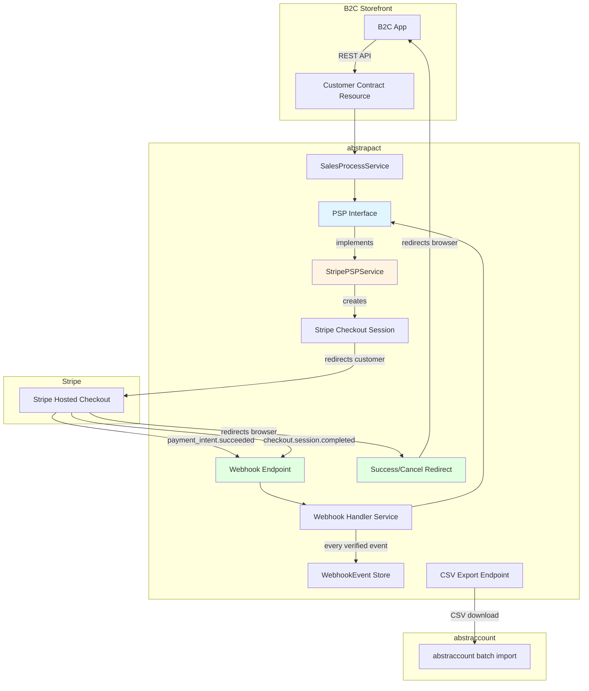
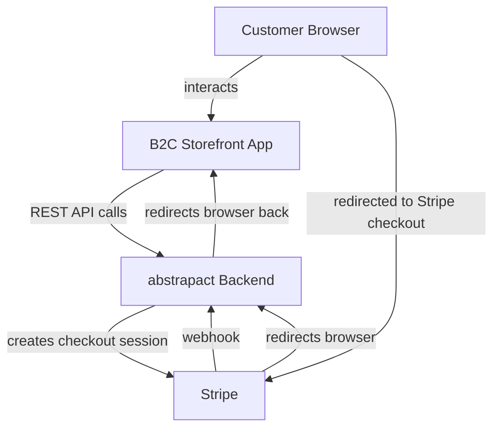
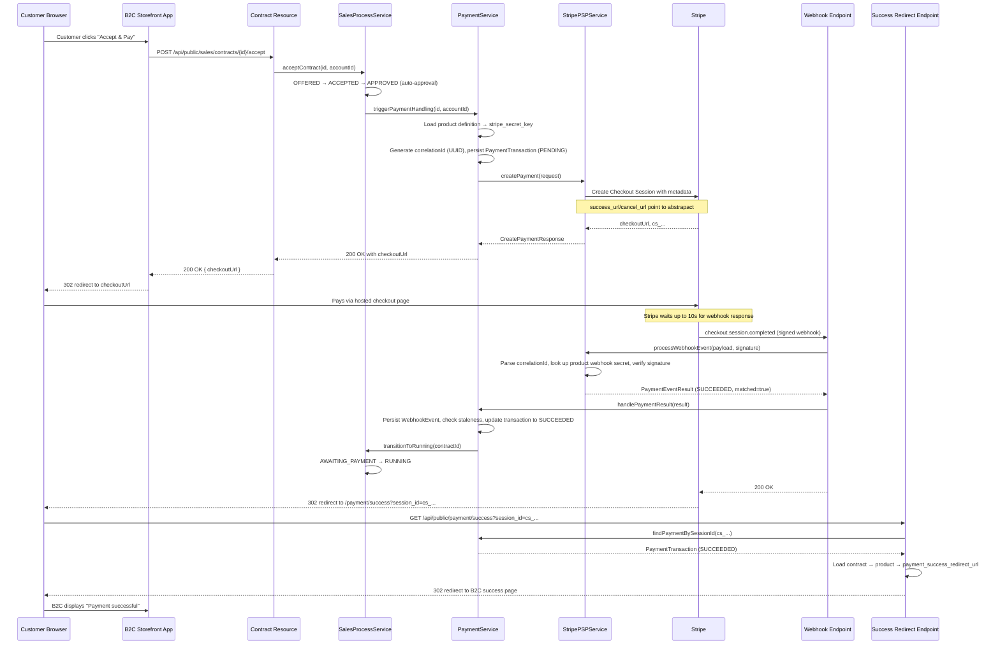
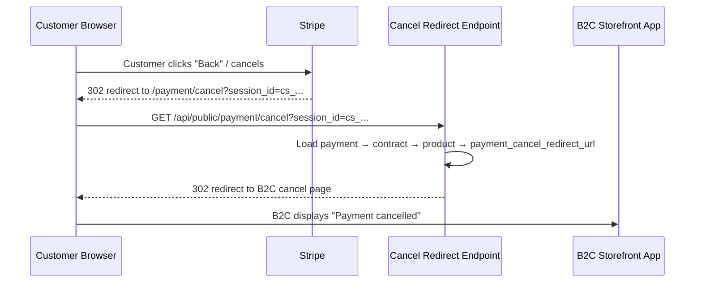
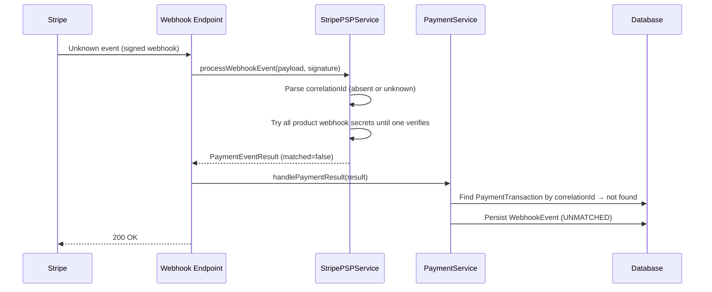
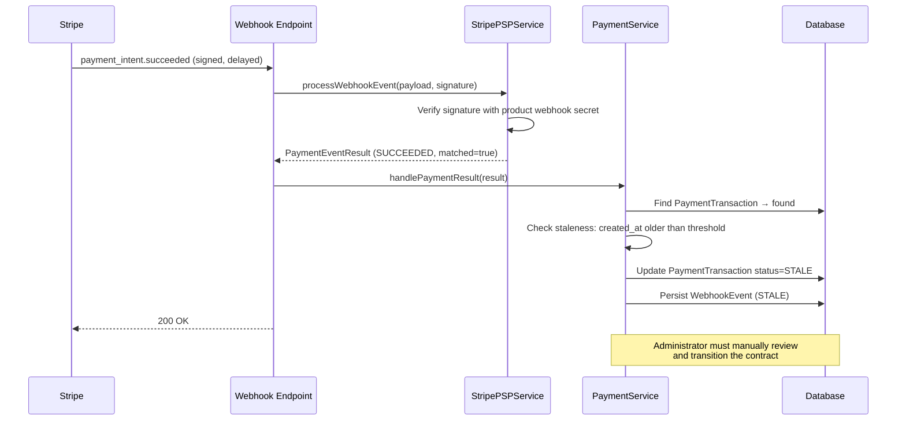

# Design of Payment Handling

## Overview

abstrapact integrates with a Payment Service Provider (PSP) to collect payments from
customers. The integration is built around a **PSP-agnostic interface** so that
additional providers (PayPal, Square, Adyen, etc.) can be added later without changing
the sales process or the contract lifecycle. The initial implementation supports
**Stripe** only, using Stripe Checkout Sessions to generate hosted payment pages.

A CSV export endpoint allows the seller to download payment data in a format compatible
with the accounting software (abstraccount) for manual import.

### Per-Product Configuration

Each product definition carries its own Stripe account credentials and B2C redirect URLs.
This means the organisation that configures a product can:

- Use a **different Stripe account per product** — e.g. one product's payments go to a
  subsidiary's Stripe account, another product's payments go to the main account.
- Use a **different B2C storefront app per product** — e.g. one product is sold through
  `shop-a.example.com`, another through `shop-b.example.com`, each with its own success
  and cancel pages.

This per-product model means third parties can fully self-serve: they configure their own
Stripe credentials and B2C redirect URLs on the product definition, deploy their B2C app
to any domain, and no abstrapact operator configuration is required. abstrapact does not
handle payouts — each seller's Stripe account pays out directly to their bank account.

---

## Concepts

### Payment Service Provider (PSP)

A PSP is an external service that processes card and online payments on behalf of the
seller. The PSP holds funds in a balance account until paying them out to the seller's
bank account. The PSP charges a processing fee per transaction.

### Payment Transaction

A **payment transaction** is abstrapact's internal record of a single payment attempt
through a PSP. It tracks the contract being paid, the PSP identifier, a correlation ID,
the PSP's transaction reference, gross/fee/net amounts, currency, and status
(`PENDING`, `SUCCEEDED`, `FAILED`, `STALE`).

### Correlation ID

When creating a payment, abstrapact generates a fresh UUID and stores it as metadata on
the PSP object (both on the Checkout Session and on the PaymentIntent). This UUID is
**not** the contract id and is never exposed to the customer or seller. When a webhook
arrives, abstrapact looks up the payment transaction by the correlation ID — if no match
is found, the event is stored as unmatched and the contract state is not changed.

This prevents an attacker from creating a draft contract, paying through their own Stripe
infrastructure, and sending a forged webhook to mark their contract as paid. The webhook
payload is additionally verified using the product's Stripe webhook signing secret
(see [Webhook Handling](#webhook-handling)).

### Idempotency

Webhook events may be delivered more than once. Every verified event is recorded in
`T_webhook_event` with a unique constraint on `(psp_identifier, psp_event_id)`, so a
redelivered event is detected as a duplicate. Once a payment transaction is in a terminal
state (`SUCCEEDED`, `FAILED`, `STALE`), subsequent events for the same correlation ID are
recorded with `processing_result=DUPLICATE` and do not trigger another state transition.

### Staleness Check

A payment transaction that has been `PENDING` for too long may indicate a stuck payment,
a replay attack, or a misconfigured webhook pipeline. When a success webhook arrives for
a `PENDING` transaction whose `created_at` is older than
`abstrapact.payment.webhook.stale-after-hours` (default: `24`), the transaction is marked
`STALE` instead of `SUCCEEDED` and the contract is **not** automatically transitioned to
`RUNNING`. An administrator must manually review and transition the contract. The
staleness check only applies to success events — late failure notifications are processed
normally. A 24-hour threshold accommodates delayed payment methods (bank transfers,
Klarna) while catching suspicious events.

---

## Architecture



### B2C Application Integration

abstrapact is a **backend-only service** — it is never called directly by the customer's
browser. A separate B2C application (the "storefront") interacts with the customer's
browser and calls abstrapact's REST API. The payment flow involves three parties:



The end-to-end flow:

1. **B2C app calls** `POST /api/public/sales/contracts/{id}/accept`. abstrapact
   transitions the contract to `APPROVED` → `AWAITING_PAYMENT`, creates a Stripe Checkout
   Session using the product's Stripe credentials, and returns the `checkoutUrl`.
2. **B2C app redirects the browser** to the `checkoutUrl` (Stripe's hosted checkout page).
3. **Customer pays** on the Stripe-hosted page.
4. **Stripe sends the webhook** and **waits up to 10 seconds** for a `2xx` response before
   redirecting the browser. Typically the webhook is processed within this window and the
   contract is already `RUNNING` by the time the browser is redirected. If the webhook is
   slow or down, Stripe redirects after 10 seconds regardless — the contract may still be
   `AWAITING_PAYMENT`, in which case the success endpoint redirects to the B2C app with
   `status=processing` so it can poll `GET /api/public/sales/contracts/{id}`.
5. **Stripe redirects the browser** to abstrapact's success endpoint, which looks up the
   `PaymentTransaction` by session id, resolves the product's redirect URL, and redirects
   the browser to the B2C app.
6. **If the customer cancels**, Stripe redirects to abstrapact's cancel endpoint, which
   redirects to the product's cancel URL. The contract remains in `AWAITING_PAYMENT`.

> **Why abstrapact handles the redirect, not Stripe directly to the B2C app:**
>
> 1. abstrapact verifies the payment status server-side before sending the browser to the
>    B2C app, avoiding a round-trip where the B2C app would have to call abstrapact to
>    check the contract state.
> 2. **Third-party B2C apps.** Any third party can write their own B2C storefront and
>    deploy it to any domain. The abstrapact operator never reconfigures Stripe's
>    `success_url`/`cancel_url` — each third party only configures their redirect URL on
>    the product definition.
> 3. **Per-product B2C apps.** Different products can be sold through different B2C
>    storefronts, each with its own success and cancel pages.

### Package Structure

All payment code lives under
`dev.abstratium.abstrapact.non_multitenancy.sales.payment`:

```
dev.abstratium.abstrapact.non_multitenancy.sales.payment
├── boundary
│   ├── PaymentWebhookResource.java          # Stripe webhook endpoint
│   ├── PaymentRedirectResource.java         # success/cancel browser redirect endpoints
│   ├── PaymentExportResource.java           # CSV export endpoint
│   └── dto
│       ├── CreatePaymentResponse.java       # returned to the B2C app
│       ├── PaymentEventResult.java          # result of processing a webhook event
│       └── PaymentExportRow.java            # one row in the CSV export
├── service
│   ├── PaymentService.java                  # orchestrates payment creation, webhook handling, staleness check
│   ├── PaymentTransactionService.java       # CRUD for payment transaction records
│   ├── WebhookEventService.java             # persists and deduplicates webhook event records
│   ├── PSPInterface.java                    # PSP-agnostic interface
│   └── stripe
│       └── StripePSPService.java            # Stripe implementation of PSPInterface
└── entity
    ├── PaymentTransaction.java              # JPA entity
    └── WebhookEvent.java                    # JPA entity — audit log of every verified webhook call
```

---

## PSP Interface

The `PSPInterface` abstracts PSP-specific operations. Each PSP implementation provides
its own CDI bean; the active PSP is selected via configuration.

```java
public interface PSPInterface {

    /**
     * Creates a payment for the given contract and returns a URL the customer
     * can be redirected to. PSP credentials and redirect URLs are resolved from
     * the product definition and passed in the request.
     */
    CreatePaymentResponse createPayment(CreatePaymentRequest request);

    /**
     * Processes a webhook event. The implementation must determine the correct
     * webhook secret for signature verification (see Webhook Handling).
     * Returns an unmatched result if the event does not correspond to a known
     * payment transaction.
     */
    PaymentEventResult processWebhookEvent(String payload, String signature);

    /** Returns the PSP identifier (e.g. "stripe", "paypal"). */
    String getPspIdentifier();
}
```

### DTOs

```java
public class CreatePaymentRequest {
    private String contractId;          // internal contract id
    private String correlationId;       // opaque UUID, stored as PSP metadata
    private BigDecimal amount;          // gross amount to charge
    private String currency;            // ISO 4217, e.g. "EUR", "CHF"
    private String description;         // shown on the PSP checkout page
    private String successUrl;          // abstrapact's success redirect endpoint
    private String cancelUrl;           // abstrapact's cancel redirect endpoint
    private String stripeSecretKey;     // from the product definition
    // getters / setters
}

public class CreatePaymentResponse {
    private String checkoutUrl;         // URL the customer is redirected to
    private String pspSessionId;        // PSP session/checkout id (e.g. Stripe's cs_...)
    // getters / setters
}

public class PaymentEventResult {
    private String pspEventId;          // PSP event id (e.g. Stripe's evt_...), for deduplication
    private String eventType;           // e.g. "payment_intent.succeeded"
    private String correlationId;       // matches the correlation id stored at creation; may be null
    private String pspTransactionRef;   // e.g. Stripe's pi_...
    private BigDecimal grossAmount;
    private BigDecimal feeAmount;       // may be null if not yet available
    private String currency;
    private PaymentStatus status;       // SUCCEEDED, FAILED, PENDING
    private boolean matched;            // true if a PaymentTransaction was found
    private String rawPayload;          // the original webhook payload, stored for every event
    // getters / setters
}
```

---

## Data Model

### Modified Table: `T_product_definition`

Four new columns for per-product Stripe credentials and B2C redirect URLs:

```sql
ALTER TABLE T_product_definition ADD COLUMN stripe_secret_key VARCHAR(100);
ALTER TABLE T_product_definition ADD COLUMN stripe_webhook_secret VARCHAR(100);
ALTER TABLE T_product_definition ADD COLUMN payment_success_redirect_url VARCHAR(500);
ALTER TABLE T_product_definition ADD COLUMN payment_cancel_redirect_url VARCHAR(500);
```

| Column | Description |
|---|---|
| `stripe_secret_key` | Stripe secret API key for this product (`sk_live_...` or `sk_test_...`). Nullable. |
| `stripe_webhook_secret` | Stripe webhook signing secret for this product's Stripe account (`whsec_...`). Nullable. |
| `payment_success_redirect_url` | Browser redirect URL after successful payment. May contain `{contractId}` placeholder. Nullable — if not set, abstrapact returns a simple HTML status page. |
| `payment_cancel_redirect_url` | Browser redirect URL after payment cancellation. Nullable. |

The `ProductDefinition` entity is extended with corresponding fields. The credential
fields must use `@JsonIgnore` and must never be exposed in REST responses to customers.

> **Security:** The B2C app must **never** be allowed to pass a redirect URL as part of
> the accept request. Allowing client-supplied redirect URLs creates an open redirect
> vulnerability — see the
> [Capgo advisory GHSA-grc7-98pf-h8hq](https://github.com/Cap-go/capgo.app/security/advisories/GHSA-grc7-98pf-h8hq).
> The redirect URLs are trusted because they are set by an administrator on the product
> definition, not by the customer or the B2C app's client-side code.

### New Table: `T_payment_transaction`

Records one payment attempt per contract. A contract may have multiple transactions
(e.g. a failed attempt followed by a successful one). The contract id is stored as a
plain column (no JPA relationship), mirroring the `ProcessInstance` pattern in
[DESIGN_OF_SALES_PROCESS.md](./DESIGN_OF_SALES_PROCESS.md) to keep the payment data
lifecycle independent from the contract data lifecycle.

```sql
CREATE TABLE T_payment_transaction (
    id VARCHAR(36) PRIMARY KEY,
    organisation_id VARCHAR(36) NOT NULL,
    contract_id VARCHAR(36) NOT NULL,
    psp_identifier VARCHAR(30) NOT NULL,
    correlation_id VARCHAR(36) NOT NULL,
    psp_session_id VARCHAR(255),
    psp_transaction_ref VARCHAR(255),
    gross_amount DECIMAL(19, 4) NOT NULL,
    fee_amount DECIMAL(19, 4),
    net_amount DECIMAL(19, 4),
    currency VARCHAR(3) NOT NULL,
    status VARCHAR(20) NOT NULL,
    created_at TIMESTAMP NOT NULL,
    updated_at TIMESTAMP NOT NULL,
    CONSTRAINT FK_payment_transaction_contract
        FOREIGN KEY (contract_id) REFERENCES T_contract(id),
    CONSTRAINT UQ_payment_transaction_correlation
        UNIQUE (correlation_id)
);

CREATE INDEX I_payment_transaction_contract ON T_payment_transaction(contract_id);
CREATE INDEX I_payment_transaction_correlation ON T_payment_transaction(correlation_id);
CREATE INDEX I_payment_transaction_org ON T_payment_transaction(organisation_id);
```

```java
@Entity
@Table(name = "T_payment_transaction")
@Audited
public class PaymentTransaction {

    @Id
    @Column(name = "id", length = 36)
    private String id;

    @Column(name = "organisation_id", length = 36, nullable = false)
    private String organisationId;

    @Column(name = "contract_id", length = 36, nullable = false)
    private String contractId;

    @Column(name = "psp_identifier", length = 30, nullable = false)
    private String pspIdentifier;

    @Column(name = "correlation_id", length = 36, nullable = false, unique = true)
    private String correlationId;

    @Column(name = "psp_session_id", length = 255)
    private String pspSessionId;

    @Column(name = "psp_transaction_ref", length = 255)
    private String pspTransactionRef;

    @Column(name = "gross_amount", precision = 19, scale = 4, nullable = false)
    private BigDecimal grossAmount;

    @Column(name = "fee_amount", precision = 19, scale = 4)
    private BigDecimal feeAmount;

    @Column(name = "net_amount", precision = 19, scale = 4)
    private BigDecimal netAmount;

    @Column(name = "currency", length = 3, nullable = false)
    private String currency;

    @Enumerated(EnumType.STRING)
    @Column(name = "status", length = 20, nullable = false)
    private PaymentStatus status;

    @Column(name = "created_at", nullable = false)
    private LocalDateTime createdAt;

    @Column(name = "updated_at", nullable = false)
    private LocalDateTime updatedAt;

    public enum PaymentStatus {
        PENDING,
        SUCCEEDED,
        FAILED,
        STALE
    }

    // getters / setters
}
```

### New Table: `T_webhook_event`

Records **every** webhook call that passes signature verification — matched, unmatched,
stale, and duplicate events alike — providing a complete audit trail of all PSP
communication.

```sql
CREATE TABLE T_webhook_event (
    id VARCHAR(36) PRIMARY KEY,
    organisation_id VARCHAR(36),
    psp_identifier VARCHAR(30) NOT NULL,
    psp_event_id VARCHAR(255) NOT NULL,
    event_type VARCHAR(100) NOT NULL,
    correlation_id VARCHAR(36),
    payment_transaction_id VARCHAR(36),
    matched BOOLEAN NOT NULL,
    processing_result VARCHAR(30) NOT NULL,
    raw_payload TEXT NOT NULL,
    received_at TIMESTAMP NOT NULL,
    CONSTRAINT UQ_webhook_event_psp_event
        UNIQUE (psp_identifier, psp_event_id),
    CONSTRAINT FK_webhook_event_payment_transaction
        FOREIGN KEY (payment_transaction_id) REFERENCES T_payment_transaction(id)
);

CREATE INDEX I_webhook_event_correlation ON T_webhook_event(correlation_id);
CREATE INDEX I_webhook_event_received ON T_webhook_event(received_at);
CREATE INDEX I_webhook_event_matched ON T_webhook_event(matched);
CREATE INDEX I_webhook_event_processing_result ON T_webhook_event(processing_result);
```

The `organisation_id` may be null for unmatched events. The `processing_result` column
records the outcome:

| Value | Meaning |
|---|---|
| `PROCESSED` | Matching transaction found, updated, and contract transitioned. |
| `DUPLICATE` | Event already processed (transaction in terminal state). No state change. |
| `UNMATCHED` | No matching `PaymentTransaction` found. No state change. |
| `STALE` | Matching transaction found but too old (see [Staleness Check](#staleness-check)). Transaction marked `STALE`, contract **not** transitioned. Requires manual review. |
| `IGNORED` | Event type not actively processed (e.g. `charge.refunded` before refund support). No state change. |

```java
@Entity
@Table(name = "T_webhook_event")
@Audited
public class WebhookEvent {

    @Id
    @Column(name = "id", length = 36)
    private String id;

    @Column(name = "organisation_id", length = 36)
    private String organisationId;

    @Column(name = "psp_identifier", length = 30, nullable = false)
    private String pspIdentifier;

    @Column(name = "psp_event_id", length = 255, nullable = false)
    private String pspEventId;

    @Column(name = "event_type", length = 100, nullable = false)
    private String eventType;

    @Column(name = "correlation_id", length = 36)
    private String correlationId;

    @Column(name = "payment_transaction_id", length = 36)
    private String paymentTransactionId;

    @Column(name = "matched", nullable = false)
    private boolean matched;

    @Enumerated(EnumType.STRING)
    @Column(name = "processing_result", length = 30, nullable = false)
    private ProcessingResult processingResult;

    @Lob
    @Column(name = "raw_payload", nullable = false)
    private String rawPayload;

    @Column(name = "received_at", nullable = false)
    private LocalDateTime receivedAt;

    public enum ProcessingResult {
        PROCESSED,
        DUPLICATE,
        UNMATCHED,
        STALE,
        IGNORED
    }

    // getters / setters
}
```

Both new tables and their Envers audit tables (`T_payment_transaction_AUD`,
`T_webhook_event_AUD`) are included in migration `V01.025__createPaymentTransactionTable.sql`.

---

## Webhook Handling

The webhook endpoint (`POST /api/public/payment/webhook`) is **not** behind OIDC
authentication — it is called by Stripe, not by an authenticated user.

### Signature Verification with Per-Product Secrets

Each product has its own Stripe account with its own webhook signing secret. Since
abstrapact receives webhooks from multiple Stripe accounts at a single endpoint, it
cannot know which secret to use until it identifies the product. The verification
process:

1. Parse the raw JSON payload to extract the correlation ID from the event metadata.
   This is pure JSON parsing — the data is **not trusted** at this point.
2. If a correlation ID is found, look up the `PaymentTransaction` → contract → product
   definition → `stripe_webhook_secret`.
3. Verify the signature using `StripeClient.constructEvent(payload, signature,
   webhookSecret)` with that product's webhook secret.
4. If no correlation ID is found or no matching transaction exists (unmatched event),
   try verifying the signature against all configured product webhook secrets. If none
   match, the event is discarded with a `400` response — it is not recorded in
   `T_webhook_event` because it cannot be trusted.

> For unmatched events, trying all webhook secrets is O(n) in the number of products.
> This is acceptable for the initial implementation. If the number of products grows
> large, a future optimisation is to use Stripe's
> [webhook endpoints with account filtering](https://docs.stripe.com/webhooks.md#webhook-endpoints)
> or to maintain a lookup table of Stripe account ids to webhook secrets.

### Event Processing

Every verified event is persisted as a `WebhookEvent` row **before** further processing,
ensuring the audit trail is complete even if processing fails partway through. The
`PaymentService.handlePaymentResult` method:

1. Persists the webhook event row with `matched=false`, `processing_result=IGNORED` as
   a placeholder.
2. Attempts to find a `PaymentTransaction` by the correlation ID.
3. **If not found** → `matched=false`, `processing_result=UNMATCHED`. No state change.
4. **If found** → `matched=true`. Then:
   - Transaction already in terminal state → `processing_result=DUPLICATE`. No state change.
   - Event type not processed by abstrapact → `processing_result=IGNORED`. No state change.
   - Success event + transaction is stale (see [Staleness Check](#staleness-check)) →
     `processing_result=STALE`. Contract **not** transitioned. Requires manual review.
   - Success event + transaction is fresh → update to `SUCCEEDED`, store fee + PSP ref,
     transition contract to `RUNNING`. `processing_result=PROCESSED`.
   - Failure event → update to `FAILED`. Contract remains in `AWAITING_PAYMENT`.
     `processing_result=PROCESSED`.
5. In all cases, return `200` to Stripe so the event is not retried.

The webhook endpoint must respond within 10 seconds (Stripe's timeout before redirecting
the browser). The handler persists the `WebhookEvent` row and updates the
`PaymentTransaction` synchronously, but defers external calls (e.g. accounting export)
to asynchronous processing. If processing becomes slow, a future optimisation is to
enqueue the event and return `200` immediately.

### Handled Event Types

| Event Type | Action |
|---|---|
| `checkout.session.completed` | Extract correlation ID from session metadata; mark payment succeeded if `payment_status == "paid"` |
| `payment_intent.succeeded` | Extract correlation ID from PaymentIntent metadata; mark payment succeeded |
| `checkout.session.async_payment_succeeded` | Same as `checkout.session.completed` (delayed payment methods) |
| `checkout.session.async_payment_failed` | Mark payment failed; contract remains in `AWAITING_PAYMENT` |
| `charge.updated` | Update fee amount from `balance_transaction` data (fees may arrive in a later event) |

> **Fee data timing:** Stripe does not always include fee data in the initial
> `payment_intent.succeeded` event. The `charge.updated` event captures the fee once the
> `balance_transaction` is available.

### Resource

```java
@Path("/api/public/payment/webhook")
@Produces(MediaType.APPLICATION_JSON)
@Consumes(MediaType.APPLICATION_JSON)
public class PaymentWebhookResource {

    @Inject
    PaymentService paymentService;

    @Inject
    PSPInterface psp;

    @POST
    @Operation(summary = "Receive a PSP webhook event")
    public Response handleWebhook(String payload, @HeaderParam("Stripe-Signature") String signature) {
        try {
            PaymentEventResult result = psp.processWebhookEvent(payload, signature);
            paymentService.handlePaymentResult(result);
            return Response.ok().build();
        } catch (WebApplicationException e) {
            return e.getResponse();
        } catch (Exception e) {
            return Response.status(Response.Status.BAD_REQUEST).build();
        }
    }
}
```

---

## Payment Flow

### Prepaid Contracts

When the contract's payment model is `PREPAID`, the customer must pay before the contract
enters `RUNNING`:



### Cancel Flow



The contract remains in `AWAITING_PAYMENT`. The customer may retry by accepting the
contract again (which creates a new payment transaction and Checkout Session).

### Unmatched Webhook Event Flow



### Stale Webhook Event Flow



### Postpaid Contracts

Postpaid contracts (invoiced periodically after `RUNNING`) are **not yet implemented**.
When the payment model is `POSTPAID`, `triggerPaymentHandling` throws
`UnsupportedPaymentModelException` (HTTP `422`) rather than transitioning the contract.
The contract remains in `APPROVED`. This makes the limitation explicit at the boundary.

> **Future:** Once periodic invoicing is implemented, `POSTPAID` contracts will transition
> directly to `RUNNING` upon approval and the payment flow will be triggered per invoice.

### State Transitions

`SalesProcessService.triggerPaymentHandling` (currently a placeholder) will be updated to:

1. Load the contract and check its payment model.
2. **`PREPAID`**: transition to `AWAITING_PAYMENT`, delegate to
   `PaymentService.createPaymentForContract`, return the checkout URL.
3. **`POSTPAID`**: throw `UnsupportedPaymentModelException` (HTTP `422`). No transition,
   no payment created.

On successful payment webhook: `PaymentService` finds the transaction by correlation ID,
applies the [staleness check](#staleness-check), and if fresh, updates the transaction to
`SUCCEEDED` and calls `SalesProcessService.transitionToRunning`. On failure, the contract
remains in `AWAITING_PAYMENT` and the customer may retry. A system timeout (grace period
expiry) will eventually move the contract to `CANCELLED` — this is out of scope for the
initial implementation.

---

## REST API Endpoints

### Payment Creation (Implicit)

Payment creation is triggered by the existing
`POST /api/public/sales/contracts/{id}/accept` endpoint (called by the B2C app, not the
browser). For prepaid contracts, the response body is extended with a `checkoutUrl`:

```json
{
  "id": "...",
  "state": "AWAITING_PAYMENT",
  "checkoutUrl": "https://checkout.stripe.com/c/pay/cs_..."
}
```

The `CustomerContractResponse` DTO is extended with an optional `checkoutUrl` field,
populated only when a payment was created.

### Payment Success Redirect

```
GET /api/public/payment/success?session_id={CHECKOUT_SESSION_ID}
```

Browser redirect target (not behind OIDC). Looks up the `PaymentTransaction` by
`psp_session_id`:

- **`SUCCEEDED`**: redirect to the product's `payment_success_redirect_url` (with
  `{contractId}` replaced). If not configured, return a simple HTML "Payment successful"
  page.
- **`PENDING`**: redirect to the product's `payment_success_redirect_url` with
  `status=processing`. If not configured, return an HTML "Payment is being processed" page.
- **Not found**: `404`.

This endpoint does **not** trigger state transitions — it only reads the current state.

### Payment Cancel Redirect

```
GET /api/public/payment/cancel?session_id={CHECKOUT_SESSION_ID}
```

Browser redirect target (not behind OIDC). Looks up the `PaymentTransaction` to resolve
the product's `payment_cancel_redirect_url`. If configured, redirects to it; otherwise
returns an HTML "Payment cancelled" page. The contract remains in `AWAITING_PAYMENT`.

### CSV Export

```
GET /api/public/payment/export?from={date}&to={date}
```

Returns a CSV file with one row per successful payment transaction in the date range.
Requires the `abstratium-abstrapact_user` role, scoped to the caller's organisation.

```csv
date,partner,description,gross_amount,fee_amount,stripe_txn,contract_id
2025-08-09,,Contract E2E-REF-123,100.00,3.20,pi_3Mtwxxxx,abc-123-def
2025-08-09,,Contract E2E-REF-456,250.00,7.50,pi_3Mtwyyyy,ghi-789-jkl
```

| Column | Source | Notes |
|---|---|---|
| `date` | `PaymentTransaction.updatedAt` | ISO date `YYYY-MM-DD` |
| `partner` | Empty | abstraccount assigns the partner |
| `description` | `Contract.contractReference` | Human-readable reference |
| `gross_amount` | `PaymentTransaction.grossAmount` | 2 decimal places |
| `fee_amount` | `PaymentTransaction.feeAmount` | May be `0.00` if not yet received |
| `stripe_txn` | `PaymentTransaction.pspTransactionRef` | PSP transaction code |
| `contract_id` | `PaymentTransaction.contractId` | Internal contract id |

Response headers: `Content-Type: text/csv`,
`Content-Disposition: attachment; filename="payments-{from}-to-{to}.csv"`

---

## Stripe Implementation

### Checkout Sessions

The `StripePSPService` uses Stripe's [Checkout Sessions API](https://docs.stripe.com/api/checkout/sessions/create)
to create a hosted payment page. Key parameters:

| Parameter | Value |
|---|---|
| `mode` | `payment` (one-time payment) |
| `line_items` | One line item with `price_data` (ad-hoc price) containing the contract's currency and grand total |
| `payment_intent_data.metadata` | `{"correlation_id": "<UUID>"}` — the opaque correlation ID |
| `metadata` | `{"correlation_id": "<UUID>"}` — also on the session for `checkout.session.completed` events |
| `success_url` | `https://{abstrapact-host}/api/public/payment/success?session_id={CHECKOUT_SESSION_ID}` |
| `cancel_url` | `https://{abstrapact-host}/api/public/payment/cancel?session_id={CHECKOUT_SESSION_ID}` |
| `client_reference_id` | The contract id (dashboard visibility only; **not** used for webhook matching) |

> **Important:** Metadata set on the Checkout Session does **not** automatically propagate
> to the PaymentIntent. The `payment_intent_data.metadata` parameter must be set
> explicitly so that the correlation ID is available in `payment_intent.succeeded` events.
> See the [Stripe metadata documentation](https://docs.stripe.com/metadata/use-cases).

### Stripe SDK

Add the Stripe Java SDK as a dependency (use a version published at least 7 days ago —
check [Maven Central](https://central.sonatype.com/artifact/com.stripe/stripe-java)):

```xml
<dependency>
    <groupId>com.stripe</groupId>
    <artifactId>stripe-java</artifactId>
    <version>{latest-stable}</version>
</dependency>
```

> **Native image warning.** The Stripe Java SDK uses reflection and Gson, which do not
> work out of the box in a native image. See
> [Native Image Considerations](#native-image-considerations). **Build and test the native
> image early.**

Since each product has its own Stripe account, the `StripeClient` is created per payment
request rather than as a singleton:

```java
@ApplicationScoped
public class StripePSPService implements PSPInterface {

    @ConfigProperty(name = "abstrapact.payment.stripe.success-url")
    String successUrl;

    @ConfigProperty(name = "abstrapact.payment.stripe.cancel-url")
    String cancelUrl;

    @Override
    public CreatePaymentResponse createPayment(CreatePaymentRequest request) {
        StripeClient client = new StripeClient(request.getStripeSecretKey());
        SessionCreateParams params = SessionCreateParams.builder()
                .setMode(SessionCreateParams.Mode.PAYMENT)
                .setSuccessUrl(successUrl)
                .setCancelUrl(cancelUrl)
                .putMetadata("correlation_id", request.getCorrelationId())
                .setPaymentIntentData(SessionCreateParams.PaymentIntentData.builder()
                        .putMetadata("correlation_id", request.getCorrelationId())
                        .build())
                .setClientReferenceId(request.getContractId())
                .addLineItem(SessionCreateParams.LineItem.builder()
                        .setQuantity(1L)
                        .setPriceData(SessionCreateParams.LineItem.PriceData.builder()
                                .setCurrency(request.getCurrency().toLowerCase())
                                .setUnitAmountDecimal(request.getAmount()
                                        .multiply(BigDecimal.valueOf(100)))
                                .setProductData(SessionCreateParams.LineItem.PriceData
                                        .ProductData.builder()
                                        .setName(request.getDescription())
                                        .build())
                                .build())
                        .build())
                .build();

        Session session = client.checkout().sessions().create(params);
        // ...
    }

    // ...
}
```

### Configuration Properties

| Property | Description | Example |
|---|---|---|
| `abstrapact.payment.psp` | Active PSP identifier | `stripe` |
| `abstrapact.payment.stripe.success-url` | abstrapact's own success redirect endpoint (must include `{CHECKOUT_SESSION_ID}`) | `https://abstrapact.example.com/api/public/payment/success?session_id={CHECKOUT_SESSION_ID}` |
| `abstrapact.payment.stripe.cancel-url` | abstrapact's own cancel redirect endpoint (must include `{CHECKOUT_SESSION_ID}`) | `https://abstrapact.example.com/api/public/payment/cancel?session_id={CHECKOUT_SESSION_ID}` |
| `abstrapact.payment.webhook.stale-after-hours` | Hours after which a `PENDING` transaction is considered stale. Default: `24` | `24` |

These are set via environment variables or `application.properties` and must **never** be
committed to the repository. Stripe API keys and webhook secrets are **not** here — they
are stored per product in `T_product_definition` (see
[Per-Product Configuration](#per-product-configuration)).

---

## Stripe Portal Configuration

The following steps are performed in the [Stripe Dashboard](https://dashboard.stripe.com)
by the seller. Each product uses its own Stripe account, so these steps are repeated per
product.

### 1. Obtain API Keys

1. Navigate to **Developers → API Keys**.
2. Copy the **Secret key** (`sk_live_...` for production, `sk_test_...` for test mode).
3. Store it in the `stripe_secret_key` column of the product definition.

### 2. Create a Webhook Endpoint

1. Navigate to **Developers → Webhooks** → **Add endpoint**.
2. Set the endpoint URL to `https://{abstrapact-domain}/api/public/payment/webhook`.
3. Select events: `checkout.session.completed`,
   `checkout.session.async_payment_succeeded`, `checkout.session.async_payment_failed`,
   `payment_intent.succeeded`, `charge.updated`.
4. Copy the signing secret (`whsec_...`) and store it in the `stripe_webhook_secret`
   column of the product definition.

### 3. Configure Success and Cancel URLs

The `ABSTRAPACT_PAYMENT_STRIPE_SUCCESS_URL` and
`ABSTRAPACT_PAYMENT_STRIPE_CANCEL_URL` environment variables must point to abstrapact's
own redirect endpoints (not the B2C app), with the `{CHECKOUT_SESSION_ID}` placeholder:

```
ABSTRAPACT_PAYMENT_STRIPE_SUCCESS_URL=https://abstrapact.example.com/api/public/payment/success?session_id={CHECKOUT_SESSION_ID}
ABSTRAPACT_PAYMENT_STRIPE_CANCEL_URL=https://abstrapact.example.com/api/public/payment/cancel?session_id={CHECKOUT_SESSION_ID}
```

The B2C app's success and cancel URLs are configured per product in
`T_product_definition` (`payment_success_redirect_url` and
`payment_cancel_redirect_url`).

### 4. Test with the Stripe CLI

```bash
stripe listen --forward-to localhost:8080/api/public/payment/webhook
```

The CLI prints a temporary webhook signing secret — store it as the
`stripe_webhook_secret` on the test product definition. Trigger a test payment:

```bash
stripe trigger checkout.session.completed
```

### 5. Activate Live Mode

Switch the API key from `sk_test_...` to `sk_live_...`, ensure the webhook endpoint is
in live mode, and update the `stripe_secret_key` and `stripe_webhook_secret` columns on
the product definition to the live values.

---

## Native Image Considerations

This project **must** be deployed as a GraalVM native image. The Stripe Java SDK uses
reflection, Gson JSON deserialization, and dynamic class loading — the following steps
are required.

### 1. Register Stripe classes for reflection

Quarkus auto-registers `@RegisterForReflection` classes, but the Stripe SDK is external.
Two approaches:

**Option A — broad (`quarkus.native.additional-build-args`):**

```properties
quarkus.native.additional-build-args=\
  --initialize-at-build-time=com.stripe,\
  -H:ReflectionConfigurationResources=reflect-config-stripe.json
```

**Option B — precise (recommended):** Create
`src/main/resources/META-INF/native-image/reflect-config-stripe.json` listing only the
classes actually accessed via reflection. Start broad and narrow down:

```json
[
  {
    "name": "com.stripe.model.PaymentIntent",
    "allDeclaredConstructors": true,
    "allPublicMethods": true,
    "allDeclaredFields": true
  },
  {
    "name": "com.stripe.model.Charge",
    "allDeclaredConstructors": true,
    "allPublicMethods": true,
    "allDeclaredFields": true
  },
  {
    "name": "com.stripe.model.checkout.Session",
    "allDeclaredConstructors": true,
    "allPublicMethods": true,
    "allDeclaredFields": true
  },
  {
    "name": "com.stripe.model.Event",
    "allDeclaredConstructors": true,
    "allPublicMethods": true,
    "allDeclaredFields": true
  },
  {
    "name": "com.stripe.model.BalanceTransaction",
    "allDeclaredConstructors": true,
    "allPublicMethods": true,
    "allDeclaredFields": true
  }
]
```

> The exact list is determined empirically — build the native image, run the webhook
> test, and add any class that appears in a `ClassNotFoundException` or
> `NoSuchMethodException`.

Classes that typically need registration: `com.stripe.model.*` (PaymentIntent, Charge,
Checkout.Session, Event, BalanceTransaction), `com.stripe.net.ApiResource`, and nested
`SessionCreateParams` builder classes.

### 2. Gson registration

If Gson errors appear in the native image, add:

```properties
quarkus.native.additional-build-args=--initialize-at-build-time=com.google.gson
```

### 3. Build and test early

After implementing `StripePSPService` and the webhook endpoint:

1. Run `./mvnw verify -Pnative`.
2. Start the native binary and send a test webhook payload (Stripe CLI).
3. Fix reflection errors by adding missing classes to `reflect-config.json`.
4. Repeat until the webhook processes successfully.

### Resources

- [Quarkus Native Image Guide](https://quarkus.io/guides/native-reference)
- [GraalVM Reflection Configuration](https://www.graalvm.org/latest/reference-manual/native-image/dynamic-features/Reflection/)

---

## Testing

### Unit Tests

- `StripePSPServiceTest`: test `createPayment` builds correct Checkout Session parameters
  using the Stripe secret key from the request. Mock the `StripeClient`.
- `PaymentServiceTest`: correlation ID generation, payment transaction persistence,
  loading Stripe credentials from the product definition, idempotent webhook handling
  (same correlation ID twice → single transition, second event `DUPLICATE`), unmatched
  event handling (no transaction → `UNMATCHED`), staleness check (old `PENDING` + success
  → `STALE`, no transition).
- `PaymentTransactionServiceTest`: CRUD operations, including lookup by `psp_session_id`.
- `WebhookEventServiceTest`: persistence and deduplication (same PSP event id → unique
  constraint violation on second insert).

### Integration Tests (`@QuarkusTest`)

- `PaymentWebhookResourceTest`: signed payload → contract transitions to `RUNNING`,
  `WebhookEvent` with `PROCESSED`. Unsigned payload → 400, no `WebhookEvent` row.
  Unknown correlation ID → `WebhookEvent` with `UNMATCHED`, contract unchanged. Same
  event twice → one `WebhookEvent` row, second delivery `DUPLICATE`. Old `PENDING`
  transaction + success event → `STALE`, contract not transitioned.
- `PaymentRedirectResourceTest`: success with configured redirect → `302` to B2C URL
  with `{contractId}` replaced. `PENDING` transaction → `status=processing`. No redirect
  URL configured → HTML page. Unknown session id → `404`. Cancel endpoint → cancel
  redirect.
- `PaymentExportResourceTest`: create transactions, call CSV export, verify format.
- `SalesProcessServiceTest` (update): `triggerPaymentHandling` creates payment
  transaction and transitions to `AWAITING_PAYMENT` for prepaid; throws
  `UnsupportedPaymentModelException` (HTTP `422`) for postpaid, contract unchanged.

### E2E Tests

E2E tests use the existing Playwright-based framework (see `e2e-tests/tests/`) and the
Stripe CLI to simulate webhook events.

#### `05-payment-flow.spec.ts` — Happy Path

1. Create a product definition (prepaid, fixed price) with Stripe test credentials and
   redirect URLs configured.
2. Create a customer contract via the cross-tenant API.
3. Offer and accept the contract. Verify the response contains a `checkoutUrl` pointing
   to `checkout.stripe.com`.
4. Start the Stripe CLI listener: `stripe listen --forward-to localhost:8080/api/public/payment/webhook`.
5. Trigger a test payment event: `stripe trigger checkout.session.completed` (or
   construct a signed payload with the correct correlation id in metadata).
6. Poll `GET /api/public/sales/contracts/{id}` until `RUNNING`.
7. Verify `PaymentTransaction` with status `SUCCEEDED` and `WebhookEvent` with
   `processing_result=PROCESSED`.

#### `05-payment-flow.spec.ts` — Cancel Path

1. Create a product definition and contract as above. Accept and verify the `checkoutUrl`.
2. Do not trigger a payment event (simulating "Back" on the Stripe page).
3. Call `GET /api/public/payment/cancel?session_id={cs_id}` and verify `302` redirect (or
   HTML page if no redirect URL configured).
4. Verify the contract remains in `AWAITING_PAYMENT`.

#### `05-payment-flow.spec.ts` — Success Redirect

1. Create a product definition with `payment_success_redirect_url` configured, and a
   contract. Accept and trigger the payment event.
2. Call `GET /api/public/payment/success?session_id={cs_id}` and verify `302` redirect to
   the configured B2C URL with `{contractId}` replaced.
3. Repeat with the webhook not yet processed (transaction `PENDING`) and verify
   `status=processing`.

#### `05-payment-flow.spec.ts` — Postpaid Rejection

1. Create a product definition with `paymentModel=POSTPAID`.
2. Create and accept a contract. Verify the response is `422` with
   `UnsupportedPaymentModelException`.
3. Verify the contract remains in `APPROVED` (not `RUNNING`).

> **Test infrastructure:** The e2e tests require the Stripe CLI with a test mode API key.
> The test product definition must have `stripe_secret_key` and `stripe_webhook_secret`
> set to the Stripe CLI's test values.

---

## Implementation Task List

### Prerequisites

- [ ] Add the Stripe Java SDK dependency to `pom.xml`.
- [ ] Add configuration properties for abstrapact's redirect URLs and staleness threshold.

### Database Migrations

- [ ] **V01.025** — create `T_payment_transaction`, `T_payment_transaction_AUD`,
      `T_webhook_event`, `T_webhook_event_AUD`; add `stripe_secret_key`,
      `stripe_webhook_secret`, `payment_success_redirect_url`,
      `payment_cancel_redirect_url` columns to `T_product_definition`.

### Domain Model

- [ ] `PaymentTransaction` entity with `PaymentStatus` enum (`PENDING`, `SUCCEEDED`,
      `FAILED`, `STALE`).
- [ ] `WebhookEvent` entity with `ProcessingResult` enum (`PROCESSED`, `DUPLICATE`,
      `UNMATCHED`, `STALE`, `IGNORED`).
- [ ] Extend `ProductDefinition` with `stripeSecretKey`, `stripeWebhookSecret`,
      `paymentSuccessRedirectUrl`, `paymentCancelRedirectUrl` (`@JsonIgnore` on
      credentials).

### PSP Interface

- [ ] `PSPInterface`, `CreatePaymentRequest` (with `stripeSecretKey`), 
      `CreatePaymentResponse`, `PaymentEventResult` (with `matched`, `pspEventId`,
      `rawPayload`).
- [ ] `StripePSPService` — Checkout Session creation with per-product credentials,
      webhook event processing with per-product signature verification, raw payload
      parsing for correlation ID extraction.

### Services

- [ ] `PaymentService` — payment creation (loads credentials from product definition),
      correlation ID generation, webhook result handling, staleness check.
- [ ] `PaymentTransactionService` — CRUD, lookup by `psp_session_id`.
- [ ] `WebhookEventService` — persist and deduplicate webhook events.
- [ ] Update `SalesProcessService.triggerPaymentHandling` — `AWAITING_PAYMENT` +
      `PaymentService` for prepaid; `UnsupportedPaymentModelException` (422) for postpaid.

### REST Resources

- [ ] `PaymentWebhookResource` at `/api/public/payment/webhook`.
- [ ] `PaymentRedirectResource` at `/api/public/payment/success` and `/cancel` — look up
      payment by session id, resolve product redirect URL.
- [ ] `PaymentExportResource` at `/api/public/payment/export`.
- [ ] Extend `CustomerContractResponse` with optional `checkoutUrl`.

### Configuration

- [ ] Document environment variables: `abstrapact.payment.stripe.success-url`,
      `abstrapact.payment.stripe.cancel-url`, `abstrapact.payment.webhook.stale-after-hours`.
- [ ] Document per-product `T_product_definition` columns for administrators.

### Tests

- [ ] Unit tests for `StripePSPService`, `PaymentService`, `PaymentTransactionService`,
      `WebhookEventService`.
- [ ] Integration tests for `PaymentWebhookResource` (matched, unmatched, stale,
      duplicate, unsigned), `PaymentRedirectResource` (success, processing, cancel, 404),
      `PaymentExportResource`.
- [ ] Update `SalesProcessServiceTest` for `triggerPaymentHandling` behaviour.
- [ ] E2E test `05-payment-flow.spec.ts` — happy path, cancel, success redirect,
      postpaid rejection.

### Native Image

- [ ] Verify native image build works with the Stripe SDK.
- [ ] Add required reflection configuration.

---

## References

- [Stripe Webhooks (Java)](https://docs.stripe.com/webhooks.md?lang=java)
- [Stripe Checkout Sessions API](https://docs.stripe.com/api/checkout/sessions/create)
- [Stripe Checkout Fulfillment](https://docs.stripe.com/checkout/fulfillment)
- [Stripe Metadata Use Cases](https://docs.stripe.com/metadata/use-cases)
- [Stripe CLI](https://docs.stripe.com/cli)
- [DESIGN_OF_SALES_PROCESS.md](./DESIGN_OF_SALES_PROCESS.md)
- [DESIGN_OF_CONTRACTS.md](./DESIGN_OF_CONTRACTS.md)
- [DESIGN_OF_CROSS_TENANT_CUSTOMER_CONTRACTS.md](./DESIGN_OF_CROSS_TENANT_CUSTOMER_CONTRACTS.md)
