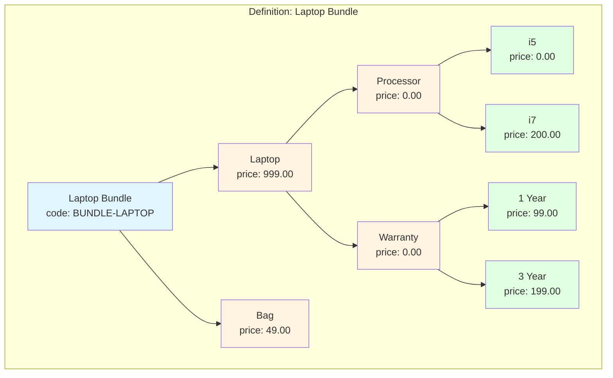
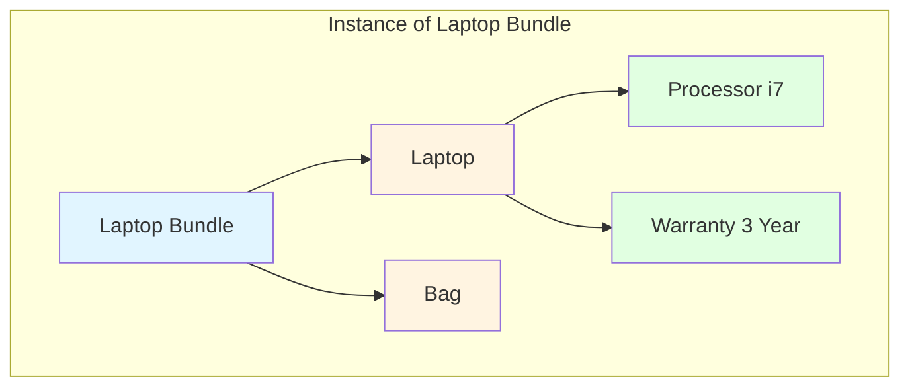
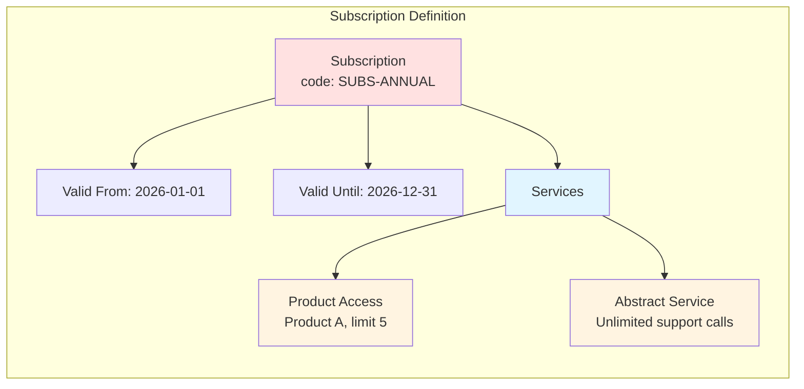

# Design of Products

## Overview

This document defines how products are modelled within the system. A product is a sellable item or service that an SME offers to its customers. The design supports two high-level categories:

- **Fixed-price products** -- the customer pays a set price for each item purchased.
- **Subscription products** -- the customer buys a subscription that entitles them to a service during a defined date window. The service may grant access to instances of fixed-price products or provide abstract benefits such as support calls.

Every product is split into two layers:

- **Product Definition** -- the template created by the SME. It defines what *can* be configured (the part tree, possible attributes, discounts, and for subscriptions, the service entitlements).
- **Product Instance** -- the concrete configuration created for a specific customer or sale. It captures what *has* been chosen, including duplicate parts that may each carry their own independently configured children.

The instance tree is what gets priced, stored on a contract, and presented to the customer.

---

## Product Definition

The definition is the reusable blueprint. It is made up of the following elements.

### 1. Product Code

A unique, human-readable identifier (e.g. `PROD-001`, `SUBS-ANNUAL`). Used for lookup, reporting, and integration.

### 2. Product Description

A display name and optional long-form description intended for the UI and for customer-facing documents.

### 3. Payment Model

Each product definition declares a `PaymentModel` that controls when the customer must pay for products based on this definition:

- `PREPAID` -- payment is required before the contract can enter `RUNNING`.
- `POSTPAID` -- the contract can enter `RUNNING` as soon as it is approved; invoices are issued later.

The payment model is independent of the `BillingModel` (fixed-price vs. subscription). This allows combinations such as a fixed-price installation that is paid in advance (`FIXED_PRICE` + `PREPAID`) alongside a subscription service that is invoiced monthly (`SUBSCRIPTION` + `POSTPAID`) within the same contract.

### 4. Part Tree (Definition)

A definition is not a flat list of line items. It is a **tree of parts**.

- The root of the tree represents the product itself.
- Each node in the tree is a **part definition**.
- A part may contain zero or more child parts.
- There is no enforced depth limit; trees can be as deep or as wide as required.
- Where a product offers choices (e.g. "pick one processor"), the definition lists all the alternative child parts under the parent.
- Alternatives are grouped into **choice groups**. Each group declares the minimum and maximum number of child parts that must be selected from it. The actual choices are recorded later in the **instance**.

This allows modelling of:

- Simple products (root only, no children).
- Bundles (root with multiple child parts).
- Configurable products with nested options (e.g. a laptop with a processor choice, and each processor choice has a warranty sub-choice).

### 5. Choice Groups

When a parent part offers alternatives, its direct children can be assigned to a **choice group**. The group declares how many of those children must appear in a valid instance.

- A choice group belongs to a parent `PartDefinition`.
- Sibling child parts with the same non-null `choiceGroupId` are members of the group.
- Each group has `minChoices` and `maxChoices`.
- A child part that is not in a choice group is independent: it is governed only by its own `minCardinality` and `maxCardinality`.
- Validation must reject any instance that selects too few or too many parts from a group.

Example: a `Processor` parent with children `i5`, `i7`, and `AMD Ryzen 5` in a choice group with `minChoices = 1` and `maxChoices = 1` forces the customer to pick exactly one processor.

#### Database Schema

Add a new table for choice groups and a foreign key on `T_part_definition`:

```sql
CREATE TABLE T_part_definition_choice_group (
    id VARCHAR(36) PRIMARY KEY,
    parent_part_definition_id VARCHAR(36) NOT NULL,
    min_choices INT NOT NULL DEFAULT 1,
    max_choices INT NOT NULL DEFAULT 1,
    CONSTRAINT FK_part_definition_choice_group_parent
        FOREIGN KEY (parent_part_definition_id) REFERENCES T_part_definition(id)
);

ALTER TABLE T_part_definition
ADD COLUMN choice_group_id VARCHAR(36),
ADD CONSTRAINT FK_part_definition_choice_group_id
    FOREIGN KEY (choice_group_id) REFERENCES T_part_definition_choice_group(id);

ALTER TABLE T_part_definition_AUD
ADD COLUMN choice_group_id VARCHAR(36);
```

#### Entity

```java
@Entity
@Table(name = "T_part_definition_choice_group")
@Audited
public class PartDefinitionChoiceGroup {

    @Id
    @Column(name = "id", length = 36)
    private String id;

    @ManyToOne(fetch = FetchType.LAZY)
    @JoinColumn(name = "parent_part_definition_id", nullable = false)
    private PartDefinition parentPartDefinition;

    @Column(name = "min_choices", nullable = false)
    private Integer minChoices = 1;

    @Column(name = "max_choices", nullable = false)
    private Integer maxChoices = 1;

    // getters / setters
}
```

`PartDefinition` gets a nullable `@ManyToOne` reference to `PartDefinitionChoiceGroup`.

### 6. Price per Part

Every part definition carries its own unit price.

- The price is always defined at the part level, never at the product level directly.
- For a simple product, the root part holds the single price.
- For a bundle, the root part may have a price of zero and each child part carries its own price; or the root may carry a bundled price that overrides the sum of its children.
- The rules for price resolution are defined in the **Pricing Rules** section below.

### 7. Part Attributes

Each part definition has a list of **attributes** that describe the actual product.

- Attributes are name/value pairs.
- They are stored on the definition and inherited by every instance of that part.
- Examples: `colour: red`, `weight_kg: 2.5`, `warranty_months: 12`, `subscription_tier: premium`.
- Attributes may influence downstream behaviour (e.g. filtering, reporting) but the core product model treats them as opaque data.
- An instance may later override or extend these attributes if the business rules allow it.

### 8. Discounts

Discounts can be attached to **any path in the definition tree**.

- A discount is a reduction that applies to the price of the part at the end of the path.
- A path is defined by traversing from the root down to a specific part.
- Multiple discounts may apply to the same path; the resolution order is defined in the **Pricing Rules** section.
- Discount types may include:
  - **Percentage** -- reduces the price by a given percent.
  - **Fixed amount** -- reduces the price by a fixed currency amount.
  - **Override** -- replaces the price entirely.



---

## Product Instance

A product instance is created from a definition when a customer configures a product for purchase. It captures every choice and every duplicate that makes up the sellable configuration.

### 1. One Node per Physical Part

If a part is required more than once, it appears in the instance tree as **multiple distinct nodes**, not as a single node with a quantity. For example, a bundle that contains two identical power supplies is represented by two separate power-supply nodes in the instance tree.

### 2. Independent Child Configuration

Because each duplicate is its own node, each one can carry **independently configured children**. One power-supply node may have a UK plug child, while the other has an EU plug child. The definition merely declares that a power-supply part exists; the instance decides how many appear and how each is configured.

### 3. Selected Paths Only

The instance tree contains only the parts that are actually included in this sale. If the definition offers three processor choices, the instance contains exactly one of them (the one the customer picked). Unchosen branches are simply absent from the instance tree.

### 4. Snapshot of Pricing

The instance stores the resolved unit price of each part at the moment it is created. This isolates historical contracts from later changes to the definition.



---

## Product Categories

Categories apply to the **definition**.

### Fixed-Price Product

The customer pays the resolved price of the instance at the point of purchase.

- The resolved price is calculated by summing the prices of every node in the instance tree, applying any discounts that are active for the corresponding definition paths.
- There is no "quantity" field on a line item; quantity is expressed by the presence of multiple nodes.

### Subscription Product

The customer purchases a subscription that entitles them to one or more services during a validity period.

- **Valid from / Valid until** -- two dates that bound the entitlement window.
- **Service definition** -- each subscription links to one or more services that define what the holder is entitled to consume. A service may be:
  - **Product access** -- grants the right to instantiate a specific fixed-price product definition up to a defined usage limit (e.g. "up to 5 instances of Product A").
  - **Abstract service** -- provides an intangible benefit described in the service definition itself (e.g. "unlimited phone calls to the service desk").
- When a subscription holder uses a product-access service, the system creates a product instance and records the consumption against the subscription. The instance may be priced at zero if fully covered by the subscription, or at the product's fixed price if the subscription only grants a discount.
- A subscription definition carries its own part tree and pricing for the subscription fee itself. The service definitions determine what is included beyond that fee.
- Each service definition may specify a **usage limit** (e.g. up to 5 items). A null limit means unlimited.



---

## Pricing Rules

Price resolution is performed against the **instance tree**, using the **definition** to locate applicable discounts.

1. **Tree traversal** -- walk every node in the instance tree.
2. **Part price collection** -- for each instance node, take its snapshot price.
3. **Discount application** -- for each included part, identify all discounts attached to the corresponding path in the definition tree.
   - If multiple discounts exist, apply them in the order defined by a `priority` field on the discount.
   - Percentage and fixed-amount discounts compose additively.
   - An override discount replaces the price after all other discounts have been applied.
   - The minimum resolved price for any part is zero; discounts cannot make a price negative.
4. **Total** -- sum the resolved prices of all nodes in the instance tree to produce the line total.

---

## Data Model Sketch

### Definition Layer

```
ProductDefinition
- id (PK)
- product_code (unique, not null)
- description
- billing_model (FIXED_PRICE | SUBSCRIPTION)
- payment_model (PREPAID | POSTPAID)
- product_valid_from (nullable)
- product_valid_until (nullable)
- terms_and_conditions_code (nullable)

PartDefinition
- id (PK)
- product_definition_id (FK)
- parent_part_definition_id (FK, nullable, self-referencing)
- part_code
- description
- unit_price
- display_order

PartDefinitionAttribute
- id (PK)
- part_definition_id (FK)
- attribute_name
- attribute_value

DiscountDefinition
- id (PK)
- product_definition_id (FK)
- path (string, e.g. "/root/part-a/part-b")
- discount_type (PERCENTAGE | FIXED_AMOUNT | OVERRIDE)
- discount_value
- priority
- active_from
- active_until

ServiceDefinition
- id (PK)
- service_code (unique, not null)
- description
- service_type (PRODUCT_ACCESS | ABSTRACT_SERVICE)
- target_product_definition_id (FK -> ProductDefinition, nullable, for PRODUCT_ACCESS)
- usage_limit (nullable, null = unlimited)
- abstract_service_description (nullable)

SubscriptionServiceLink
- id (PK)
- subscription_product_definition_id (FK -> ProductDefinition)
- service_definition_id (FK -> ServiceDefinition)
```

### Instance Layer

```
ProductInstance
- id (PK)
- product_definition_id (FK)

PartInstance
- id (PK)
- product_instance_id (FK)
- part_definition_id (FK)
- parent_part_instance_id (FK, nullable, self-referencing)
- resolved_unit_price
- display_order

PartInstanceAttribute
- id (PK)
- part_instance_id (FK)
- attribute_name
- attribute_value
```

A definition with `billing_model = FIXED_PRICE` has a part-definition tree and may have discount definitions.
A definition with `billing_model = SUBSCRIPTION` has a part-definition tree (typically minimal), a date range, and a set of `SubscriptionServiceLink` entries connecting it to `ServiceDefinition` records that describe the entitlements.
Every definition also has a `payment_model` (PREPAID or POSTPAID) that is independent of the billing model.
An instance is created from a fixed-price definition either directly or when a subscription holder consumes a product-access service.

---

## Open Questions

1. Should discounts support **conditional rules** (e.g. "apply only if total node count > 10") or remain simple and unconditional?
2. Should subscription service consumption be tracked as separate **contract line items** or as a ledger of usage against the subscription?
3. Is there a need for **definition versioning** so that price or structure changes do not affect historical instances?
