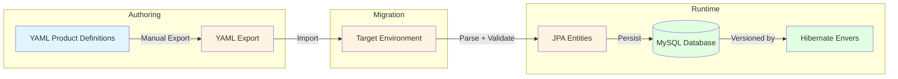

# Design of Product Definition Source

## Overview

This document describes how product definitions are authored, stored, versioned, and migrated between environments.

The runtime model (product definitions as JPA entities) is already defined. This document specifies:
- How definitions get into the database
- How changes are tracked and reviewed
- How data moves between environments

## Chosen Architecture

The solution uses **YAML import/export** with **Hibernate Envers** for database versioning:

- **Authoring**: Product definitions are authored as YAML files
- **Storage**: Data lives in the database at runtime
- **Migration**: Manual YAML export/import between environments
- **Version control**: Hibernate Envers tracks database changes; YAML file version control is out of scope
- **Validation**: Invalid YAML imports fail fast with clear errors



## Why MVEL is Not Recommended

Scripting languages like **MVEL** were considered but rejected due to native-image incompatibility:

| MVEL characteristic | Native-image problem |
|---------------------|----------------------|
| **Runtime compilation** | MVEL generates classes at runtime; GraalVM native image does not support `ClassLoader.defineClass` |
| **Heavy reflection** | Every reflectively accessed member must be declared in `reflect-config.json` |
| **Dynamic classloading** | Classpath scanning is restricted in native images |
| **No Quarkus extension** | No automatic GraalVM metadata generation |

Using MVEL would force JVM mode, defeating the native-image requirement.

## YAML Format

Product definitions are authored as human-readable YAML that maps directly to the entity model.

### Example: Fixed-Price Product

```yaml
productCode: BUNDLE-LAPTOP
category: FIXED_PRICE
description: Laptop bundle with choice of processor
parts:
  - partCode: LAPTOP
    description: Base Laptop
    unitPrice: 999.00
    children:
      - partCode: PROCESSOR
        description: Processor Selection
        unitPrice: 0.00
        children:
          - partCode: I5
            description: Intel Core i5
            unitPrice: 0.00
          - partCode: I7
            description: Intel Core i7
            unitPrice: 200.00
discounts:
  - path: "/LAPTOP/PROCESSOR/I7"
    type: PERCENTAGE
    value: 10
    priority: 1
```

### Example: Subscription Product

```yaml
productCode: SUBS-ANNUAL
category: SUBSCRIPTION
description: Annual support subscription
parts:
  - partCode: SUBSCRIPTION
    description: Annual Support Plan
    unitPrice: 499.00
subscription:
  validFrom: "2026-01-01"
  validUntil: "2026-12-31"
  services:
    - serviceCode: HW-ALLOWANCE
      description: Hardware replacement allowance
      serviceType: PRODUCT_ACCESS
      targetProductCode: BUNDLE-LAPTOP
      usageLimit: 2
```

## Import/Export Behavior

**Validation**: Invalid YAML files cause the import to fail immediately. No partial imports are allowed.

**Idempotency**: Each import replaces the entire product definition dataset for the target environment.

**Environment Isolation**: Each environment (dev, staging, prod) is a separate deployment with its own database. No environment-specific overrides in YAML; environments are kept completely separate.

## Decisions

| Question | Decision |
|----------|----------|
| Fail on invalid YAML? | **Yes** -- imports are atomic, all-or-nothing |
| Environment-specific overrides? | **No** -- environments are separate deployments |
| Conditional attributes in YAML? | **Deferred** -- will be added later if needed |
| Scripting support (MVEL, etc.)? | **No** -- not native-image compatible |
| YAML version control? | **Out of scope** -- Envers handles database versioning |

## Future Considerations

- Conditional attributes may be added to the YAML format when requirements emerge
- Shared part references via `ref` can be implemented to reduce duplication
