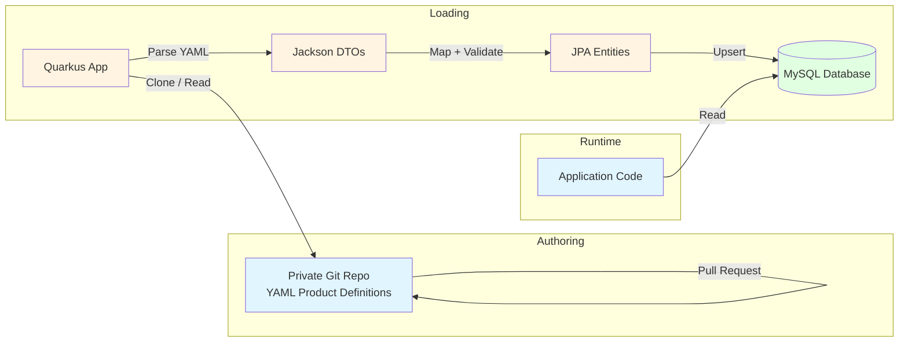

# Design of Product Definition Source

## Overview

This document evaluates how product definitions are authored, stored, and loaded into the system. The design documents already describe the runtime model (product definitions as JPA entities stored in the database). What remains is deciding where the *source of truth* for those definitions lives, and how they get into the database.

The SME needs:

- Product definitions under **version control** (Git), so changes are tracked, reviewed, and reversible.
- Definitions kept **private** and **separate** from the main application repository, which is on GitHub.
- Full **Quarkus native-image compatibility** -- no runtime mechanism that breaks GraalVM's closed-world assumption.

Two broad approaches are considered:

1. **Database as source of truth** -- definitions are edited through the application UI and stored in the database; version control is used for backup or migration scripts.
2. **File-based definitions** -- definitions are authored as text files (scripts, configuration, or a custom DSL), stored in a separate Git repository, and loaded into the database at build time or startup.

Within the file-based approach, scripting languages such as **MVEL** are sometimes proposed because they are concise and programmable. This document evaluates whether MVEL is viable given the native-image constraint.

---

## Option 1: Database as Source of Truth

### How it works

- The SME edits product definitions through the application's admin UI.
- Changes are persisted via JPA/Hibernate into the MySQL database.
- A separate private repository stores Flyway migration scripts or database dumps that represent snapshots of the definitions.
- The private repo is the "backup of record" for version control, but the database is what the application reads at runtime.

### Pros

- **Fully native-image compatible**. The runtime model is already JPA entities; nothing changes.
- **Immediate updates**. An SME user can edit a definition and see the change reflected instantly without redeploying.
- **No build-time dependency**. The application does not need to know about a separate repository at build time.
- **Simple tooling**. The application already uses Hibernate and Flyway; the approach requires no new libraries.

### Cons

- **Version control is indirect**. The database is the source of truth; the Git repo is a secondary export. It is easy for the two to drift out of sync.
- **Review workflow is weak**. Changes made in the UI are not reviewed through pull requests unless a manual export-and-commit step is added.
- **Hard to diff or merge**. Database dumps and generated migration scripts are poor formats for code review.
- **Separate repo feels bolted-on**. The private repo exists only as an after-the-fact backup mechanism, not as a natural authoring environment.

---

## Option 2: File-Based Definitions with a Build-Time Loader

### How it works

- Product definitions are authored as text files in a structured format (see format options below).
- The files live in a **separate private Git repository** (not on GitHub).
- At **build time** or **application startup**, the application reads the files, validates them, and inserts or updates the corresponding JPA entities in the database.
- At runtime, the application reads only from the database. The file-based source is the authoring and version-control layer; the database is the runtime cache.

### Format options

#### 2a. YAML / JSON Configuration Files

Each product definition is a YAML or JSON file that maps directly to the entity model.

```yaml
productCode: BUNDLE-LAPTOP
category: FIXED_PRICE
description: Laptop bundle with bag
parts:
  - partCode: LAPTOP
    unitPrice: 999.00
    children:
      - partCode: PROCESSOR
        children:
          - partCode: I5
            unitPrice: 0.00
          - partCode: I7
            unitPrice: 200.00
discounts:
  - path: "/LAPTOP/PROCESSOR/I7"
    type: PERCENTAGE
    value: 10
    priority: 1
```

**Pros:** human-readable, easy to diff and review in pull requests, no extra runtime dependencies.

**Cons:** requires a custom parser and validator, does not support conditional logic or computed values natively.

#### 2b. Custom DSL (Domain-Specific Language)

A purpose-built grammar for product definitions, compiled by a small parser at build time.

**Pros:** exactly fits the domain, can enforce structural rules at parse time, compact syntax.

**Cons:** must design, implement, and maintain the parser and grammar.

#### 2c. MVEL (or Similar Scripting Language)

MVEL is an expression language that supports inline logic, loops, and method calls. Definitions could be MVEL scripts that construct product objects programmatically.

```java
// Hypothetical MVEL product definition
ProductDef p = new ProductDef("BUNDLE-LAPTOP", FIXED_PRICE);
p.addPart(new PartDef("LAPTOP", 999.00)
    .addChild(new PartDef("PROCESSOR", 0.00)
        .addChild(new PartDef("I5", 0.00))
        .addChild(new PartDef("I7", 200.00))));
return p;
```

### Why MVEL is not recommended

MVEL is **not compatible with Quarkus native images** without extensive and fragile workaround configuration. The reasons are fundamental to how MVEL and GraalVM native image interact:

| MVEL characteristic | Native-image problem |
|---------------------|----------------------|
| **Runtime compilation** | MVEL compiles expressions into generated classes at runtime. GraalVM native image does not support dynamic class generation (`ClassLoader.defineClass`). |
| **Heavy reflection** | MVEL introspects arbitrary classes and methods reflectively. Every reflectively accessed class, method, and field must be pre-declared in `reflect-config.json`. For a full domain model this list is large and easy to miss. |
| **Dynamic classloading** | MVEL loads classes by name from strings. In a native image, classpath scanning and dynamic class resolution are severely restricted. |
| **No Quarkus extension** | There is no first-party or well-maintained Quarkus extension for MVEL. Without an extension, there is no automatic generation of the GraalVM metadata required to make MVEL work. |

In practice, using MVEL would force the application to run in **JVM mode**, defeating the native-image requirement stated in the project rules. Even with a `reflect-config.json` generated by the tracing agent, the runtime compilation aspect is a hard blocker.

**Alternative scripting options evaluated:**

- **GraalVM JavaScript (GraalJS)** -- technically runs in native image via the Truffle framework, but requires the `js` language component, significantly increases image size, and is overkill for product definitions.
- **Qute (Quarkus templating)** -- designed for rendering, not for authoring structured data models.
- **Kotlin DSL** -- compiled to bytecode like Java, so native-compatible in principle, but requires compiling the definitions into the application build, which couples them to the main repo and complicates the "separate private repo" requirement.

### Recommendation for file-based approach

Use **YAML configuration files** (Option 2a) stored in a separate private Git repository. They are human-readable, diff-friendly, require no exotic libraries, and can be parsed with Jackson (already on the classpath via `quarkus-rest-jackson`) or with a lightweight YAML parser such as SnakeYAML.

---

## Option 3: Hybrid -- File-Based Source with Runtime Sync

### How it works

- Definitions are authored as YAML files in the separate private repository.
- The application is configured with the path or URL of the repository (or a local clone).
- On startup, the application pulls or reads the files, parses them, and **upserts** the JPA entities in the database.
- The application provides an admin endpoint (`POST /admin/sync-product-definitions`) that the SME can trigger to reload definitions without redeploying.

### Pros

- Combines the version-control benefits of files with the runtime flexibility of database storage.
- The database remains the native-image-compatible runtime source.
- The private repo is the true source of truth; the database is a derived cache.
- Changes can be reviewed via pull request before being synced into production.

### Cons

- Requires the runtime environment to have access to the private repository (SSH key, deploy token, or a mounted volume with a cloned repo).
- A sync failure leaves the database in an intermediate state unless wrapped in a transaction.
- If two environments (dev and prod) sync from the same repo, they must be able to target different branches or tags.

---

## Comparison Summary

| Criterion | Option 1<br/>Database source | Option 2a<br/>YAML files + loader | Option 3<br/>Hybrid (recommended) |
|-----------|-----------------------------|-----------------------------------|-----------------------------------|
| Native-image compatible | Yes | Yes | Yes |
| Version control friendly | Poor | Excellent | Excellent |
| Separate private repo | Possible (backup only) | Natural fit | Natural fit |
| Review workflow (pull requests) | None | Built-in | Built-in |
| Runtime update without redeploy | Yes | Requires rebuild | Yes (via sync endpoint) |
| Extra build/runtime dependencies | None | Jackson / SnakeYAML | Git client or HTTP client |
| Complexity | Low | Medium | Medium |
| Risk of source/database drift | High | Low (if build-time) | Low (if runtime sync is robust) |

---

## Recommended Architecture

Adopt **Option 3 (Hybrid)** with the following specifics:

1. **Authoring layer** -- YAML files in a separate private Git repository (e.g. a self-hosted Git server, GitHub private repo, or GitLab). Each product is one YAML file; changes are reviewed via pull request.

2. **Loading layer** -- a Quarkus service bean that reads the YAML files, validates them against a Jackson-annotated DTO, and maps them to JPA entities. This bean is triggered:
   - Automatically on application startup (via `@Observes StartupEvent`).
   - Manually via an admin REST endpoint (`POST /admin/product-definitions/sync`).

3. **Runtime layer** -- the application reads product definitions exclusively from the database via JPA. No runtime dependency on the YAML files or the private repository.

4. **Environment isolation** -- the sync mechanism reads a configuration property (e.g. `product.definitions.git.branch`) so that dev, staging, and prod can sync from different branches or tags of the private repo.



---

## Decisions on Open Questions

1. **References in YAML** -- **Yes**. The format supports reusable part definitions that are declared once and referenced by ID from multiple products. This avoids duplication and ensures that a shared part (e.g. a standard power supply) is updated in one place.

2. **Sync idempotency** -- **Yes, idempotent**. Each sync operation replaces the entire product-definition dataset in the database with the current state of the YAML files. This is simpler to implement, guarantees consistency between the repo and the database, and is acceptable because catalogues are expected to be small enough for a full reload.

3. **Multiple repositories** -- **No, a single repository is sufficient** for the foreseeable future. If the need arises later, the loading layer can be extended to read from multiple sources.

4. **Dry-run mode** -- **Yes**. The sync endpoint accepts a `?dryRun=true` query parameter. In dry-run mode the loader parses all YAML files, validates them, computes the changes, and returns a report of what would be inserted, updated, or deleted -- without writing anything to the database.

---

## YAML Examples

### Shared Part Reference

Common parts that appear in many products are declared in a `shared/` directory and referenced by `ref`.

```yaml
# shared/power-supply.yaml
partCode: POWER-SUPPLY
description: 65W USB-C Power Supply
unitPrice: 29.99
attributes:
  - name: wattage
    value: "65"
  - name: connector
    value: USB-C
```

```yaml
# shared/bag.yaml
partCode: BAG
description: Laptop Carry Bag
unitPrice: 49.00
attributes:
  - name: material
    value: nylon
  - name: max_laptop_size_inch
    value: "15.6"
```

### Fixed-Price Product with References

```yaml
# products/laptop-bundle.yaml
productCode: BUNDLE-LAPTOP
category: FIXED_PRICE
description: Laptop bundle with choice of processor and warranty
parts:
  - partCode: LAPTOP
    description: Base Laptop
    unitPrice: 999.00
    children:
      - partCode: PROCESSOR
        description: Processor Selection
        unitPrice: 0.00
        children:
          - partCode: I5
            description: Intel Core i5
            unitPrice: 0.00
          - partCode: I7
            description: Intel Core i7
            unitPrice: 200.00
      - partCode: WARRANTY
        description: Extended Warranty
        unitPrice: 0.00
        children:
          - partCode: 1YEAR
            description: 1 Year Warranty
            unitPrice: 99.00
          - partCode: 3YEAR
            description: 3 Year Warranty
            unitPrice: 199.00
  - ref: BAG
  - ref: POWER-SUPPLY
discounts:
  - path: "/LAPTOP/PROCESSOR/I7"
    type: PERCENTAGE
    value: 10
    priority: 1
    activeFrom: "2026-01-01"
    activeUntil: "2026-12-31"
```

### Subscription Product with Services

```yaml
# products/support-subscription.yaml
productCode: SUBS-ANNUAL
category: SUBSCRIPTION
description: Annual support subscription with hardware allowance
parts:
  - partCode: SUBSCRIPTION
    description: Annual Support Plan
    unitPrice: 499.00
subscription:
  validFrom: "2026-01-01"
  validUntil: "2026-12-31"
  services:
    - serviceCode: HW-ALLOWANCE
      description: Hardware replacement allowance
      serviceType: PRODUCT_ACCESS
      targetProductCode: BUNDLE-LAPTOP
      usageLimit: 2
    - serviceCode: SUPPORT-CALLS
      description: Unlimited service desk calls
      serviceType: ABSTRACT_SERVICE
      abstractServiceDescription: "Phone and email support, 9am-5pm weekdays"
```

### Product with Two Identical Referenced Parts

Because the instance model treats each occurrence as a distinct node, a product can reference the same shared part twice. The loader resolves each `ref` into a separate node in the definition tree.

```yaml
# products/dual-monitor-kit.yaml
productCode: DUAL-MONITOR-KIT
category: FIXED_PRICE
description: Kit containing two identical 27-inch monitors
parts:
  - partCode: MONITOR-KIT
    description: Dual Monitor Kit
    unitPrice: 0.00
    children:
      - ref: MONITOR-27
      - ref: MONITOR-27
```

Where `MONITOR-27` is defined in `shared/monitor-27.yaml`.

---

## Open Questions

1. How should the loader handle **orphaned references** (a product references a shared part that no longer exists)? Fail the entire sync, skip the affected product, or treat it as a validation error in dry-run mode?
2. Should the system support **environment-specific overrides** (e.g. a `dev/` or `staging/` directory in the repo that merges with the base definitions) or should environment differences be handled purely by Git branches?
3. Should the YAML format support **conditional attributes** (e.g. a part has attribute `colour: red` only when the parent part is `SPORT-EDITION`), or should conditional logic be kept out of the definition layer entirely?
