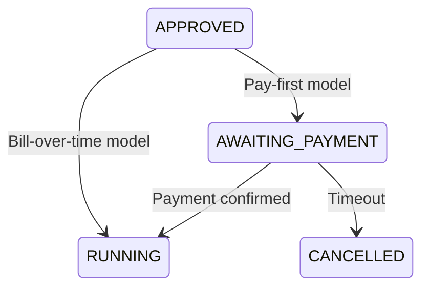
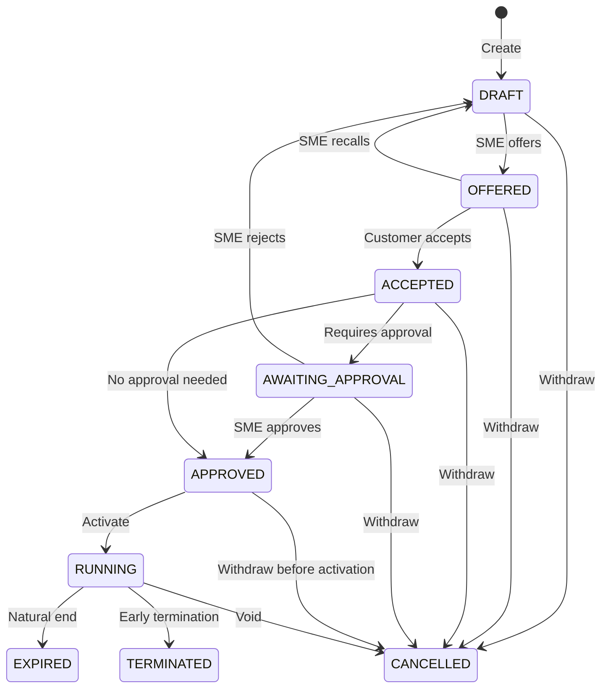

# Design of Sales Process

## Overview

The sales process transforms a draft contract into a running agreement. It is implemented as a specific `ProcessInstance` (see [DATABASE_PROCESSES.md](./DATABASE_PROCESSES.md)) linked to the contract, with each transition recorded as a `ProcessInstanceStep`.

Two variants exist, chosen at draft time based on the payment model:

- **Pay-first** -- contract enters `RUNNING` only after the initial invoice is paid in full.
- **Bill-over-time** -- contract enters `RUNNING` immediately upon approval; invoices are issued periodically.

Both variants share the same early steps (draft, offer, acceptance, approval). They diverge only at the payment stage.

---

## Steps

| # | Step | Contract State Change | Actor |
|---|------|----------------------|-------|
| 1 | **Draft Creation** | `* -> DRAFT` | SME |
| 2 | **Offer** | `DRAFT -> OFFERED` | SME |
| 3 | **Acceptance** | `OFFERED -> ACCEPTED` | Customer |
| 4 | **Approval** (if required) | `ACCEPTED -> AWAITING_APPROVAL -> APPROVED` | SME |
| 4 | **Approval** (if not required) | `ACCEPTED -> APPROVED` | -- |
| 5 | **Document Preparation** | (no contract state change) | System / SME |
| 6 | **Payment Handling** | `APPROVED -> RUNNING` (or `CANCELLED`) | System / Customer |

### Payment Handling Divergence

- **Pay-first**: the contract stays `APPROVED` while an initial invoice is issued. A background job monitors payment; on confirmation the contract moves to `RUNNING`. Unpaid invoices past a grace period may result in `CANCELLED`.
- **Bill-over-time**: the contract moves immediately to `RUNNING`. Invoices are generated after activation; unpaid invoices are handled by the [after-sales process](DESIGN_OF_AFTER_SALES_PROCESS.md).

---

## Full Contract State Diagram

---

## Process Tracking

The generic `ProcessInstance` / `ProcessInstanceStep` tables track the sales workflow. A contract may have one active `ProcessInstance` with `process_name = "sales-process"`. Each state transition (including retries and rollbacks) becomes a step.

---

## Decision: Payment Model

| Scenario | Model | Rationale |
|----------|-------|-----------|
| One-off product sale | Pay-first | Goods ship after payment. |
| Annual subscription up-front | Pay-first | Period starts after fee received. |
| Monthly subscription | Bill-over-time | Active immediately; invoices monthly. |
| Instalment plan | Bill-over-time | Goods now; pay over time. |
| Service retainer | Either | Depends on advance vs. arrears. |
