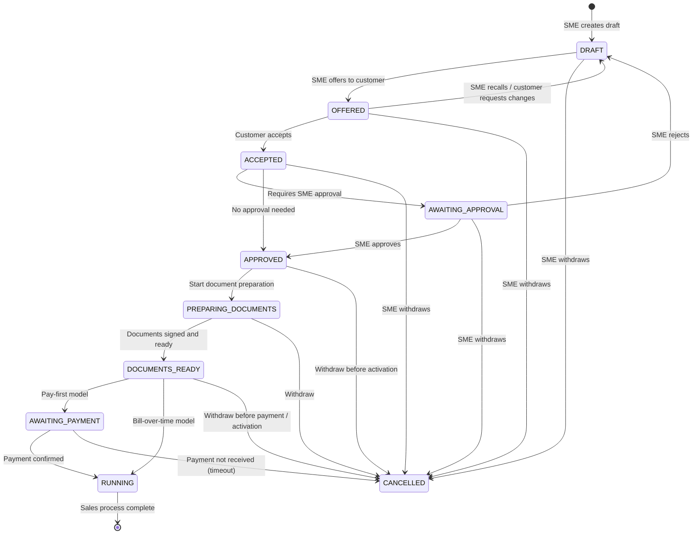

# Design of Sales Process

## Overview

The sales process is the sequence of steps that transforms a draft contract into a running agreement. It covers everything from the SME creating an offer to the point where the contract becomes legally active and ready for fulfilment.

The process is **generic** -- the SME can configure which variant to use for a given contract based on the payment model:

- **Pay-first model** -- the contract does not enter `RUNNING` until the initial invoice is paid in full. Used for one-off product sales or up-front subscription fees.
- **Bill-over-time model** -- the contract enters `RUNNING` as soon as it is approved, and invoices are issued periodically over the life of the contract. Used for subscription services or instalment plans. Unpaid invoices are handled by the [after-sales process](DESIGN_OF_AFTER_SALES_PROCESS.md), not the sales process.

Both variants share the same early steps (draft, offer, acceptance, approval). They diverge only at the document-preparation and payment stages.

---

## Process Steps

### 1. Draft Creation

- The SME assembles a new contract in state `DRAFT`.
- Product instances are created from product definitions and attached as line items.
- The grand total is calculated and snapshotted.
- The appropriate payment model (pay-first or bill-over-time) is selected.

### 2. Offer

- The SME transitions the contract to `OFFERED`.
- The customer receives the offer and may review the line items, total price, and terms and conditions.
- The customer may accept, reject, or request changes. If changes are requested, the SME transitions back to `DRAFT`.

### 3. Acceptance

- The customer accepts the offer.
- The contract moves to `ACCEPTED`.
- At this point the system records the customer signatory details (name, role, date, place) and the digital acceptance token.

### 4. Approval

- Some contracts require explicit SME approval after customer acceptance.
- If required, the contract moves to `AWAITING_APPROVAL`.
- An authorised SME representative reviews and either approves (moves to `APPROVED`) or rejects (returns to `DRAFT`).
- If no approval gate is configured, the contract moves directly from `ACCEPTED` to `APPROVED`.

### 5. Document Preparation

- Once approved, the system generates the final contract documents.
- This step produces:
  - A PDF representation of the contract, including all line items, totals, and referenced terms and conditions.
  - A covering letter or summary page.
  - An initial invoice (for pay-first contracts) or a schedule of future invoices (for bill-over-time contracts).
- The SME signatory reviews and digitally signs the documents.
- The documents are made available to the customer.

### 6. Payment Handling

The behaviour of this step depends on the payment model selected in step 1.

#### Pay-First Model

- The initial invoice is issued immediately upon document completion.
- The contract remains in `APPROVED` and does **not** advance to `RUNNING`.
- A background process monitors the payment status.
- Once payment is confirmed, the contract transitions to `RUNNING`.
- If payment is not received within a configurable grace period, the contract may be moved to `CANCELLED`.

#### Bill-Over-Time Model

- No payment is required before the contract becomes active.
- The contract transitions immediately from `APPROVED` to `RUNNING`.
- The initial invoice (and subsequent periodic invoices) is generated after activation and sent to the customer according to the agreed payment schedule.
- Unpaid invoices are tracked and chased by the [after-sales process](DESIGN_OF_AFTER_SALES_PROCESS.md); they do not block the sales process.

---

## Sales Process State Diagram

The diagram below extends the contract lifecycle with the sales-specific preparation and payment steps that sit between `APPROVED` and `RUNNING`.



### Legend

- **Blue nodes** (`PREPARING_DOCUMENTS`, `DOCUMENTS_READY`, `AWAITING_PAYMENT`) are sales-process states that do not appear in the core contract state machine. They are transient steps managed by the sales workflow engine.
- The contract state stored in the database remains `APPROVED` while the sales process is in `PREPARING_DOCUMENTS`, `DOCUMENTS_READY`, or `AWAITING_PAYMENT`. The sales process tracks its own sub-state separately.
- Once the contract reaches `RUNNING`, the sales process is complete and the [after-sales process](DESIGN_OF_AFTER_SALES_PROCESS.md) takes over.

---

## Data Model Sketch (Sales Process Layer)

```
SalesProcess
- id (PK)
- contract_id (FK -> Contract)
- payment_model (PAY_FIRST | BILL_OVER_TIME)
- sales_process_status (DRAFT | OFFERED | ACCEPTED | AWAITING_APPROVAL | APPROVED | PREPARING_DOCUMENTS | DOCUMENTS_READY | AWAITING_PAYMENT | RUNNING | CANCELLED)
- current_step
- started_at
- completed_at (nullable)

SalesProcessStep
- id (PK)
- sales_process_id (FK)
- step_name (e.g. PREPARE_DOCUMENTS, ISSUE_INVOICE, AWAIT_PAYMENT)
- step_status (PENDING | IN_PROGRESS | COMPLETED | FAILED | SKIPPED)
- assigned_to_user_id (nullable)
- started_at (nullable)
- completed_at (nullable)
- outcome_notes (nullable)

PreparedDocument
- id (PK)
- sales_process_id (FK)
- document_type (CONTRACT_PDF | COVER_LETTER | INITIAL_INVOICE | PAYMENT_SCHEDULE)
- storage_reference (e.g. S3 key or file path)
- generated_at
- signed_at (nullable)
- SME_signatory_id (nullable -> Signatory)
```

---

## Decision: When to Use Each Payment Model

| Scenario | Recommended Model | Rationale |
|----------|-------------------|-----------|
| One-off product sale | Pay-first | Goods are shipped only after payment. |
| Annual subscription with up-front fee | Pay-first | Subscription period starts after fee is received. |
| Monthly subscription | Bill-over-time | Contract is active immediately; invoices are issued monthly. |
| Instalment plan for expensive equipment | Bill-over-time | Customer receives goods now and pays in agreed instalments. |
| Service retainer | Either | Depends on whether the retainer is paid in advance or arrears. |

---

## Open Questions

1. Should the sales process support **parallel steps** (e.g. preparing documents while awaiting SME approval) or is a strictly sequential flow sufficient?
2. Should the system allow the SME to **switch payment model** after the contract has reached `APPROVED`, or is the model locked at draft time?
3. Is there a need for an **escalation timer** on `AWAITING_PAYMENT` so that overdue contracts are automatically cancelled or flagged for manual review?
4. Should the document-preparation step support **multiple document templates** (e.g. one for B2B, one for B2C) chosen per contract?
