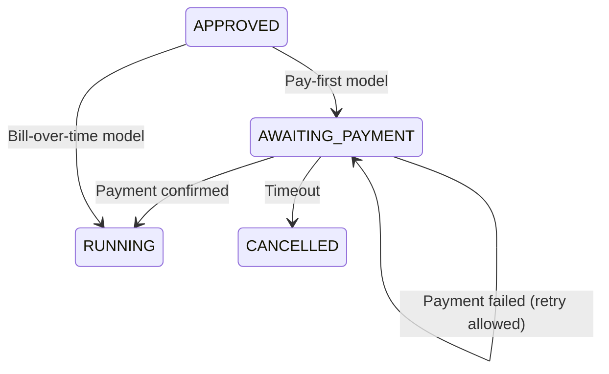
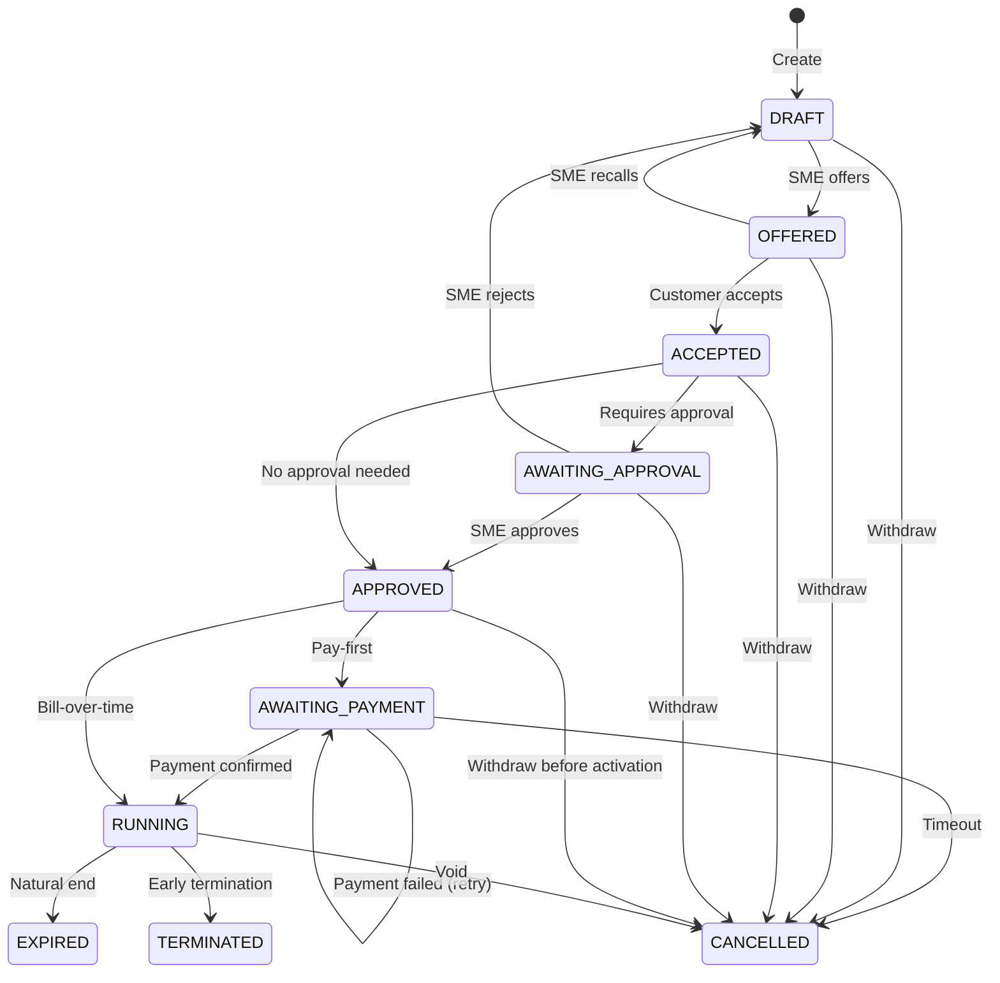

# Design of Sales Process

## Overview

The sales process transforms a draft contract into a running agreement. It is implemented with an application-scoped bean in the `dev.abstratium.sales_process` package. This "service" bean is used to drive the contract through its lifecycle, validating each transition and recording the work as a specific `ProcessInstanceStep` (see [DATABASE_PROCESSES.md](./DATABASE_PROCESSES.md)) linked to the contract.

A contract in `DRAFT` can still be changed: products may be configured, line items may be added or removed, and pricing may be recalculated. Once the customer is satisfied with the configuration, they move it to `OFFERED` so that it can be added to a shopping cart and considered before acceptance.

Two variants exist, chosen at draft time based on the payment model:

- **Pay-first** -- contract enters `RUNNING` only after the initial invoice is paid in full.
- **Bill-over-time** -- contract enters `RUNNING` immediately upon approval; invoices are issued periodically.

Both variants share the same early steps (draft, offer, acceptance, approval). They diverge only at the payment stage.

---

## Steps

| # | Step | Contract State Change | Actor |
|---|------|----------------------|-------|
| 1 | **Draft Creation** | `* -> DRAFT` | SME |
| 2 | **Offer** | `DRAFT -> OFFERED` | SME |
| 3 | **Acceptance** | `OFFERED -> ACCEPTED` | Customer |
| 4 | **Approval** (if required) | `ACCEPTED -> AWAITING_APPROVAL -> APPROVED` | SME |
| 4 | **Approval** (if not required) | `ACCEPTED -> APPROVED` | -- |
| 5 | **Document Preparation** | (no contract state change) | System / SME |
| 6 | **Payment Handling** | `APPROVED -> AWAITING_PAYMENT -> RUNNING` (pay-first) `APPROVED -> RUNNING` (bill-over-time) | System / Customer |

### Payment Handling Divergence

- **Pay-first**: the contract moves to `AWAITING_PAYMENT` once approved. An invoice is issued and a background job monitors payment events from the external payment service. The contract remains in `AWAITING_PAYMENT` across multiple payment attempts; only a confirmed successful payment transitions it to `RUNNING`. A system timeout (grace period expiry) is the only event that moves the contract from `AWAITING_PAYMENT` to `CANCELLED`.
- **Bill-over-time**: the contract moves immediately to `RUNNING`. Invoices are generated after activation; unpaid invoices are handled by the [after-sales process](DESIGN_OF_AFTER_SALES_PROCESS.md).

---

## Full Contract State Diagram

---

## Payment State Semantics

The contract's `state` column is the single source of truth for where the contract sits in its lifecycle, including payment-related waiting. There is no separate payment-status field. This allows the service to know whether a contract is awaiting payment, has been paid, or was cancelled due to timeout, without querying the external payment microservice at runtime.

| Contract State | Meaning for Payment | Allowed Next States |
|----------------|---------------------|---------------------|
| `APPROVED` | No payment action yet (pay-first) or bill-over-time | `AWAITING_PAYMENT`, `RUNNING`, `CANCELLED` |
| `AWAITING_PAYMENT` | Invoice issued; waiting for confirmation from payment service | `RUNNING`, `CANCELLED` |
| `RUNNING` | Payment confirmed (pay-first) or immediate (bill-over-time) | `EXPIRED`, `TERMINATED`, `CANCELLED` |

A failed payment attempt leaves the contract in `AWAITING_PAYMENT`; the customer may retry. The contract is only moved to `CANCELLED` by a system timeout job once the grace period expires.

## Process Tracking

The generic `ProcessInstance` / `ProcessInstanceStep` tables track the sales workflow. A contract may have one active `ProcessInstance` with `process_name = "sales-process"`. Each state transition (including retries and rollbacks) becomes a step.

---

## Decision: Payment Model

| Scenario | Model | Rationale |
|----------|-------|-----------|
| One-off product sale | Pay-first | Goods ship after payment. |
| Annual subscription up-front | Pay-first | Period starts after fee received. |
| Monthly subscription | Bill-over-time | Active immediately; invoices monthly. |
| Instalment plan | Bill-over-time | Goods now; pay over time. |
| Service retainer | Either | Depends on advance vs. arrears. |
