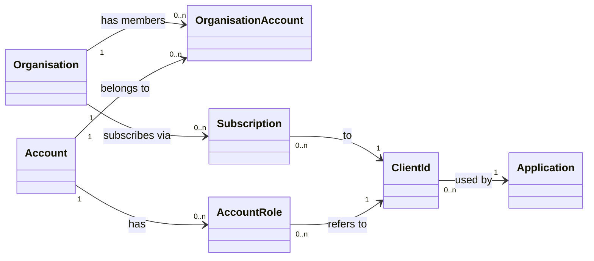
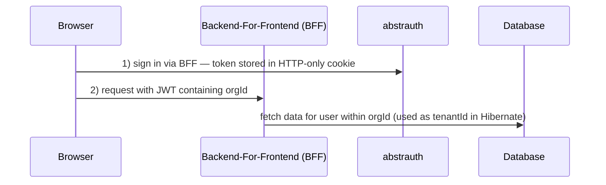

# Multitenancy Design

## Overview

Data isolation uses Hibernate ORM's **discriminator approach**: shared tables with an `org_id` column that discriminates rows at query level. The current organisation is resolved from an `orgId` claim in the signed JWT.

**The `orgId` in a JWT is what downstream applications call `tenantId`.** No separate "tenant" concept exists — the organisation *is* the tenant.

## Domain Model in Abstrauth - the OAuth Identity Provider



- **`Organisation`** — the billing and membership unit. Has 1..n administrators and 1..m members. Admins control membership.
- **`Account`** — a user's login identity. Belongs to one or more organisations. When someone first registers with abstrauth, an organisation is automatically created; the account becomes both owner and member.
- **`Subscription`** — links an organisation to an application (via `clientId`). Its existence grants the org access to the application.
- **`ClientId`** — represents an application registered in abstrauth. A client can be **private** (`publik = false`, only the owning org can subscribe) or **public** (`publik = true`, any org can subscribe).
- **`AccountRole`** (entity: `T_account_roles`) — models "client & role": an account is assigned roles per `clientId`. These rows are the sole source of truth for roles placed in the JWT `groups` claim at sign-in time. Every assigned role must exist in the client's `T_client_allowed_roles` catalog. The `available_to_foreign_orgs` column controls whether a foreign (subscribing) organisation may assign that role.

## Runtime Flow



The `orgId` claim in the JWT is used directly as the Hibernate discriminator value (`org_id` column); services call it `tenantId` because that is what Hibernate calls it.

## Organisation Resolution

### JWT Claim

```java
// TokenResource.java
jwtBuilder.claim("orgId", orgId)
```

Both `access_token` and `id_token` include the claim. Applications may treat this value as their `tenantId`.

### Hibernate Discriminator Configuration

```properties
# application.properties
quarkus.hibernate-orm.multitenant=DISCRIMINATOR
```

### Org Resolver

`OrgIdResolutionFilter` runs after OIDC or bearer-token authentication and reads the `orgId` claim only from Quarkus-provided authenticated token instances. It stores the non-blank value in the request-scoped `CurrentOrgContext`. `JwtOrgResolver` reads that context for Hibernate's discriminator value.

The filter never parses an `Authorization` header itself, so an unverified JWT payload cannot select a tenant. In production, an `/api/` request without a valid resolved `orgId` is rejected with `403 Forbidden`. The resolver falls back to the configured default organisation when no valid request context is available (e.g. startup, scheduled tasks, non-multitenancy entity access). The fallback logs at INFO unless the caller has marked the context as expected via `CurrentOrgContext.setIgnore(true)`.

### Entity Annotation

Organisation-scoped entities receive a `@TenantId` field. Global entities (`Account`, `Credential`, `FederatedIdentity`) do not.

```java
@Entity
public class OAuthClient {
    @TenantId
    @Column(name = "org_id")
    private String orgId;
}
```

Hibernate automatically appends `org_id = ?` to SELECT/UPDATE/DELETE by primary key and sets it on INSERT.

### Bulk Operations Limitation

`@TenantId` does **not** filter bulk JPQL/Criteria UPDATE or DELETE. A bulk operation can affect rows from other organisations.

**Never use JPQL/Criteria bulk UPDATE or DELETE on organisation-scoped entities.** Use per-row operations on loaded entities instead. Neither MySQL nor H2 supports native Row-Level Security.

## Non-Multitenancy Package (`non_multitenancy`)

The `src/main/java/dev/abstratium/.../non_multitenancy` package contains entity classes and services that **bypass Hibernate's discriminator-based multitenancy** (they do not use the `@TenantId` annotation). This separation is critical for maintaining security boundaries while enabling specific cross-tenant operations.

### Package Structure

```
non_multitenancy/
├── boundary/                              # Cross-tenant REST endpoints
├── entity/                                # Cross-tenant JPA entites (no `@TenantId`) - enties normally mirror entity classes from normal packages
└── service/                               # Cross-tenant service classes containing business logic
```

### Security Considerations

- **Cross-tenant calls are isolated to this package** - All code that bypasses the tenant discriminator is contained within `non_multitenancy`, making it easier to audit and maintain.
- **Explicit orgId required** - All service methods require an explicit `orgId` parameter; they never rely on the `JwtOrgResolver` implicit tenant context.
- **No native RLS**: MySQL and H2 do not support Row-Level Security. Isolation is enforced entirely at the application layer.

