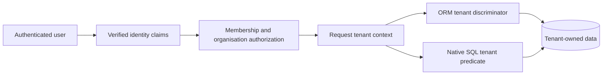

# Multi-Tenant Data Isolation Checklist

## Goal

Ensure that a user can access only data owned by an organisation to which that user belongs. The design must fail closed: an identity, request, query, or background job without an unambiguous organisation must not access tenant-owned data.

## Scope and Ownership Model

- [ ] Define which records are tenant-owned and which records are genuinely global, immutable system data.
- [ ] Add an organisation identifier to every tenant-owned record, including child records that may be queried independently.
- [ ] Do not accept the organisation identifier from client-controlled request data. Derive it from authenticated, verified identity claims or trusted server-side context.
- [ ] Treat changes to organisation membership and organisation selection as authorization operations, not ordinary data updates.
- [ ] Decide explicitly whether organisation-specific configuration is copied from global defaults at provisioning time or is represented as immutable global data plus tenant overrides.

## Request and Identity Handling

- [ ] Validate the access token or session before reading the organisation claim.
- [ ] Rely on the trusted token issuer to authorize the authenticated subject's organisation membership and define the organisation identifier format.
- [ ] Populate a request-scoped tenant context once, before application data access begins.
- [ ] Reject an authenticated request with a missing or blank organisation identifier using `403 Forbidden` or an equivalent denial.
- [ ] Never silently fall back to a production default organisation for a request whose organisation cannot be resolved.
- [ ] Do not let a header, URL parameter, payload field, or UI selection override the organisation derived from verified identity.
- [ ] For service-to-service identities, require an explicit, authorized tenant scope rather than treating them as unrestricted by default.

## ORM Isolation

- [ ] Enable discriminator-based multi-tenancy, or another deliberate isolation strategy, globally for the persistence unit.
- [ ] Mark every tenant-owned entity with the ORM's tenant/discriminator mapping.
- [ ] Make the tenant identifier immutable after persistence and exclude it from externally writable DTOs.
- [ ] Ensure the ORM automatically supplies the current tenant on inserts and applies it to entity and JPQL reads, updates, and deletes.
- [ ] Load an existing entity in the current tenant context before applying client-provided updates. Do not merge detached objects assembled from external input.
- [ ] Do not create managed references from client-provided identifiers without first proving the referenced record belongs to the current tenant.
- [ ] Keep a tenant context stable for the complete unit of work. Do not reuse a persistence context across tenants.

## Database Integrity

ORM filtering prevents many application mistakes, but the database must prevent cross-tenant relationships and protect data when native SQL or future code bypasses the ORM.

- [ ] Add a non-null organisation identifier to each tenant-owned table.
- [ ] Add indexes beginning with the organisation identifier for the application's actual access paths.
- [ ] Add a unique key containing `(organisation_id, id)` for tenant-owned parent records.
- [ ] Use composite foreign keys containing the organisation identifier, so a child record can reference only a parent in the same organisation.
- [ ] Apply the same rule to self-references, historical links, association tables, and value/collection tables.
- [ ] Keep database foreign keys restrictive and perform lifecycle deletion, relationship unlinking, cascading, and orphan removal through managed JPA entities so future auditing observes every change.
- [ ] Run a migration-time validation query for orphaned or cross-organisation references before adding non-null and composite foreign-key constraints.
- [ ] Use forward-only database migrations: add nullable columns, backfill a known legacy owner, validate, then enforce non-null constraints and keys.

## Queries Outside the ORM

- [ ] Inventory all native SQL, database views, stored procedures, full-text searches, reporting queries, exports, imports, and batch queries.
- [ ] Bind the current organisation identifier as a required parameter to every query that reads or changes tenant-owned data.
- [ ] Add the organisation predicate to every tenant-owned source in multi-table queries, not only to the first table.
- [ ] Do not expose generic query endpoints or database identifiers that can be used to infer another organisation's records.
- [ ] Treat caches, search indexes, files, object storage keys, asynchronous messages, audit events, and telemetry as tenant-scoped data stores. Include the organisation identifier in their key or authorization check.

## Background Work and Administration

- [ ] Require jobs, event handlers, imports, and scheduled tasks to establish an explicit tenant context before touching tenant data.
- [ ] Reject background work without an explicit organisation instead of using a default tenant.
- [ ] Give support and administrative tools separate, narrowly scoped cross-tenant authorization. Do not make ordinary user identities administrative by convention.
- [ ] Log the resolved organisation and authenticated subject for security-relevant actions without logging secrets or sensitive record contents.
- [ ] Define retention, export, deletion, and restore procedures per organisation.

## Tests

Use integration tests with at least two organisations and distinct users.

- [ ] Verify list and detail endpoints never return another organisation's data.
- [ ] Verify search endpoints never return another organisation's data.
- [ ] Verify report endpoints never return another organisation's data.
- [ ] Verify export and download endpoints never return another organisation's data when introduced.
- [ ] Verify guessing another organisation's identifier produces `404` or `403`, without leaking whether the record exists.
- [ ] Verify delete operations cannot target another organisation's records.
- [ ] Verify create operations cannot target another organisation's records.
- [ ] Verify update operations cannot target another organisation's records.
- [ ] Verify relationship-creation operations cannot target another organisation's records.
- [ ] Verify import operations cannot target another organisation's records.
- [ ] Verify missing and blank organisation claims are rejected and never resolve to a default production tenant.
- [ ] Verify ORM queries are discriminator-filtered.
- [ ] Verify native SQL paths bind an organisation predicate.
- [ ] Verify direct database writes with cross-organisation foreign keys fail.
- [ ] Verify current caches, files, messages, and background jobs contain no tenant-owned data.
- [ ] Require organisation-scoped keys and explicit tenant context before introducing tenant-owned caches, files, messages, or background jobs.
- [ ] Run the full test suite against the production-like database engine as well as the test database.

## Rollout Gates

Do not enable multi-organisation access until all of the following are true:

- [ ] Tenant context fails closed in production: API requests without a valid organisation are rejected, and tenant resolution never silently falls back to the default organisation.
- [ ] Every tenant-owned entity and table is scoped: each has a required `org_id` discriminator mapped with `@TenantId`, so ORM operations are restricted to the resolved organisation.
- [ ] Composite relationship constraints are in place.
- [ ] All native and external-data paths have been audited.
- [ ] Cross-organisation integration tests pass.
- [ ] Existing data has a verified owner and has been backfilled.
- [ ] Operational procedures for provisioning, membership changes, support access, backup, restore, and deletion have been reviewed.
